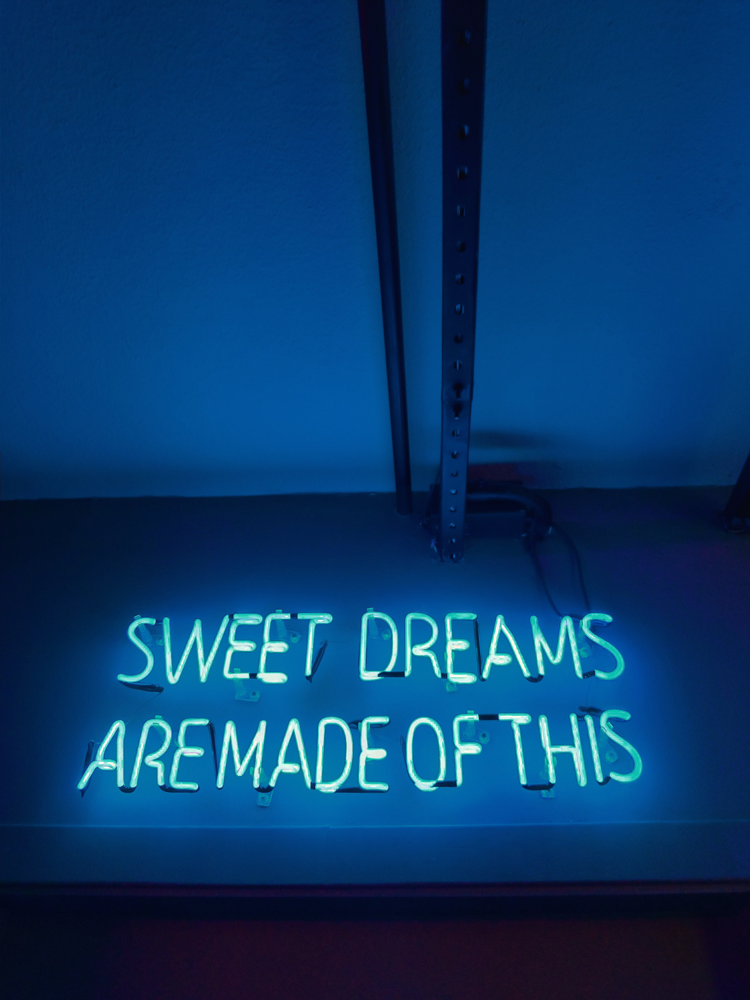
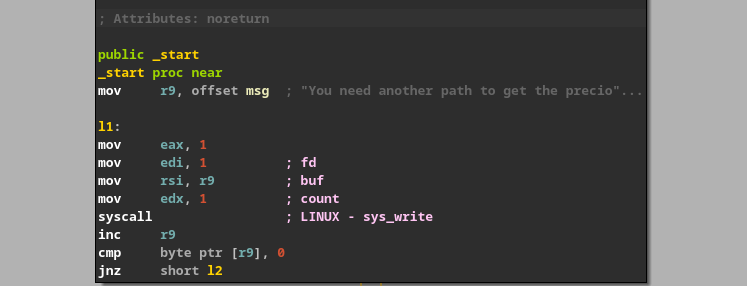
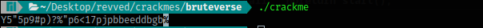
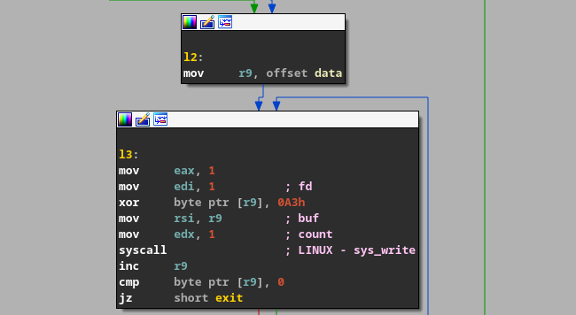
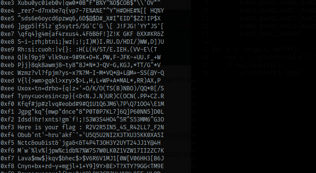

This is also another easy crackme. I don't know why is it rated 4.0 in difficulty. It should be like 2 or less than that. All you have to do is read the assembly of the program or decompiled code (if available) and everything will be clear. When I opened this in IDA first I saw that this only had one simple function. I was confused that a 4.0 rated challenge and only this function? Maybe something advanced was going on. So I objdumped it and found nothing more than what was already shown in IDA.



This is using basic syscalls to write to stdout. I thought this was a patching challenge because if you scroll down the disassembly, you'll see that it can print a string if we somehow jump to it, magically. So I tried patching this binary. You can see that in the given image I'm jumping to l2 instead of l1. This printed out some jibberish string.



But we don't have anything else in the binary, other than this data.



Now either this program is stupid or it wants to do something else. So as a last try, I thought of bruteforcing. The binary itself gives us hint on how we can bruteforce it. We need to xor the whole string with a single key. I created a script for this : 

```python
#!/usr/bin/env python3

data = [0x0BB,0x96,0x81,0x96,
        0x0D3,0x9A,0x80,0x0D3,
        0x8A,0x9C,0x86,0x81,
        0x0D3,0x95,0x9F,0x92,
        0x94,0x0D3,0x0C9,0x0D3,
        0x0A1,0x0C1,0x0A5,0x0C1,
        0x0A1,0x0C6,0x0BA,0x0BD,
        0x0C6,0x0AC,0x0C7,0x0A0,
        0x0AC,0x0A1,0x0C7,0x0C1,
        0x0BF,0x0BF,0x0C4,0x0AC,
        0x0B5,0x0C1,0x0BD]

for k in range(1, 0xffff):
    msg = ''.join(chr(data[i] ^ k) for i in range(len(data)))
    if msg.isascii():
        print(hex(k), msg)

```

Running this prints a whole lot of strings, but there's one string that makes some real sense and that must be the flag!



Can you find that string in the image? I don't know if this is really the correct way to solve this or not. I tried contacting the author but at the time of writing this solution, no reply came. But we have something! better than nothing :-)

Meet you next time in some other solution!