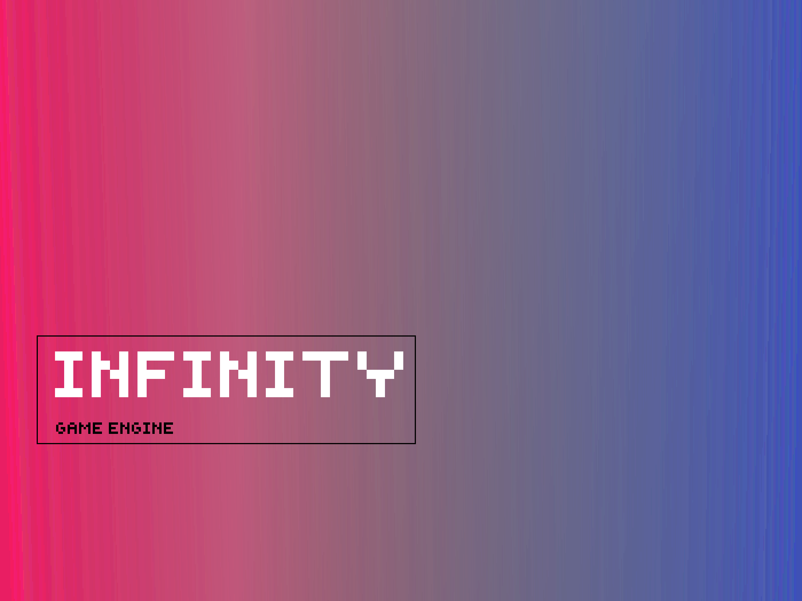

In this post, we will setup our first window, that will present our rendered images on the screen. We will use [SDL](https://libsdl.org/) for this. You can use other windowing libraries like [GLFW](https://glfw.org/), [Qt](https://qt.io/), etc... This dependes on what functionality and how much of it you want and the most important factor of them all is how much you are comfortable with the API of the library/utility you are using. I'm comfortable with [SDL](https://libsdl.org/), plus, [Unreal Engine](https://www.unrealengine.com/en-US/) uses it too. One more plus point with SDL is that it runs of many platforms : 

> SDL officially supports **Windows, Mac OS X, Linux, iOS, and Android**.

This almost all you want when you are beginning to make a Game Engine. For now I will do development for the specific platform I am working on (Linux). This doesn't mean that our engine won't work on other platforms, instead it just means that some of the platform dependent tasks we are doing in our Engine "might" not work. For example : If we don't use [SDL](https://libsdl.org/) to manage the platform dependent tasks for a window creation then for now our engine will be able display rendered images only on Linux. We can do some off-screen rendering on a non supported to output the rendered images as a video / GIF / screenshot etc... but that won't be fulfill the purpose of a Game Engine. 

There is a very nice [set of tutorials](https://lazyfoo.net/tutorials/SDL/) available for [SDL](https://libsdl.org/) on [lazyfoo](https://lazyfoo.net/). You can try reading that if you don't understand some part of this tutorial.

So, we will begin by introducing necessary includes in our `main` source file.

```cpp
// stdlib includes
#include <iostream>

// sdl includes
#include <SDL2/SDL.h>
#include <SDL2/SDL_vulkan.h>

// vulkan includes

int main(){
    puts("Infinity Engine [ Version - 0.0 ]");
    return 0;
}
```

The `SDL2/SDL.h` is for [SDL](https://libsdl.org/) functions and `SDL2/SDL_vulkan.h` is for vulkan helper functions. This header will provide us functions for creating a Vulkan surface, searching for required surface extensions etc...

```cpp
// stdlib includes
#include <SDL2/SDL_error.h>
#include <SDL2/SDL_video.h>
#include <cstdlib>
#include <iostream>

// sdl includes
#include <SDL2/SDL.h>
#include <SDL2/SDL_vulkan.h>

// vulkan includes

// typedefs
typedef uint64_t uint64;
typedef uint32_t uint32;
typedef uint16_t uint16;
typedef uint8_t uint8;

// global data
constexpr const char* appName           = "Infinity Engine";
constexpr int mainWindowWidth           = 800;
constexpr int mainWindowHeight          = 600;
constexpr uint32 windowCreationFlags    = SDL_WINDOW_VULKAN | SDL_WINDOW_SHOWN; 

int main(){
    puts("Infinity Engine [ Version - 0.0 ]");

    // initialize sdl video subsystem
    if(!SDL_WasInit(SDL_INIT_VIDEO)) SDL_InitSubSystem(SDL_INIT_VIDEO);

    // pointer to sdl window
    SDL_Window* window = nullptr;

    // create window
    window = SDL_CreateWindow("Infinity Engine", SDL_WINDOWPOS_CENTERED, SDL_WINDOWPOS_CENTERED, 
                               mainWindowWidth, mainWindowHeight, windowCreationFlags);

    // check if window was created
    if(window == nullptr){
        std::cerr << "Window creation failed : " << SDL_GetError() << std::endl;
    }

    return EXIT_SUCCESS;
}
```

We won't try to hard code any thing until unless needed. Using variables instead of definitions (`#define`) is generally recommended. So, we will store width, height, name etc... in one place. In case in future we wanted to change some parameter for testing purposes, we will have to change it only in one place. These variables are now in `main.cpp` but in future can be shifted to header to contain parameters only. I usually name that `Common.hpp` as it includes headers and defines parameters that are needed by almost all other source files.

`SDL_WasInit(<init_flag>)` is used to check whether a group of particular subsystem was initialized. In this case, we want to check whether video subsystem was initialized or not. If it is not initialized already, we initialize it. Note that this is just for showing how to do it because here there is no need to check whether it is initialized or not. But in some parts of code we will need to check that, so it's just to show that such function exists in [SDL](https://libsdl.org/).

`SDL_Window*` is pointer to internal window struct. We won't have access to it as it is platform dependent and again here the API thing comes into play. So all functions in [SDL](https://libsdl.org/) are like : `SDL_<function_name>`, for e.g. : To create an [SDL](https://libsdl.org/) window, we make a guess that function name can be  ***CreateWindow*** and yes it is! There is a function named [`SDL_CreateWindow`](https://wiki.libsdl.org/SDL_CreateWindow) to create an [SDL](https://libsdl.org/) window, as you can see that in the above code snippet also. [`SDL_CreateWindow`](https://wiki.libsdl.org/SDL_CreateWindow) declaration looks something like this : 

```cpp
SDL_Window * SDL_CreateWindow(const char *title,
                              int x, int y, int w,
                              int h, Uint32 flags);
```

So, it takes the titile of our window, X & Y cooridinate of window's position, width and height of window and the [flags](https://wiki.libsdl.org/SDL_CreateWindow#remarks) that will be used to create it! In our case we want the window to be visible and to be compatible for use with Vulkan, so we give `SDL_WINDOW_VULKAN | SDL_WINDOW_SHOWN`. The function returns `SDL_Window*`, i.e. pointer to the created window. In order to check whether the window creation was successful or not, we can check whether the window pointer returned is a `nullptr` or not. If `nullptr` is returned then there was an error and we print the error in `stderr`. To get the error message by [SDL](https://libsdl.org/), we use [`SDL_GetError()`](https://wiki.libsdl.org/SDL_GetError), which will return a string that contains the error message. 

Next, go to `./source/CMakeLists.txt` and add `target_link_libraries(${PROJECT_NAME} SDL2)` after `add_executable(${PROJECT_NAME} "source/main.cpp")` to link SDL2 with our main executable otherwise you will see some linker errors. 

Try to run the executable now! You will see only the version string getting printed on our screen and no window appears. Some of you may notice the window pop up and go out! This happens because our main thread must be open for as long as we want the window to be displayed onto the screen. To do this we use a while loop. This loop is also called the game loop  as all our game or game engine's logic will be here. Let's add that loop here so we can see our window : 

```cpp
// game loop
SDL_Event event;
bool keepRunning = true;
while(keepRunning){
    // handle all events like jump, run, resize, close, etc.. here
    while(SDL_PollEvent(&event) != 0){
        if(event.type == SDL_QUIT){
           keepRunning = false;
        }
    }
    
    // draw graphics etc...
}
```

Note that this is our game engine's loop here and not a game's main loop. The main difference is that here that Inifinity will be in control of this loop and will decide when to call which function. This will hide low level stuffs from our game.

Try to run this now and you will see a window on your screen!

Since there is no surface in this window, it will be like a transparent window but soon we will create a surface for our window.

This concludes our window setup and in the next part, we will setup our ***TestGame***. This TestGame will be used to check our Infinity's functionalities and working. See you in next post 😉. Have a good day/afternoon/evening/night!

If you have any queries, you can ping me on my [Instagram](https://instagram.com/imsiddharthmishra) or [Twitter](https://twitter.com/brightprogramer) ID 😄!