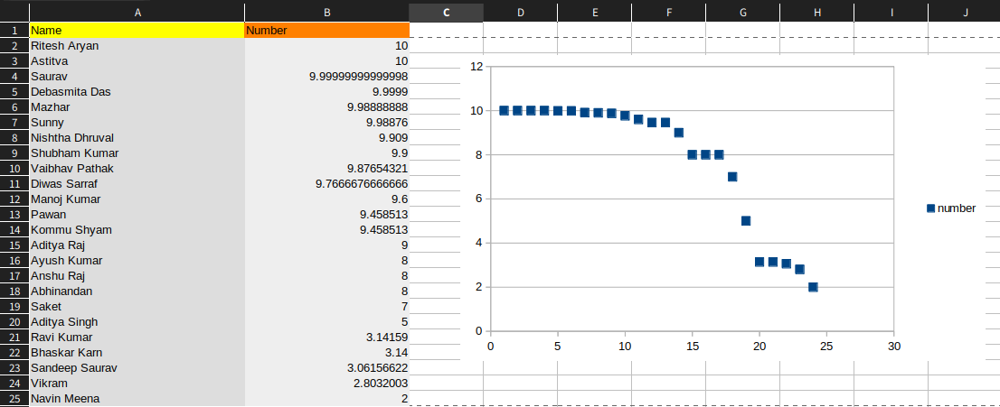

So, recently I conducted a small socail experiment based on something I read in a Game Theory [book](https://www.amazon.in/Game-Theory-Critical-Concepts-Sciences/dp/0415222400/ref=sr_1_1?crid=2DQJH8C3AMFK7&keywords=game+theory+critical+concepts&qid=1660931489&sprefix=game+theory+critical+concep%2Caps%2C304&sr=8-1) that I recently issued from library. Damn college libraries are awesome! especially the maths sections and biology ones! This blog post is about the experiment I conducted. Thanks to all my classmates who participated in this experiment.

## What Is Game Theory?

Ever fell into a situation where the decision you take depends on what decision others take? Well, yes, you are in that situation uncountable times in a day! Game Theory is the maths behind these situations. In Game Theory we study what optimal decision must players participating in a game take in order to maximize their chances of winning. More precisely how the book states it :

> The study of how rational people behave under such circumstances is the subject of *game theory*

This is used widely in areas like Social Sciences and Economics. Game Theory is said to have revolutionalized the world of Economics since it's birth with a simple but mind boggling question asked by ***Antoine Augustin Cournot***. His question was very simple :

> What happens when two profit maximizing producers of an identical commodity chose their output (in absence of any malpractices)

## A Question About Equilibrium

To help you understand the complexity of this problem, let me elaborate this question. Let's consider two network service providers : Jio and Airtel. These two companies provide the same service and also let's assume there are no other competitors in market. This means to maximize their profits these companies will have to set their service price by keeping in mind what their opponent is doing. Let's say Jio want's to change the price of it's service, but then to maximize it's profits, it has to consider what Airtel's current price is! Now Jio also knows that Airtel may also change it's price and it will also be considering Jio's service price. So now this means that the price Jio will set actually depends on what it thinks that Airtel is thinking that what Jio's thinking! Same rule applies to Airtel too! Airtel's decision depends on what it thinks that Jio's thinking that what Airtel is thinking. This myriad of thought keeps going on and on like this till it becomes completely incomprehensible by us. This thought process is called a **[Gordian Knot](https://en.wikipedia.org/wiki/Gordian_Knot)** in Game Theory. A Gordian Knot is a knot in Greek mythology that is defined as a knot that is impossible to untie.

If a process like this keeps going on then there will always be price fluctuations in the market (which we usually see) because both the companies will recalculate their prices when any one of them changes their price. Now the question is that will this system ever reach equilibrium? If an equilibrium is reached, what will be the final price of the service? Cournot wasn't able to completely solve this question and he made some pretty strong assumptions. One of which was that *each firm is unaware of how their decision impacts this dynamic process*. So now, Jio does not need to think that Airtel's decision will be dependent on it's decision or not. This means that Jio's thinking as if it's the solo service provider in the whole market (acting as a monopoly). This assumption eventually lead to the answer that, yes, the price will reach a stable equilibrium.

He reached at a conclusion but this conclusion came after making this bold assumption. What if the firms are in a complementary situation? Hence the solution remains incomplete. Then there came some few more sceintists (like Borel, John von Neumann etc...) who tried some new methods to try to solve this problem. Like Borel showed that in some simple games, this could be answered by considering all possible situations and then adivsing the player to select the best possible moves based on the calculated situations. Neumann on the other hand tied to find set of moves that a player can always count on independent of what his/her opponent does. Using these set of moves, he showed that there existed a unique set of moves that will result in a stable equilibrium. Yet his techniques can only be applied to ***zero-sum games***. A zero-sum game is on where sum of all profits and losses is equal to zero! This means one player's win is a direct result of another player's loss! Clearly this is now always the case in real life markets. Like Jio and Airtel can both set a price that they both profit from and they settle to that and don't keep it changing. So, they both win and nobody loses! The problem remains unsolved...

## A Beautiful Mind

This problem was solved by ***John Nash***. His papers revolutionised the field of economics and laid the groundwork for future game theorists. You might've also seen a movie with same name (A Beautiful Mind). Nash basically used some of Neumanns tools to solve this problem, but

> What is it that enabled Nash to employ von Neumann's own tools in order to succeed where the master himself had failed?

Well, the main reason Gordian Knot existed is because players had the independence to change their decisions after getting feedback. Nash took this power from players and suggested that they must be allowed to take decision only once. This means that there is no dynamic system now and hence the problem can now no longer be explained in terms of an equilibrium. All the decisions now players have to make is to be done in the time alloted to them for making that decision (*the logical time*) and not *the real time*. Thus price adjustments can now only occur in logical time and not real time! Now, to demonstrate this new approach, the book introduces a scenario where N number of players are playing a game called ***Race-to-Zero***.

## Race To Zero

The game has only two rules : 

* Player has to select a real number between 0 and 10 (or any number you like, in book it was 100)
* Player who selected number is closest to the maximum number divided by two wins.

As a motivation, I also told my friends that a unique winner will get a small treat from me (ahh, things I do for the love of maths 💗). I only disclosed the name of the game to them and didn't explain them what this is all about in order to keep their decisions as unbiased as possible. Also, the numbers were recieved privately (throught whatsapp chats). I think most of them enjoyed the sudden mystery game and were asking what this was all about. So here it is : 

Let's assume that all players are thinking rationally. By rationally I mean that they know what they can think, others can think too! This means again the Gordian Knot kicks in! Now, every player knows that the highest number one can choose is 10 so they must select a number that is closer to 5. Thinking rationally again, they know that others will be doing the same so they try to select a number closer to 2.5. And now this cycle continues till we reach zero! Hence Race-to-Zero. This is the equilibrium point for given set of rules  and this equilibrium is called ***Nash Equilibrium***. Hence the optimal choice for each player must be the number 0.

I however wanted to know how exactly will this equilibrium change when I slightly change the rules! The slight change I introduced was by replacing the second rule by : 

> Player who selects the second largets number wins!

And below is the data for that experiment :

Clearly one can see that equilibrium point shifted from zero to 10 in this case. How do I know that? Look at the scatter plot, most of the points are cluttered near the line **y=10**. Slight changing of rule and such major change in equilibrium! So, how do we explain this? One major thing to notice is that equilibrium point still exists! and hence the mathematics of Game Theory is working as expected and hence maths never fails to amaze meeeee...

Explanation of this result is actually quite simpler than before. Since the highest number one can choose is 10, no one will be chosing that! So the highest and the second highest, both numbers will be as close to 10 as possible as select a number less than 9 will result in a strict loss and we can see that most of the players actually selected numbers very close to 10. One thing to point out here is that no one actually gave the number 10 and it is the fault of the software to approximate those values to 10 and all the numbers were unique! Clearly the winner is Astitva in this case. Also, I realize that after changing the rules, the game should've been named Race-to-Ten.

## Ending Notes

As we can see, Nash also came to same conclusion as Cournot. They both predicted that an equilibrium will exist but Nash's solution is in much general sense hence more acceptable. I'd like to quote exact statements written in book here : 

> Nash's brazen move was to cut through the Gordian beliefs until the knot could be untied effortlessly. How? *By rejecting all beliefs which, if held, would lead to behaviour that will falsify these beliefs.* Put differently, *by admitting only beliefs which will be confirmed by the actions which they recommend.* Put differently again, *by assuming that rational players, who recognize that their competitors are also rational, will never expect them to hold mistaken beliefs*

This approach not only solved this Race-to-Ten problem, but also solved Cournot's problem as Nash was able to show out of all the decisions the two firms can make, there is only one decision that would not falsify the beliefs that led to this decision! The only reason we were stuck in the Gordian knot was because one belief led to another that required the previous one to be modifed again.

To be honest, I'm new to game theory and some of the statements I wrote today sometimes go over my head to and I have to re-read them multiple times and recally how I understood it last time. It is quite complex (atleast at this point) but I know that it will open a new dimension of thinking for me.