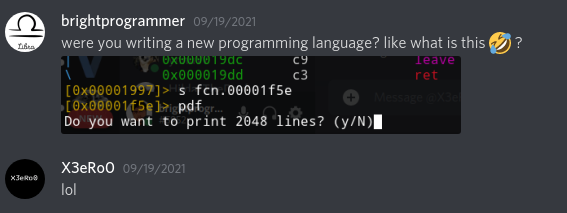
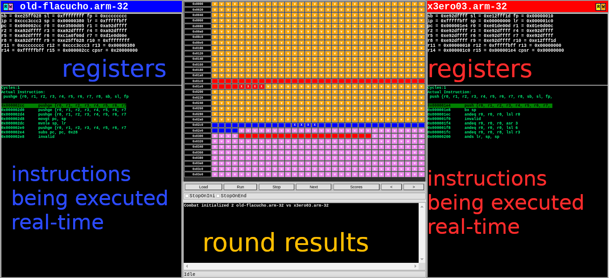

So I participated in this year's online [r2con](https://rada.re/con/2021/)'s [r2wars](https://rada.re/con/2021/#r2wars) event. It was amazing. Me and my friend (**[X3eRo0](https://twitter.com/X3eRo0)**) participated in this years [r2con](https://rada.re/con/2021/). I never heard of this event before and it was introduced to me by **[X3eRo0](https://twitter.com/X3eRo0)** himself. Also this type of event was completely new to me.


### Beginning

My exams were already over and I was sitting waiting for a nice thing to happen in my life  (working on my side projects). As I've mentioned in my earlier post ([Solving **X3eRo0**'s CrackME The Hard Way](https://brightprogrammer.netlify.app/post/solving-x3ero0s-crackme-the-hard-way/)) **[X3eRo0](https://twitter.com/X3eRo0)** challeged me to solve his CrackMe and he'll invite me to his **[ctf-team](https://medium.com/zh3r0)**. This acted as a motivation to me. At the time of writing this post, the CrackMe is still unsolved (I am still at reversing stage, the read time is 109mins and I guess it will probably increase to 400mins+ after I'm done with it). After a month approx he sent me an invitation to join his **[ctf-team](https://medium.com/zh3r0)** (probably by seeing how foolish I am and that I won't be able to complete his crackme in an eternity 😂 🤣). Everyone is polite and helpful in the team I feel comfortable with them 😄.



So, I was there checking my notifications, reading some ctf writeups, waiting for a nice team event to occur and on the 2nd day of joining the team, **[X3eRo0](https://twitter.com/X3eRo0)** invited me and some other team members to participate in this event. Some members we busy with their college life and other stuffs so in the end only me and **[X3eRo0](https://twitter.com/X3eRo0)** were participating.

### What is [r2wars](https://rada.re/con/2021/#r2wars)?

At the time of joining, I didn't even knew what we have to do there. I just jumped in because of my excitement. I had this feeling that it will be amazing so let's just do whatever has to be done to get involved. 

[r2wars](https://rada.re/con/2021/#r2wars) is a game like [corewars](https://www.corewars.org/) in which participants write bots that fight in an arena and winner bots get some amazing prizes. Bots compete against each other in a round robin tournament in which every bot get's a change to compete agains every other bot. The competing bots are assigned same memory space and the main goal of each bot is to crash the other or to survive till the other bot crashes on it's own.

The competing bots will be initialized in a common memory space of 1024 (0x400 or `pow(2,10)`) bytes. The bots are initialzed at random memory locations and they don't know where they are initialzed. They can be placed in the beginning of this memory region, at the end or in the middle or somewhere random. Running your bot outside this memory region will crash your bot. There are two rounds held in every match (generally). If your bot wins both the rounds then your bot wins the match and you recieve a higher score. You can write your bot in x86-64, x86-32, arm, aarch64, mips etc... architectures. The reason this wide rnage of ISAs are supported is because of [radare's ESIL](https://github.com/radareorg/radare2/blob/master/doc/esil.md). The main motto of this event is to ***improve*** [radare's ESIL](https://github.com/radareorg/radare2/blob/master/doc/esil.md).

[r2wars](https://rada.re/con/2021/#r2wars) is held once every year. It is a part of [r2con](https://rada.re/con/2021) which usually happened (before [covid19](https://en.wikipedia.org/wiki/COVID-19)) like a normal conference but since the last two years [it was held online](https://www.youtube.com/results?search_query=r2con).



So as you can see above, the coloured (yellow, red, blue, pink etc...) region in the middle is a pictorial representation of memory region allocated to the two bot's. In the image you can see that almost every thing is open source here. You can see the god damn assembly instructions of each bot in there! Which means you can reverse the bot by just looking at the match! Here **[X3eRo0](https://twitter.com/X3eRo0)**'s bot is competing against a bot named **old-flacucho.** This bot was reversed by **[X3eRo0](https://twitter.com/X3eRo0)** after [day1's match](https://youtu.be/yv4vuXrbt0M?t=19274). Blue means the executable code for left bot and Red means the executable code for right bot. Also the |R|W| colors shown beside the name of each bot is the colour of read and written memory for each bot. So, for eg: orange coloured memory region is written by **[X3eRo0](https://twitter.com/X3eRo0)**'s bot and the region in pink is written by **old-flacucho.**

#### Day 1

[Day1's match](https://youtu.be/yv4vuXrbt0M?t=19274) got be got me demotivated a little bit. This was becuase I was completely new to this type of warfare. **[X3eRo0](https://twitter.com/X3eRo0)** had his bot almost already so he sumbitted his bot. There were 4 participants only. Two bot's were from the same author (as we come to know in the end). I didn't understand a bit! Nothing made sense except the scoreboard. **[X3eRo0](https://twitter.com/X3eRo0)** too participated in this for the first time.

According to Indian Standard Time (IST) the matches where held between 12:00 A.M to 12:30 A.M. I was pretty exhausted because before this day I usually was fast asleep till 11:00 - 11:30 P.M but the story after this day was about to change. You an find the schedule r2con2021 [here](https://rada.re/con/2021/#schedule).

### Day 2

I had plans this day to go outside for some work but it got cancelled so I had the whole day ahead of me to work on my bot. I didn't knew where to start so **[X3eRo0](https://twitter.com/X3eRo0)** gave me some resources to begin with. He showed me some previously written bots and helped me understand them. Here are those resources : 

* [r2wars for n00bs by Captain Banana](https://www.youtube.com/watch?v=PB0AFBqFwGQ)
* [The Kamikaze Bot](https://github.com/m1ckey/r2wars-bots/blob/master/kamikaze.x86-32.asm) - Probably the best bot for x86-32 architecture.

This bot is amazing and almost all the other bots work the same way. I'll explain everything as we move further. 

This was the first time I saw and learned that the stack can be executable too and I understood the true power of assembly. I understood the true meaning of a function's stack and much more concepts were getting crystal clear as I started to understand the true working.

There are other [bots open sourced](https://www.google.com/search?q=r2wars+bots+github&oq=r2wars+bots+github&ie=UTF-8) out there too! You can look at them and understand their workings. Some are easy to understand weak and some really f*ck your brain and are GOD (like amphibia this year)!

So, I spent the whole day writing and testing my bot. The r2wars UI felt quite complex to begin with so it took some time. You can setup the test environment by cloning and building [this repo](https://github.com/radareorg/r2wars). You can use `xbuild` or `msbuild` (whichever supports your system) to build the project file in `csharp` directory. Install the required dependencies listed in the `README.md`. You must place your bots in the ***warriors*** directory next to `r2wars.exe` and your bot's name must be similar to `*.<arch-name>.asm`. For eg : `killlerbot.x86-32.asm` or `madmax.arm-32.asm`.

#### Begin To Write First Bot!.

The main goal is to crash the other bot. The most common way is to feed some invalid instruction that the bot executes and dies. This instruction can be something that is not in the ISA, jump out of maximum memory bound (0x400 or 1024 bytes), return without a call, something else malicious. This is similar to shellcoding. Since we don't know the address of either of the bots we can't just start feeding invalid instructions to it. This leaves us with only one option i.e curropting the whole memory region. This has several constrains and risks :

* We might get out of max memory bound (i.e 1024 bytes)
* We might execute that invalid statement ourselves.
* The other bot might crush our bot if our bot is slower.

Considering these constraints and risks in mind we need our bot to run faster. There is one golden rule and that is : larger is your code, more is it's chance of getting curropted. 

This is what my first bot looked like : 

```
; fill gprs with config values
; edx - low mem bound
; ecx - max mem bound

; program start
start:
	mov ecx, 0x400;		max mem loc bound = 0x400 or 1024 bytes
	mov edx, 0x0;		beginning of mem loc

; search and fill loop
; strategy :
; loop through memory space
; check if the value at given mem address is 0
; if it's zero then move forward to next instruction
; if it's not zero then store invalid opcode there

loop:
	cmp [eax], 0;							check if eax is 0
	je loop;								if eax is 0 then jump to loop
	mov [eax], 0xffffffff;					invalid opcode
	inc eax;								move forward
	jmp loop;								do it again

```

You can read the comments and understand. After writing this bot, I asked **[X3eRo0](https://twitter.com/X3eRo0)** for a match between our bots. This bot was too slow and almost all other bot's beat this one. Still it perfomed better against some bots because some of them were so fast that they curropted themselves 🤣. Bots can be funny once you start wrting them. 

So after failing a lot, I wrote another bot named `amaterasu` named after [The Japanese Sun Goddess](https://www.britannica.com/topic/Amaterasu). It was also mentioned in [Naruto](https://en.wikipedia.org/wiki/Naruto)'s S6E25 where Sasuke's brother Itachi uses Amaterasu for the first time. The code for this bot is : 

```
start:
    mov ebp, 0x3e0
    mov esp, 0x3e0
    ; lea eax, [end + 0x20]
    ; lea ebx, [start - 0x20]
    mov eax, 0xffffffff
    mov ebx, 0xffffffff
    mov ecx, 0xffffffff
    mov edx, 0xffffffff
    mov edi, 0xffffffff
    mov esi, 0xffffffff

bot_loop:
    ; cmp esp, eax
    ; cmovbe esp, ebx

    ; push 128 bytes at once
    pushad
    pushad
    pushad
    pushad

    ; push again
    pushad
    pushad
    pushad
    pushad

    ; jmp to beginning once again
    cmp esp, 0x10
    cmovz esp, ebp
    jmp bot_loop

end:
    nop
```

This bot was actually better than the previous bot. You might be wondering why so many `PUSHAD`s? Well after researching a lot I saw that this instruction actually copies data in the memory super fast! One single instruction pushes a data of 32 bytes onto the stack and 8 `PUSHAD`s will push data of 256 bytes! This is one fourth of available memory! Almost every bot out there used the same apporach. So if you want to write a better bot, find an ISA that supports huge and faster `PUSHAD` like `arm32`. ARM can push 16 registers at once each of 4 bytes in size. This is double than that of Intel `i386` (`x86-32`). This is one of the reasons why top 3 bots this year were written in arm-32.

This also didn't satisfy me so I wrote another bot named `karma`. The main goal was that this bot will just sit at one place and wait for the other bot to crash by itself.

```
mov ebp, 0x400
mov esp, ebp
mov esi, 0x0f0b0f0b
mov edi, 0x0f0b0f0b
mov ecx, 0x0f0b0f0b
mov edx, 0x0f0b0f0b
mov ebx, 0x0f0b0f0b
mov eax, 0x0f0b0f0b
start:
    pushad
    sub esp, 0x20
    and esp, 0x3ff
    jmp start
```

But this was a failure too. I sumbitted this on for [Day2 match](https://youtu.be/UgJhN3dt9yU?t=8715). It came last 😆. It was fun though seeing it fight. This time since I wrote a bot myself I felt that current of excitement running through my body, giving me goosebumps.


We both were constantly modifying our code and testing against other bots from github. It was was a blast. I had my setup for r2wars already done so **[X3eRo0](https://twitter.com/X3eRo0)** sent me his bots to test and run. I screencasted  my pc and we enjoyed a lot.

This time  **[X3eRo0](https://twitter.com/X3eRo0)** made a bot in `arm-32` code. His bot was nailing it! But still ***amaterasu*** was able to defeat it sometimes! I planned to learn `arm-32` the next day and this marked the end of Day 2.

### Day 3

This was the final day. Day 1 and Day 2 were just test rounds and 2 test matches were conducted on each day but today it was just gonna be only one single round! ***THE FINAL ROUND***! I woke up and started to read [this awesome blog post](https://modexp.wordpress.com/2018/10/30/arm64-assembly/) on `aarch64` assembly. I just started reading the post and then my discord notification popped out. A team member requested me to help him solve a CTF challenge. I got involved in that for more than half of the day.