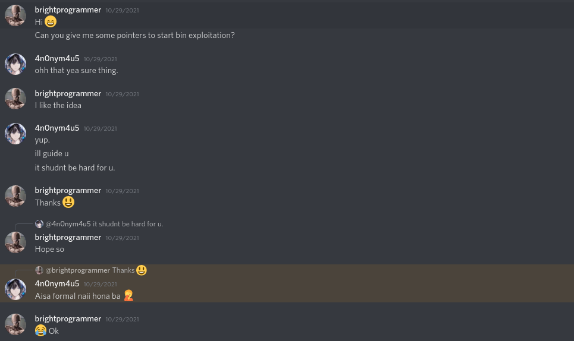
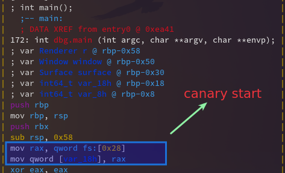
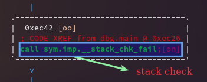
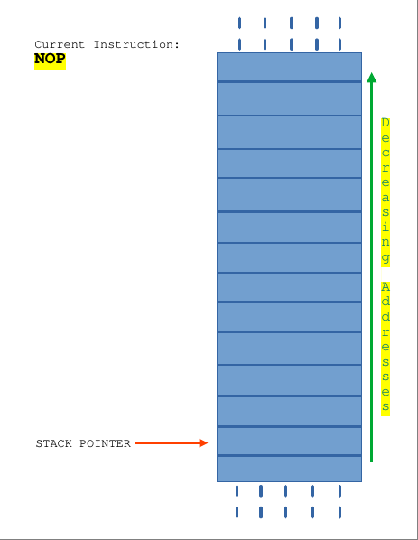

## Background Story

So, I started to gain interest in pwn challenges when I saw one of my team-mate (**4n0nym4u5**) solving a pwn challenge from [pwnable.tw](https://pwnable.tw/). I didn't understand a bit but there was this urge in me trying to understand what he was doing. I was able to deduce this much : 

* He was writing an exploit in python using [`pwntools`](https://docs.pwntools.com/en/stable/) (I noticed it because **X3eRo0** instroduced me to this during r2con)
* He was continuously using PwnDbg for that (I saw GEF being used in some of the writeups)
* He was re-running his exploit again and again, maybe to debug it.
* It was awesome and felt like real hacking!

So, the next day I tried searching on how to start binary exploitation and I found almost nothing that helped me (maybe I was impatient or something but I really didn't find it). I thought maybe trying to solve a real challenge help me learn so I downloaded the **start** challenge from [pwnable.tw](https://pwnable.tw/). That didn't help either. I tried reading writeups about it but that didn't help either mainly because by conscience wasn't allowing it because maybe by reading the solution I'll destroy my chance of learning it. 

> You can see the solution, understand the solution, but never understand the concepts. You can understand the concepts only if you solve it on your own!

After a few days I was frustrated and directly asked 4n0nym4us how to begin binary exploitation.



Then he asked me some questions to know how much I already know and then the next day in approximately 2hrs video session he taught me many concepts : 

* Security permissions in binary like what NX, RelRO etc... meant
* How buffer overflow actually works
* How to write payloads
* How to write your own shellcodes
* Some basic intro to PwnDbg
* How things work with `ALSR` (**Address Space Layout Randomization**) and without `ASLR`
* Return Oriented Programming (ROP), building ROP chain etc...
* Return `libc` (all C/C++ programs link to it)
* Return to `csu` (a function found in all C/C++ programs)
* How things work when `NX` (**No eXecute**) is enabled and when it is disabled.
* How to dyanmically patch a binary using `read` (idk the exact term for this but you'll understand when we see this)

The list is huge and I regret not recording the session, so, I want to revise everything I learnt in that video and because of that I'm motivated to write this post. Hope this helps you too.

## Some Pre-Knowledge

In cybersec you will hear/read the words ***vulnerability*** and ***exploit*** in most of the related resources. A vulnerability is something that you exploit. An exploit is the algorithm or method that you use to do some things that the developer didn't expect you or anyone to do. For example, you are connected over some server that asks you to enter your name and instead you write something that gives you access to the shell on that server. Since you have access to a remote shell, you can theoretically do almost anything with that server! shut it down, restart it, gain root privileges, get access to some confidential data etc! All of this because you exploited a vulnerability! and this is what real hacking looks like!

Before beginning, you must know how to read assembly code! alteast a little bit. Because sometimes, these programs aren't written in C/C++ that a decompiler can easily understand. They are sometimes written pure assembly. Your decompiler can recognize some stuffs but not all of it! not matter how good it is!

You must know what an ELF file is. If you need an intro to ELF files, you can refer to my notes [here](https://brightprogrammer.github.io/pwn.college/program-interaction/intro-to-elf-files.html). 

## The Real Stuff

So, in this part we'll only see different ways to exploit stack. There are two ways in which memory can be allocated in a program :

* The Stack (volatile)
* The Heap (non volatile)

Both can be exploited but here we'll see only how to exploit the stack because that's what I learnt and what I know at the moment.

#### What is The Stack?

Stack is usually referred to a data structure that is `LIFO` (**Last In First Out**) type. In context with memory allocation, stack is a memory region assigned to each program while being loaded by the operating systems that is used like a stack data structure. When you allocate space without using functions like `malloc`, `calloc`, `new` etc..., you allocate them on the stack. See some examples below : 

```c
// includes
.
.
.
// this int is not in the stack, this is stored in $rax
int main(){
    .
    .
    .
    // all these variables are allocated on the stack
    int x;
    float y;
    double z;
    uint8_t[1024] buffer;
    char[256] input;
    .
    .
    .
}
.
.
.
```

The stack is actually common for each function, it is just a plain contiguous memory space like any other! but then what makes us think that stack is separate for each function? This is an illusion created by the compiler in the assembly level and this is where the stack `canary` comes into play. 

It is called a canary because of the use of canary birds in the mines before. Miners used to take canary birds in cages and go into the mine. A mine sometimes contains poisonous gases and when a canary stopped screaming then they understood that this area is poisonous and they get out of there. Sometimes the canary even died!

The stack canary fullfills a similar purpose! In the beginning of a function, just after function epilogue, a secret value is stored on the stack that is different for every function and at the end, just before epilogue, this value on stack is matched with the special value and if it's not same then this means that there was an overwrite and the program exits with a stack overflow error.





This is dynamically linked executable, so, the actual stack check code isn't here but usually it'll roughly look something like this :

```
; our stack check
stack_check_fail : 
    mov rax, qword [var_18h] ; get the magical value in rax
    cmp rax, qword fs:[0x28] ; check the magical value
    jne stack_fail           ; if fails then exit
    
; calls exit with segfault code
stack_fail:
    mov rdi, SIGSEGV         ; segmentation fault
    call sys.imp.exit        ; call exit

```

#### How The Stack Works

You have `push` and `pop` instructions in assembly to save and get data from the stack (the memory region). When a `push` instruction is executed, the data passed as second operand is stored in the memory region pointed by `stack pointer` and it is decremented by one, so that when a next push instruction is executed, it is pushed to memory region one more than previous one. When a `pop` instruction is executed, data stored in the memory region pointed by the `stack pointer` is stored in the given operand and `stack pointer` is incremented by one.

