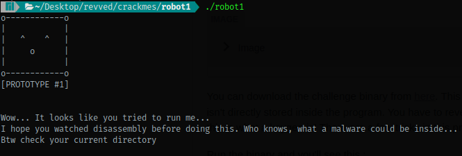
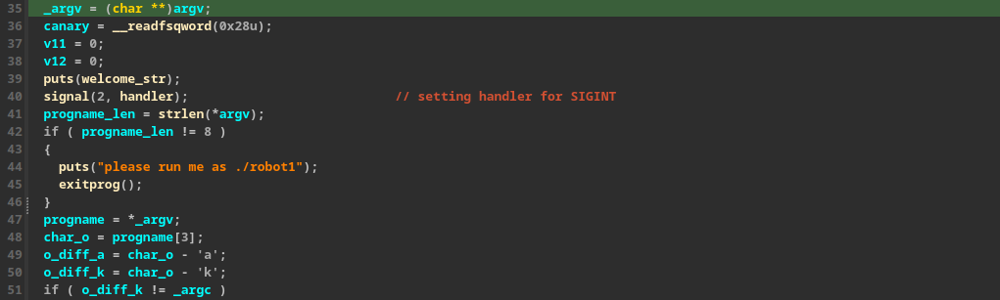
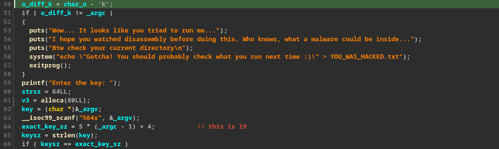
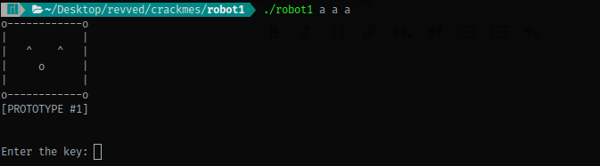
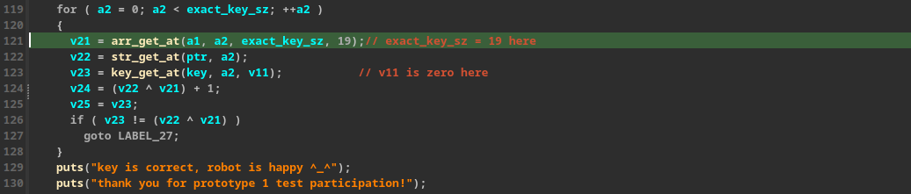
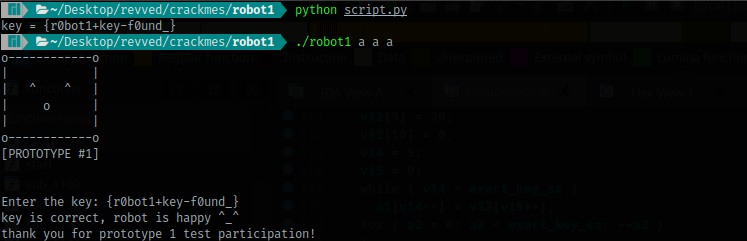

You can download the challenge binary from [here](https://crackmes.one/crackme/63710e2433c5d43ab4eceac6). This is a keygen like crackme. Program asks you for a key that isn't directly stored inside the program. You have to reverse the key checking algorithm to genreate key. Basically this is what a keygen is! There are a few tricks in this program as the author tried to make it little bit fun.

Run the binary and you'll see this :



On checking your `pwd` you'll notice that there's a new file created. Opening that file reaveals nothing useful. So we jump to IDA to see it's decompilation.



In the very beginning it's checking if you're running the program as .`/robot1` or not. Then it gets the fourth charcter from program name ("./robot") and takes differences with 'a' and 'k'. 



A check is made then whether `argc == 4` or not. Note that difference of 'o' and 'k' is 4 in ASCII. If argc is not exactly 4 then the program will exit printing that message we saw in the beginning. Let's run the program with 4 arguments then.



It asks for a key then. If you take a look at the decompiled code before this image, you'll see that the program's taking input from user and calculating exact key size it's expecting and comparing it with the input size. After that you'll basically see it initialize two arrays with some values. In the end these values are used to check whether the input that user gave is correct or not. The values in these two arrays are xorred element by element to get the key. 



You can now write a script to generate the actual key. I wrote this one :

```python
#!/usr/bin/env python3

a1 = [0 for i in range(0, 19)]
a1[0] = 26
a1[1] = 67
a1[2] = 83
a1[3] = 81
a1[4] = 10
a1[5] = 65
a1[6] = a1[1] + 19
a1[7] = 28 # or 95
a1[8] = 2
a1[9] = 92
a1[10] = 24
a1[11] = 28
a1[12] = 5
a1[13] = 3
a1[14] = 16
a1[15] = 91
a1[16] = 3
a1[17] = 104
a1[18] = 20

# print(''.join(chr(i) for i in a1))

a2 = [0 for i in range(0, 19)]

aeven = True
for i in range(0, 19):
    if aeven:
        a2[i] = ord('a') + i%10
    else:
        a2[i] = ord('0') + i%10

    aeven = aeven == False

# print(''.join(chr(a2[i]) for i in range(0, 19)))
key = ''.join(chr(a1[i] ^ a2[i]) for i in range(0, 19))
print(f"key = {key}")
```

Running this, you'll get the key and then you plug that into the program to get a solve! yayy!



Hope you liked the read!