I'm always having problems solving a VM obfucscation challenge in any CTF. This time I plan to end this by solving a VM CrackMe. I got this from a team-mate ( [h4x5p4c3](https://twitter.com/h4x5p4c3) ), another helpful team-mate.

Here are a few resources before we begin : 

* [Analysis Of Virtualization-based Obfuscation](https://youtu.be/b6udPT79itk)
* [The challenge](https://drive.google.com/file/d/1Yc54_ogPcVUpFICXVPOnFLsGvS8Xq668/view?usp=sharing)

As I mentioned earlier, I am not good with VM crackmes but when I started following that video (first), just 40 minutes into the video and I'm able to detect the dispatcher function. I highly recommend anyone who really wants to learn. I'll be solving a few VM crackmes to improve my skills. I have basic reversing skills but I have a bad habit of getting stuck in useless functions or parts of code like we did with XVM. Our goal was to solve the crackme and I started to reconstruct the whole code. I won't be doing such things in this one. Although we might go into detail.

At the time of writing I'm only 52 minutes into that [video](https://www.youtube.com/watch?v=b6udPT79itk&t=3278s) and still I was able to solve this challenge. Maybe the challenge is easier but I also feel that the video is effective too.  This video was recommended by a new friend I made while we participated in hxp CTF. Some of the top Indian CTF teams collaborated to participate in this heavy weight CTF. He also gave me few other resources to work on.

I've already partially solved this crackme and this'll be a detailed explanation on my struggles and all. Recently we participated in xmas ctf and I really felt like an impostor. I have two options : either I fight this and learn all about VMs (well, most of the stuffs) or I can just stay an impostor. I'll walk on the path less travelled by.

## What Is A VM?

VM is short form of Virtual Machine. A virtual machine is exactly what it's name is, it's virtual!.

An example of physical machine is your CPU. Your CPU is executing real instructions. When you do a `mov` instruction, your CPU will take minimum number of steps to complete that instruction. That instruction will have effect on real registers and memory. 

When it comes to a virtual CPU (machine), it may or may not have a move instruction in the first place! Even if it has a mov instruction, it'll be moving data to/from variables declared within the program. So the virtual cpu doesn't directly use anything real (registers/memory) and all the resources that it'll use will be stored in a variable that is already allocated on either the stack or the heap. All the (virtual) instructions that a virtual machine will run will ultimately be converted to machine code. Because of this conversion, a virtual CPU takes much more number of steps than a physical CPU to execute a single (virtual) instruction and because of this, virtual machines are slower too.

## How Do Virtual Machines Work?

Since a virtual machine is trying to emulate some new instruction set, it'll need to have a CPU that will be able to decode those set of instructions and for that all virtual machines implement their own virtual CPU. How do we do that? Well, a CPU is just a bunch of registers and some helper units.

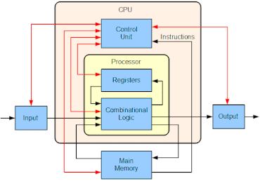

A virtual CPU is much similar to a physical CPU. It'll have it's own set of registers and cache and all. A simple implementation in code will look something like this

```cpp
enum reg_id { 
    rax = 0, rbx, rcx, ...
}

struct cpu_t{
    int64_t registers[X]; // X number of registers
    int64_t* stack;
  
    size_t pc; // program counter register
    uint32_t* bytecode;
    size_t code_sz;
    .
    .
    .
    // some other things needed for this vm
};
```

This makes up the structure of our CPU, but then how will it execute instructions? Normally, challenge developers write their program in a symbolic language and then convert it to the virtual CPUs assembly code. This assembled code is what we refer to as the bytecode. It's just an array of numbers like the opcodes of your actual CPU.

This bytecode is then read and passed to a **Fetch**, **Decode**, **Execute** (FeDeX) loop. This loop does what it's name is. It fetches the current instruction from bytecode, decodes what it means (useful part) and then executes it! This is very much similar to what an actual CPU does but this decoding part makes up the extra steps that our virtual CPU has to take.

## The FeDeX Loop

In normal CPU, there is a register called the **program counter** (instruction pointer in Intel CPUs). This register contains an absolute address or an offset from a base address that directly or indirectly points to the next instruction that needs to be executed. So, the fetch part just needs to keep track of this program counter. To fetch the next instruction, the program will do

```c
enum instr{
    MOV_REG_CONST = 0, // mov const value to register
    MOV_REG_REG, // move value in register to register
    ADD_REG_CONST, // add value in register to a const value and store in register
    .
    .
    .
}

void dispatch(){
    while(cpu.pc < cpu.code_sz){
         // fetch current instruction and increment pc
         uint32_t current_instr = cpu.bytecode[cpu.pc++];
         
         // decode
         if(current_instr == MOV_REG_CONST){
             // execute
             uint32_t reg_idx = cpu.bytecode[cpu.pc++];
             uint32_t const_val = cpu.bytecode[cpu.pc++];
             cpu.register[reg_idx] = const val;
         }else if(current_instr == MOV_REG_REG){
             // execute
         }
         .
         .
         .
    }
}
```

Instead of if-else statements, switch-case statements can be used too! Now, this is where the interesting part comes : In all normal, not crazy VMs you'll find a FeDeX loop like this one.  This function is what we need to find if it's a VM challenge. Generally it's easy to find because of the code structure here! When you'll see this code in a graph like format, you'll notice that almost all similar VMs (with a FeDeX loop) will have similar structure. Let's try that in this crackme.

## First Contact

We'll a new tool **Iaito**. Iaito is the GUI version of radare. We'll use this to quickly get to the dispatcher function and then we can switch to any other tool.

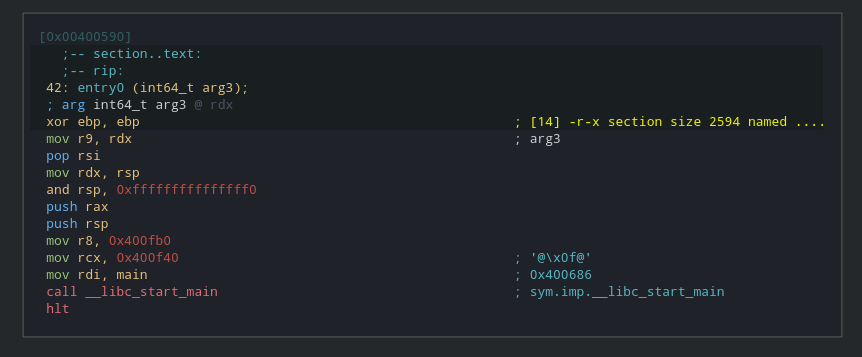

This is doing a simple call to `libc_start_main` which will eventually call `main`.

> At this point I'd like to highlight that reversing XVM from scratch wasn't a complete waste as I can do normal reversing like this very easily. I can now read the assembly very easily and understand what the code is trying to do!

Instead of going to main and following the code sequentially, we'll now go through all those functions and check the graph structure from a high level perspective.

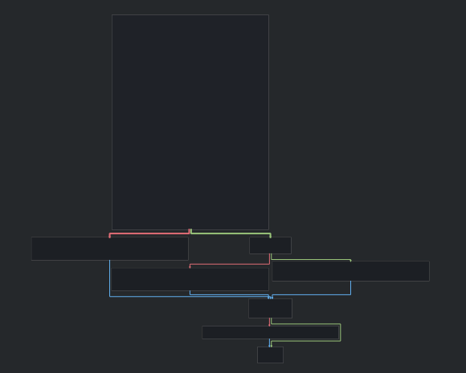

Simple and short. The head block is big and is most probably reading input and doing some initializations. On going through functions one by one, you'll see a function like this

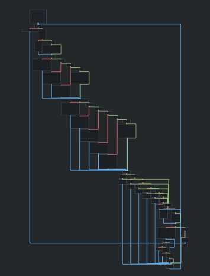

Looks like this one has lots of conditional jumps. Let's analyse this one. Spoiler : This is is indeed the dispatcher function.

## Analysis

Now we can go to main and look where this function is being called and then analyze what's being passed to this. We'll try to do as less reversing as possible in functions outside this one. I'll name this function to *dispatcher* to increase readability.

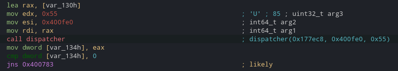

Clearly this is taking three arguments, first one is some value in `rax`, second value looks like some address, and third one is some number. Let's check the value in rax.

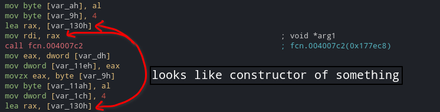

That function looks like it's creating something  (some data structure), let's check it out XD.

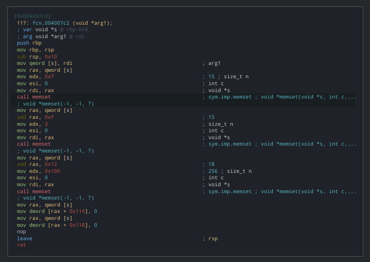

Looks like it's memsetting a huge array (0x118 bytes) to 0. So, we don't get any idea of what it is. But since this is the only constructor and is called in the initialization stage, most probably it's either building a context data structure or something similar to CPU. A context data structure will contain everything important for current execution, eg : handle to bytecode file, bytecode buffer in memory, cpu that'll execute the bytecode. Don't mind that for now as we'll see how it's being used (i.e if it's being used). We'll name that variable as ctx and continue.

Let's check the dispatcher function now.

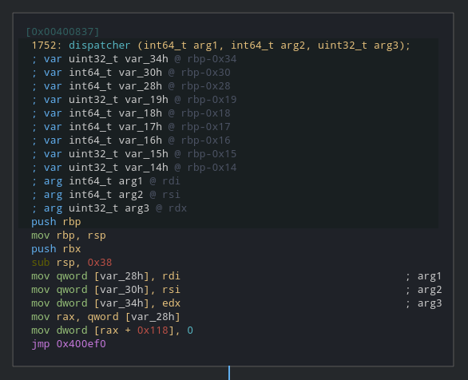

Name the first parameter as ctx, other two variables as arg2, arg3 and keep an eye on how the other two variables are being used from now on.

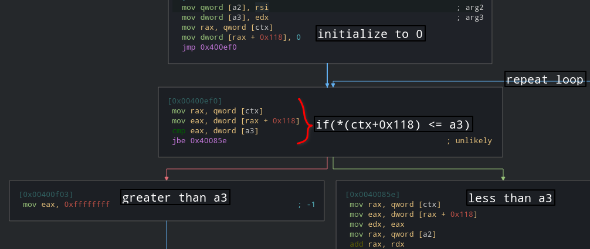

If you take a high level view, this is the basic working condition for the FeDeX loop. This means this can be either a normal iterator or a program counter or something similar. Let's keep an eye on that variable too. If this field is being increased again and again in before some conditional jumps then it must be the program counter. Let's confirm that suspicion first. Scroll through the graph and check when and how it's being altered.

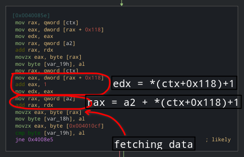

Looks like a2 is indeed an address. We can see that value is being fetched from it at an offeset. This happens when the bytecode for the vm is stored in the program itself in a global variable. Here a fixed address is being passed so let's check what's at that address.

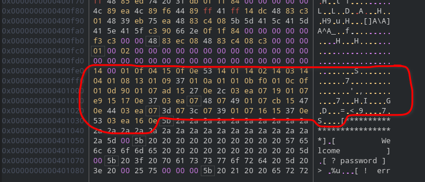

Size of this array is 16*5 + 5 = 85 bytes which is 0x55 in hex. Remember this is the third argument to dispatcher and also used in loop condition. This means this is our bytecode and a3 is the size of this bytecode. It's completely normal if you didn't get it in first glance (even I didn't get it but I feel experienced individuals will see it instantly!)

This might be a good time to start making our disassembler!

## Writing A Disassembler

This is the most important and interesting part of reversing a vm challenge. A part where I never reached before watching that video. You can write your disassembler in any language. I'll be using C++ here as that's what I'm most comfortable with.

```cpp
#include <iostream>
#include <cstdint>

// store bytecode as global array
uint8_t bytecode[] = {
    0x14,0x00,0x01,0x0f,0x04,0x15,0x0f,0x0e,0x53,0x14,0x01,
    0x14,0x02,0x14,0x03,0x14,0x04,0x01,0x08,0x13,0x01,0x09,
    0x37,0x01,0x0a,0x01,0x01,0x0b,0xf0,0x01,0x0c,0x0f,0x01,
    0x0d,0x90,0x01,0x07,0xad,0x15,0x27,0x0e,0x2c,0x03,0xea,
    0x07,0x19,0x01,0x07,0xe9,0x15,0x17,0x0e,0x37,0x03,0xea,
    0x07,0x48,0x07,0x49,0x01,0x07,0xcb,0x15,0x47,0x0e,0x44,
    0x03,0xea,0x07,0x3d,0x07,0x3c,0x07,0x39,0x01,0x07,0x16,
    0x15,0x37,0x0e,0x53,0x03,0xea,0x16,0x0e
};

int main(){
    // print size of bytecode
    std::cout << "Size of bytecode : " << sizeof(bytecode) << std::endl;
    
    .
    .
    .
    // other code
}
```

Let's also create a context struct which will hold program related information. For now it'll contain 16 registers (idk exact count yet, this might change in future) and a separate program counter. No need to add any extra fields that we won't be using yet. We'll modify this struct as we go. I'll assume that you're comfortable to do this in the language you're using.

```cpp
struct context{
    uint8_t registers[16];
    uint32_t program_counter = 0;
};
```

Now that we know the usage of all the arguments, we shoud start following each node one by one. First let's also create a dispatcher function and create that loop that we found near the first node of dispatcher function.

```
uint8_t bytecode = {
  .
  .
  .
}

void dispatch(context& ctx){
    ctx.program_counter = 0;
    while(ctx.program_counter < sizeof(bytecode)){
        // dispatchers
    }
}

int main(){
  .
  .
  .
}
```

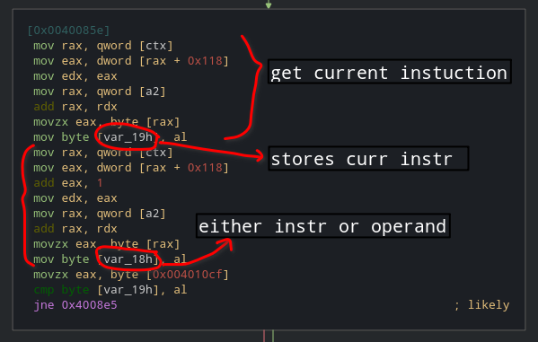

In the end it's comparing current instruction with value at some address. Let's what's at that address.

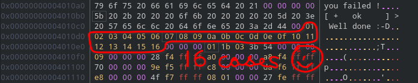

Why I selected only 16 bytes of data? Check how many similar conditional jumps are there. You'll notice only 16 such jumps are present! And logic implies this must be the total number of instructions and also we got all the opcodes! This is just a trickery to make it hard to reverse, but we are smart XD.

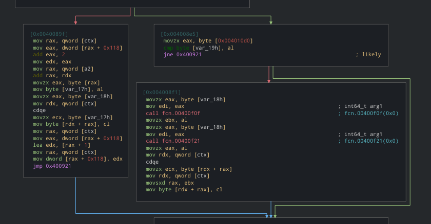

This type of graph occurs with a code flow like this

```
if(condition1){
    ...
}else{
    if(condition2){ 
        ...
    }
}

// all edges join to end node here
```

Similar you'll see 2 more node sets like this below this one. Let's reverse this set first.

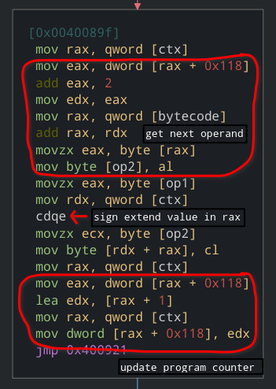

This one looks like it's moving op2 into *(ctx+op1). This bevaiour looks similar to a mov instruction : `mov <reg> <const>`. Let's check other node.

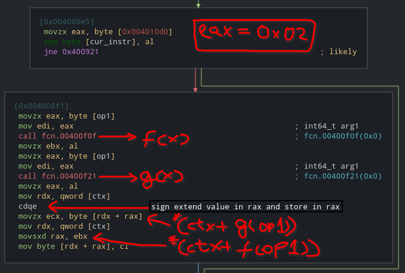

Let's analyze these two functions.

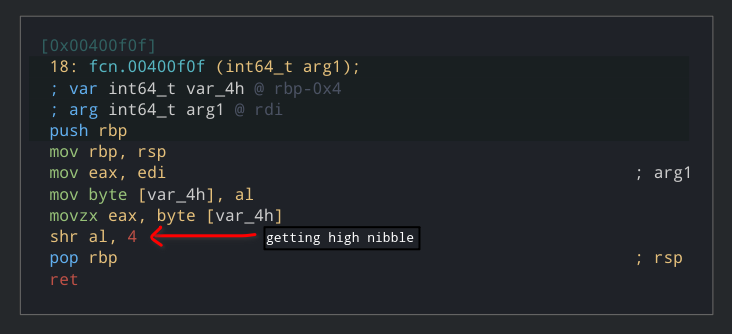

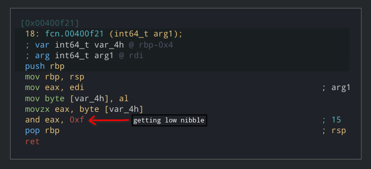

We'll also rename these functions accordingly. We noticed that values returned by these functions is used as an offset in ctx array. This means that each nibble here represents as a register and this is also a mov instruction. This node is moving value from one register to another. This also means that maximum number of registers are 16 and program counter is separate from those registers. This is a huge coincidence!

Here is how this will look in C++ 

```cpp
// other code
...

void dispatch(context& ctx){
    ctx.program_counter = 0;
    while(ctx.program_counter < sizeof(bytecode)){
        uint8_t current_instruction = bytecode + ctx.program_counter;

        if(current_instruction == 0x01){
            // mov instruction constant to register
            int32_t r1 = bytecode + ctx.program_counter + 1; // register to place op2 into
            int32_t op2 = bytecode + ctx.program_counter + 2; // value to be placed
            context.registers[r1] = op2; // mov
            context.program_counter += 1;
        }else{
            if(current_instruction == 0x02){
                // move value from one register to another
                int32_t op1 = bytecode + ctx.program_counter + 1;
                int32_t r1 = op1 & 0x0f;
                int32_t r2 = op1 >> 4;
                context.registers[r2] = context.registers[r1];
            }
        }

// other code
...
```

This wraps up mov instructions.

Set of another if-elseif-else statements

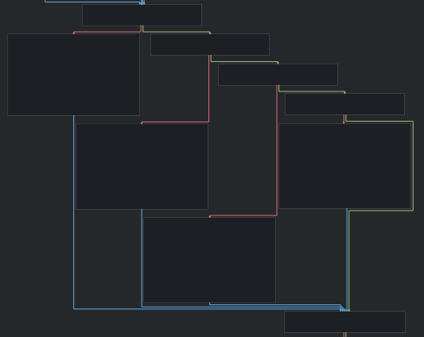

This one decodes to

```cpp
// other code
...
        if(current_instruction == 0x03){
            // add values in two instructions
            int32_t r1 = op1 & 0x0f;
            int32_t r2 = op1 >> 4;
            context.registers[r2] += context.registers[r1];
        }else{
            if(current_instruction == 0x04){
                int32_t r1 = op1 & 0x0f;
                int32_t r2 = op1 >> 4;
                context.registers[r2] -= context.registers[r1];
            }else{
                if(current_instruction == 0x05){
                    int32_t r1 = op1 & 0x0f;
                    int32_t r2 = op1 >> 4;
                    context.registers[r2] *= context.registers[r1];
                }else{
                    if(current_instruction == 0x06){
                        int32_t r1 = op1 & 0x0f;
                        int32_t r2 = op1 >> 4;
                        context.registers[r2] /= context.registers[r1];
                    }
                }
            }
        }
```

I trust you can reverse this part easily. You must spend some time to analyze this if you're doing this for the first time. This set was for arithmetic operations. Let's jump to next set.

I feel like I need to explain this if you're new to reversing.

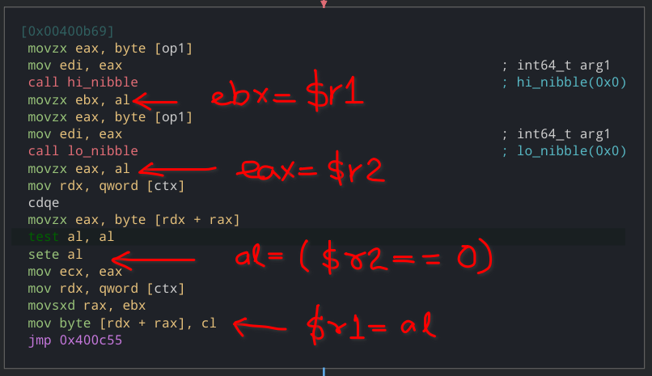

This will check if first register is 0 or not, if it's 0 then it'll set second register to 1, otherwise 0.

So, this set decodes to

```cpp
// other code
...

        if(current_instruction == 0x07){
            int32_t r1 = op1 & 0x0f;
            int32_t r2 = op1 >> 4;
            context.registers[r2] ^= context.registers[r1];
        }else{
            if(current_instruction == 0x08){
                int32_t r1 = op1 & 0x0f;
                int32_t r2 = op1 >> 4;
                context.registers[r2] |= context.registers[r1];
            }else{
                if(current_instruction == 0x09){
                    int32_t r1 = op1 & 0x0f;
                    int32_t r2 = op1 >> 4;
                    context.registers[r2] &= context.registers[r1];
                }else{
                    if(current_instruction == 0x0a){
                        int32_t r1 = op1 & 0x0f;
                        int32_t r2 = op1 >> 4;
                        // mind order of registers here
                        context.registers[r1] = context.registers[r2] == 0;
                    }else{
                        if(current_instruction == 0x0b){
                            int32_t r1 = op1 & 0x0f;
                            int32_t r2 = op1 >> 4;
                            context.registers[r2] = context.registers[r2] << context.registers[r1];
                        }else{
                            if(current_instruction == 0x0c){
                                int32_t r1 = op1 & 0x0f;
                                int32_t r2 = op1 >> 4;
                                context.registers[r2] = context.registers[r2] >> context.registers[r1];
                            }
                        }
                    }
                }
            }
        }


        
// other code
...
```

This one was for bitwise logical operations.

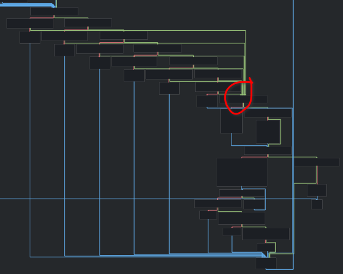

Decompilation to that red circle looks like this

```cpp
 // other code
 ...
 
        if(current_instruction == 0x0d){
            if(ctx.registers[15] != 0){
                ctx.program_counter = op1 - 2;
            }
        }else{
            if(current_instruction == 0x0e){
                if(ctx.registers[15] != 0){
                    ctx.program_counter = op1 - 2;
                }
            }else{
                if(current_instruction == 0x0f){
                    if(ctx.r16 != 0){
                        ctx.program_counter = op1 - 2;
                    }
                }else{
                    if(current_instruction == 0x10){
                        if(ctx.r16 != 0){
                            ctx.program_counter = op1 -2;
                        }
                    }else{
                        if(current_instruction == 0x11){
                            if(ctx.r17 != 0){
                                ctx.program_counter = op1 - 2;
                            }
                        }else{
                            if(current_instruction == 0x12){
                                if(ctx.r17 != 0){
                                    ctx.program_counter = op2 - 2;
                                }else{
                                    if(current_instruction == 0x13){
                                        // continue
                                        ...
                                    }
                                }
                            }
                        }
                    }
                }
            }
        }
        
 // other code
 ...
```

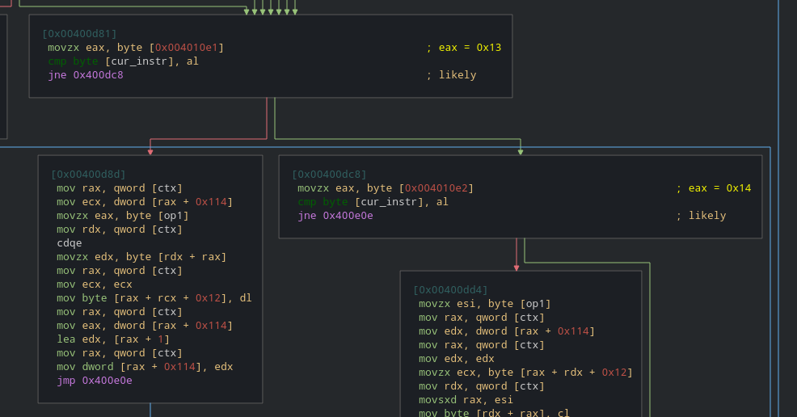

I'll add some new fields to the context struct in order to understand this. This doesn't mean we understand the meaining of those fields. This part is a bit tricky.

```cpp
struct context{
    uint8_t registers[16];
    uint8_t r16, r17;
    int8_t arr[0x100]; // ctx + 0x12
    unsigned short dummy; // because there is a 2 byte gap
    uint32_t var114;
    int32_t program_counter = 0;
};
```

This is how our context struct looks like now.

```cpp
        if(current_instruction == 0x0d){
            if(ctx.registers[15] != 0){
                ctx.program_counter = op1 - 2;
            }
        }else{
            if(current_instruction == 0x0e){
                if(ctx.registers[15] != 0){
                    ctx.program_counter = op1 - 2;
                }
            }else{
                if(current_instruction == 0x0f){
                    if(ctx.r16 != 0){
                        ctx.program_counter = op1 - 2;
                    }
                }else{
                    if(current_instruction == 0x10){
                        if(ctx.r16 != 0){
                            ctx.program_counter = op1 -2;
                        }
                    }else{
                        if(current_instruction == 0x11){
                            if(ctx.r17 != 0){
                                ctx.program_counter = op1 - 2;
                            }
                        }else{
                            if(current_instruction == 0x12){
                                if(ctx.r17 != 0){
                                    ctx.program_counter = op2 - 2;
                                }else{
                                    if(current_instruction == 0x13){
                                        ctx.arr[ctx.var114] = ctx.var114;
                                        ctx.var114++;
                                    }else{
                                        if(current_instruction == 0x14){
                                            ctx.registers[op1] = ctx.arr[ctx.var114];
                                            ctx.var114--;
                                        }
                                    }


                                    if(current_instruction == 0x15){
                                        uint8_t r1 = op1 & 0x0f;
                                        uint8_t r2 = op2 >> f;

                                        int32_t var15h = ctx.registers[r1];
                                        int32_t var16h = ctx.registers[r2];

                                        // that loop is equivalent to this
                                        ctx.registers[15] = 0;
                                        ctx.r16 = 0;
                                        ctx.r17 = 0;

                                        if(var15h == var_16h){
                                            ctx.registers[15] = 1;
                                        }else{
                                            if(var15h > var16h){
                                                ctx.r17 = 1;
                                            }else{
                                                ctx.r16 = 1;
                                            }
                                        }
                                    }else{
                                        if(current_instruction != 0x16){ // early exit in program
                                            return ctx.registers[op1];
                                        }
                                    }
                                }
                            }
                        }
                    }
                }
            }
        }
```

Now, the only thing that remains is to understand all this code and replace them with print statements.

To sync with you, here is the full code listing

```cpp
#include <iostream>
#include <cstdint>

// there might be some errors
// I havent checked the code yet.

uint8_t bytecode[] = {
    0x14,0x00,0x01,0x0f,0x04,0x15,0x0f,0x0e,0x53,0x14,0x01,
    0x14,0x02,0x14,0x03,0x14,0x04,0x01,0x08,0x13,0x01,0x09,
    0x37,0x01,0x0a,0x01,0x01,0x0b,0xf0,0x01,0x0c,0x0f,0x01,
    0x0d,0x90,0x01,0x07,0xad,0x15,0x27,0x0e,0x2c,0x03,0xea,
    0x07,0x19,0x01,0x07,0xe9,0x15,0x17,0x0e,0x37,0x03,0xea,
    0x07,0x48,0x07,0x49,0x01,0x07,0xcb,0x15,0x47,0x0e,0x44,
    0x03,0xea,0x07,0x3d,0x07,0x3c,0x07,0x39,0x01,0x07,0x16,
    0x15,0x37,0x0e,0x53,0x03,0xea,0x16,0x0e
};

struct context{
    int8_t registers[16];
    uint8_t r16, r17;
    int8_t arr[0x100]; // ctx + 0x12
    uint8_t var114;
    int32_t program_counter = 0;
};

void dispatch(context& ctx){
    ctx.program_counter = 0;
    while(ctx.program_counter < sizeof(bytecode)){
        uint8_t current_instruction = bytecode[ctx.program_counter];
        int32_t op1 = bytecode[ctx.program_counter + 1];

        if(current_instruction == 0x01){
            // mov instruction constant to register
            int32_t r1 = bytecode[ctx.program_counter + 1]; // register to place op2 into
            int32_t op2 = bytecode[ctx.program_counter + 2]; // value to be placed
            ctx.registers[r1] = op2; // movstruction sign-extends a DWORD (3
            ctx.program_counter += 1;
        }else{
            if(current_instruction == 0x02){
                // move value from one register to another
                int32_t r1 = op1 & 0x0f;
                int32_t r2 = op1 >> 4;
                ctx.registers[r1] = ctx.registers[r2];
            }
        }


        if(current_instruction == 0x03){
            // add values in two instructions
            int32_t r1 = op1 & 0x0f;
            int32_t r2 = op1 >> 4;
            context.registers[r2] += context.registers[r1];
        }else{
            if(current_instruction == 0x04){
                int32_t r1 = op1 & 0x0f;
                int32_t r2 = op1 >> 4;
                ctx.registers[r2] -= context.registers[r1];
            }else{
                if(current_instruction == 0x05){
                    int32_t r1 = op1 & 0x0f;
                    int32_t r2 = op1 >> 4;
                    ctx.registers[r2] *= ctx.registers[r1];
                }else{
                    if(current_instruction == 0x06){
                        int32_t r1 = op1 & 0x0f;
                        int32_t r2 = op1 >> 4;
                        ctx.registers[r2] /= ctx.registers[r1];
                    }
                }
            }
        }

        if(current_instruction == 0x07){
            int32_t r1 = op1 & 0x0f;
            int32_t r2 = op1 >> 4;
            ctx.registers[r2] ^= ctx.registers[r1];
        }else{
            if(current_instruction == 0x08){
                int32_t r1 = op1 & 0x0f;
                int32_t r2 = op1 >> 4;
                ctx.registers[r2] |= ctx.registers[r1];
            }else{
                if(current_instruction == 0x09){
                    int32_t r1 = op1 & 0x0f;
                    int32_t r2 = op1 >> 4;
                    ctx.registers[r2] &= ctx.registers[r1];
                }else{
                    if(current_instruction == 0x0a){
                        int32_t r1 = op1 & 0x0f;
                        int32_t r2 = op1 >> 4;
                        // mind order of registers heremind order of registers here
                        ctx.registers[r1] = ctx.registers[r2] == 0;
                    }else{
                        if(current_instruction == 0x0b){
                            int32_t r1 = op1 & 0x0f;
                            int32_t r2 = op1 >> 4;
                            ctx.registers[r2] = ctx.registers[r2] << context.registers[r1];
                        }else{
                            if(current_instruction == 0x0c){
                                int32_t r1 = op1 & 0x0f;
                                int32_t r2 = op1 >> 4;
                                ctx.registers[r2] = ctx.registers[r2] >> context.registers[r1];
                            }
                        }
                    }
                }
            }
        }

        if(current_instruction == 0x0d){
            if(ctx.registers[15] != 0){
                ctx.program_counter = op1 - 2;
            }
        }else{
            if(current_instruction == 0x0e){
                if(ctx.registers[15] != 0){
                    ctx.program_counter = op1 - 2;
                }
            }else{
                if(current_instruction == 0x0f){
                    if(ctx.r16 != 0){
                        ctx.program_counter = op1 - 2;
                    }
                }else{
                    if(current_instruction == 0x10){
                        if(ctx.r16 != 0){
                            ctx.program_counter = op1 -2;
                        }
                    }else{
                        if(current_instruction == 0x11){
                            if(ctx.r17 != 0){
                                ctx.program_counter = op1 - 2;
                            }
                        }else{
                            if(current_instruction == 0x12){
                                if(ctx.r17 != 0){
                                }else{
                                    if(current_instruction == 0x13){
                                        ctx.arr[ctx.var114] = ctx.var114;
                                        ctx.var114++;
                                    }else{
                                        if(current_instruction == 0x14){
                                            ctx.registers[op1] = ctx.arr[ctx.var114];
                                            ctx.var114--;
                                        }
                                    }


                                    if(current_instruction == 0x15){
                                        uint8_t r1 = op1 & 0x0f;
                                        uint8_t r2 = op2 >> f;

                                        int32_t var15h = ctx.registers[r1];
                                        int32_t var16h = ctx.registers[r2];

                                        // that loop is equivalent to this
                                        ctx.registers[15] = 0;
                                        ctx.r16 = 0;
                                        ctx.r17 = 0;

                                        if(var15h == var_16h){
                                            ctx.registers[15] = 1;
                                        }else{
                                            if(var15h > var16h){
                                                ctx.r17 = 1;
                                            }else{
                                                ctx.r16 = 1;
                                            }
                                        }
                                    }else{
                                        if(current_instruction != 0x16){ // early exit in program
                                            return ctx.registers[op1];
                                        }
                                    }
                                }
                            }
                        }
                    }
                }
            }
        }


        // increase program counter
        ctx.program_counter += 2;
    }
}

int main(){
    std::string password;
    std::cout << "size of bytecode : " << sizeof(bytecode) << std::endl;
    std::cout << "enter password : " << std::endl;
    std::cin >> password;
}
```

I'll end this post here and leave the part after this as a H/W and I hope this post helped you in understanding how to reverse VM CrackMes. I could have solved it completely but I want you to feel that you actually solved the challenge. Your next steps must be to check how the input is being used and when will the program print success. Once you cover those two and generate the disassembly, you can solve this crackme in one fell swoop.

Edit : There is a mistake in the context struct. Total number of registers must be 15 instead of 16 and create another variable as r15 in place of that extra array element. This will resolve the messy decompiled code in the end.

> The best things that capture your imagination are ones you hadn't thought of before and that aren't talked about in the news all the time. 
>
> \- Steve Wozniak

<blockquote class="twitter-tweet"><p lang="en" dir="ltr">New post!! 😋😋<br><br>Solving a VM CrackMe <a href="https://t.co/0IkHDWxvx2">https://t.co/0IkHDWxvx2</a></p>&mdash; Siddharth Mishra (@brightprogramer) <a href="https://twitter.com/brightprogramer/status/1474820700393246720?ref_src=twsrc%5Etfw">December 25, 2021</a></blockquote> <script async src="https://platform.twitter.com/widgets.js" charset="utf-8"></script>