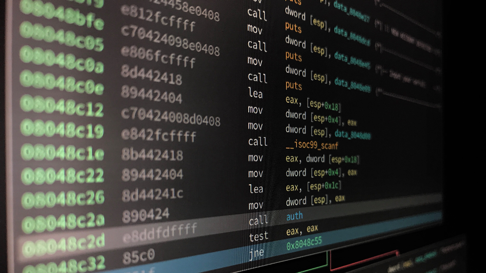

In this post, I will write about how I solved my very first crackme.



Tools you will need are : 

* A Linux terminal
* [This](crackmes.one/crackme/60f31f1d33c5d42814fb3381) crackme
* [Ghidra](https://ghidra-sre.org/)

If you are on Windows you can use cygwin or some other emulator. If you can understand what is being done in Linux, and you can translate that in Windows then you are good to go ;-).

We begin by downloading the crackme. Before opening any crackme, I recommend you to scan the file for viruses on [Virus Total](https://www.virustotal.com/gui/home/upload). Even though all crackmes are checked for malwares before being accepted, it never hurts to stay cautious. Sometimes Virus Total gives false positives too, so make sure to check whether the executable is packed or not before executing it because sometimes packed executables are detected as malwares by some AV softwares. I'm telling you this ***becuase this happened with me***, while I was solving my third crackme!

After downloading, checking for malwares, extracting blah blah... we try to run the executable and try to understand what we have to do.

If somehow your system isn't treating this as an executable, you can confirm that by using the `file` tool. You may or may not have this tool already installed on your pc so make sure to install it.

```shell
➜  forest-crackme file forest
forest: ELF 64-bit LSB pie executable, x86-64, version 1 (SYSV), dynamically linked, interpreter /lib64/ld-linux-x86-64.so.2, BuildID[sha1]=3cec36018b4f8638a3f4c1156b074988c0227980, for GNU/Linux 4.4.0, not stripped
➜  forest-crackme 
```

As you can see that it is an `ELF 64-bit executable`.

Now we need to give it permission to execute and for that we will do `chmod +x forest` and then execute the executable : 

```shell
➜  forest-crackme ./forest
The forest is dark and dangerous. Be careful!
Please enter the flag:idonthaveone
The forest is unforgiving.
Flag not correct.%                                                                                                                                             
➜  forest-crackme 
```

So, on executing, the program asks us to enter a flag. Since I don't know it now, I will enter anything that comes in my mind 😝. Ok, so ususally the next step is to check the strings in this executable. From this you can get more information like what libraries / functions this program uses, is it a packed executable or not etc. etc...

```shell
➜  forest-crackme strings forest
/lib64/ld-linux-x86-64.so.2
_ITM_deregisterTMCloneTable
__gmon_start__
_ITM_registerTMCloneTable
sqrt
__isoc99_scanf
puts
__stack_chk_fail
printf
__cxa_finalize
__libc_start_main
libm.so.6
libc.so.6
GLIBC_2.2.5
GLIBC_2.7
GLIBC_2.4
u3UH
[]A\A]A^A_
The forest is dark and dangerous. Be careful!
You escaped the forest.
Flag is correct.
The forest is unforgiving.
Flag not correct.
Please enter the flag:
%13s
;*3$"
GCC: (GNU) 11.1.0
abi-note.c
__abi_tag
init.c
forest.c
crtstuff.c
deregister_tm_clones
__do_global_dtors_aux
completed.0
__do_global_dtors_aux_fini_array_entry
frame_dummy
__frame_dummy_init_array_entry
__FRAME_END__
__init_array_end
_DYNAMIC
__init_array_start
__GNU_EH_FRAME_HDR
_GLOBAL_OFFSET_TABLE_
__libc_csu_fini
_ITM_deregisterTMCloneTable
puts@GLIBC_2.2.5
_edata
__stack_chk_fail@GLIBC_2.4
printf@GLIBC_2.2.5
__libc_start_main@GLIBC_2.2.5
__data_start
__gmon_start__
__dso_handle
_IO_stdin_used
__libc_csu_init
__bss_start
main
__isoc99_scanf@GLIBC_2.7
__TMC_END__
_ITM_registerTMCloneTable
sqrt@GLIBC_2.2.5
__cxa_finalize@GLIBC_2.2.5
.symtab
.strtab
.shstrtab
.interp
.note.gnu.property
.note.gnu.build-id
.note.ABI-tag
.gnu.hash
.dynsym
.dynstr
.gnu.version
.gnu.version_r
.rela.dyn
.rela.plt
.init
.text
.fini
.rodata
.eh_frame_hdr
.eh_frame
.init_array
.fini_array
.dynamic
.got
.got.plt
.data
.bss
.comment
➜  forest-crackme 
```

Most of the strings in this dump are useless and finding useful string is often like finding needle in a haystack (i.e if executable is large). We can see some know strings here :   

* The forest is dark and dangerous. Be careful!
* You escaped the forest.
* Flag is correct.
* The forest is unforgiving.
* Flag not correct.
* Please enter the flag:
* puts@GLIBC_2.2.5
* printf@GLIBC_2.2.5
* sqrt
* puts
* printf
* sqrt@GLIBC_2.2.5  

We can see that the program is using functions `sqrt`, `puts` and `printf`. Strings starting with a `.` represent a section in assembly, like for eg : `.rodata` means *read only data* section and `.text` is where our functions are stored. So, after taking a look at the strings above, it is clear that there is nothing important in here.

The next step is to disassemble / decompile the program and try to understand what it's doing. I will use Ghidra for that but you can use other tools too if you like. Some people also use debuggers to solve these types of crackmes. Ghidra is an awesome tool writen by the **NSA** that can both disassemble and ***decompile*** your code.

If haven't installed Ghidra yet, please google your way to install it. Fire up Ghidra, create a new project and hit `I` on your keyboard to import an executable. Navigate your way to the `forest` executable and select it. Ghidra will do some analysis now and you can just skip those steps as at this stage even I don't pay much attention to those.\
Next you will see a window labled `Listing: forest` with some elvish written in it. Just kidding 😜, that's your disassembled code! Try to hit a few buttons and menus for a file, explore the interface a bit


Next, search for `.text` in the upper left window named `Program Trees` because that is where we will find our `main`. Why are we looking for `main`, well that's because all C/C++ programs must have it! and that is the entry point for every C/C++ program and that is where you will always want to start reversing.\
Navigating to that section, you will instantly see disassembly of `main` pop up in the `Listing` window. If you are still not able to find this, then you can navigate to `main` in the window below `Program Trees` window named `Sybmol Tree`. You will find `main` in `Functions` label.


Next click on the `Listing: forest` window and you will see a C-style code pop up in window next to that (i.e `Decompile: main - (forest)`).  


We will copy this code from `Decompile` window in another text file and try to analyze that.

```c
undefined8 main(void)

{
  long in_FS_OFFSET;
  double dVar1;
  char local_1e;
  char local_1d;
  char local_1c;
  char local_1b;
  char local_1a;
  char local_19;
  char local_18;
  char local_17;
  char local_16;
  char local_15;
  char local_14;
  char local_13;
  char local_12;
  long local_10;
  
  local_10 = *(long *)(in_FS_OFFSET + 0x28);
  puts("The forest is dark and dangerous. Be careful!");
  printf("Please enter the flag:");
  __isoc99_scanf(&DAT_001020ac,&local_1e);
  if (((((local_1e == 'r') && (local_1d % '\n' == '\x01')) &&
       (dVar1 = sqrt((double)(int)local_1c), dVar1 * 5.0 == 50.0)) &&
      ((((byte)(local_1b - 1U) < 0x72 && (local_1a == 'i')) &&
       ((local_19 == 'd' && ((local_18 == 'i' && (local_17 == 'n')))))))) &&
     ((local_16 == 'g' &&
      ((((local_15 == 'h' && (local_14 == 'o')) && (local_13 == 'o')) && (local_12 == 'd')))))) {
    printf("You escaped the forest.\nFlag is correct.");
  }
  else {
    printf("The forest is unforgiving.\nFlag not correct.");
  }
  if (local_10 != *(long *)(in_FS_OFFSET + 0x28)) {
                    /* WARNING: Subroutine does not return */
    __stack_chk_fail();
  }
  return 0;
}
```

Notice that the behaviour of this program is similar to what that `forest` executable did. First print the string `The forest is dark and dangerous. Be careful!` using the `puts` and then it uses `printf` to print the string `Please enter the flag:` after which we enter our flag.   

We can close Ghidra now as we needed the decompiled code only. Why? because we see that all the functionalities of our program is defined in `main` and no other user-defined function is called in `main` so this means we just need to reverse `main`. Let's try to analyze the program further.\
Notice that after printing those strings, program asks for an input using `scanf`(or more precisely `__isoc99_scanf`). Then some randome variables are being compared with some characters and some functions are used. At this moement it really looks elvish 🙃 .   

Notice this part of code : 

```c
  long in_FS_OFFSET;
  double dVar1;
  char local_1e;
  char local_1d;
  char local_1c;
  char local_1b;
  char local_1a;
  char local_19;
  char local_18;
  char local_17;
  char local_16;
  char local_15;
  char local_14;
  char local_13;
  char local_12;
  long local_10;
```

Did you notice anything odd?\
The suffix in variable names is decreasing by 1 as we go down from `local_1e` to `local_12`. In assembly when you have to allocate variables, you just allocate them all at once by subtracting the total required memory from the stack pointer(`esp`). All this memory is allocated like an array and when decompilers deduce the variables, they name them accordingly, for eg : `local_10` is `long` which is of 2 bytes, so you see an increase of 2 from `local_10` to `local_12`. It is safe to assume from here that there is a string stored in the array from `local_1e` to `local_12` because our program took a string as input which is basically an array of characters which is what we see here and this is what is being compared in that huge elvish `if` statement.  Also, in the `__isoc99_scanf` call, you see that address of `local_1e` is passed and from this we confirm our suspicion that we just encountered the whole string stored in the form of separate `char` variables.

If you understood this part, then let's try to deduce the values of each element in the string by looking at the if statement  

```c
str[0]  = 'r';
str[1]  = ??; // something, we have to apply some more brain here
str[2]  = ??;
str[3]  = ??;
str[4]  = 'i';
str[5]  = 'd';
str[6]  = 'i';
str[7]  = 'n';
str[8]  = 'g';
str[8]  = 'h';
str[10] = 'o';
str[11] = 'o';
str[12] = 'd';
```

- - -

***For deducing value of str\[1]***\
We know that `'\n'` in decimal is 10, so we are effectively checking for `str[1] % 10 == 1`. This means that str\[1] must be of the form `char(10*r + 1)`, so the possible values are `char(1)` to `char(121)`(i.e `char(1)`, `char(11)`, `char(21)` and so on...)  

```c
int main(){
    for(uint8_t i=0; i < 128; i++){
        if(i%10==1)
            printf("%c ", i);
    }
}
```

Execute this code to get list of possible values that `str[1]` can hold and we get :  `) 3 = G Q [ e o y`. (There can be more values, because I copy pasted the output).\
So value for str\[1] can be any of those characters.

- - -

***For deducing value of str\[2]***\
Here we see the following equations 
$$dVar1 * 5.0 = 50.0 \rightarrow dVar1 = 10.0$$
$$dVar1 = \sqrt(str\[2]) \rightarrow str\[2] = (dVar1)^2 \rightarrow str\[2] = 100$$\
So, we get `str[2] = 100` which in ASCII is the alphabet `d` (yes, I'm taking reference from [ASCII chart](https://en.cppreference.com/w/cpp/language/ASCII)).   

***For deducing value of str\[3]***
So up intil now we have our string : `r_d_idinghood`, where `_` means we are missing something there.\
If we try to solve for `str[3]`, we will have to bruteforce it because for `str[3]` we have the mathematical inequality\
$$str\[3] - 1 < 114 \rightarrow str\[3] < 115$$
ASCII value for 115 is `s`. So all ASCII characters that come before `s` will be accepted as place holder for str\[3].

Let's try that :    

```shell
➜  forest-crackme ./forest
The forest is dark and dangerous. Be careful!
Please enter the flag:r3doidinghood
You escaped the forest.
Flag is correct.%                                                                                                                               
➜  forest-crackme 
```

Again :    

```shell
➜  forest-crackme ./forest
The forest is dark and dangerous. Be careful!
Please enter the flag:r=daidinghood
You escaped the forest.
Flag is correct.%                                                                                                                               
➜  forest-crackme 
```

So, we have multiple passwords, so let's make a program to check for all possible values : 

```c++
#include <string>
#include <memory>
#include <cstdio>
#include <array>
#include <cstring>
#include <iostream>

int main(int argc, char** argv){


        if(argc != 2){
                fprintf(stderr, "usage : bruteforce command\n");
                exit(-1);
        }

        // get command to be executed
        const char* cmd = argv[1];

        printf("beginning to bruteforce \"%s\"\n\n", cmd);

        // get possible values for str[1]
        std::string str1 = ""; // initialize as empty so that we can append values to it
        for(char i=0; i < 127; i++){
        if(i%10==1)
                        str1.append(1, i);
    }

        // this is the password we get
        // 1 and 2 are place holders
        std::string passwd = "r1d3idinghood";


        for(uint i = 0; i < str1.size(); i++){
                for(uint j = 0; j < 114; j++){
                        // substitue placeholder values with possible ones
                        passwd[1] = str1[i];
                        passwd[3] = char(j);

                        printf("trying password : \"%s\"\n", passwd.c_str());

                        // test it out
                        std::array<char, 256> buffer;
                        std::string result;
                        std::unique_ptr<FILE, decltype(&pclose)> proc_ptr(popen(cmd, "w"), pclose);
                        if(!proc_ptr){
                                fprintf(stderr, "failed to open executable \"%s\"\n", cmd);
                                exit(-1);
                        }

                        // write the password
                        if(fwrite(passwd.c_str(), 1, passwd.size(), proc_ptr.get()) != passwd.size()){
                                fprintf(stderr, "failed to give input to child process \"%s\"", cmd);
                                exit(-1);
                        }

                        printf("\n\n");
                }
        }
}
```

On running this, you will see that all passwords are accepted.
So let's make a dump of all these passwords and complete solving the crackme.

```c++
#include <string>
#include <cstdio>
int main(){
	// get possible values for str[1]
	std::string str1 = ""; // initialize as empty so that we can append values to it
	for(char i=0; i < 127; i++){
        if(i%10==1)
			str1.append(1, i);
    }

	// this is the password we get
	// 1 and 3 are place holders
	std::string passwd = "r1d3idinghood";

	// create dump file
	FILE* passwd_dump = fopen("passwd_dump.txt", "w");
	
	for(uint i = 0; i < str1.size(); i++){
		for(uint j = 0; j < 114; j++){
			// substitue placeholder values with possible ones
			passwd[1] = str1[i];
			passwd[3] = char(j);

			fprintf(passwd_dump, "%s\n", passwd.c_str());
		}
	}	

	// close file
	fclose(passwd_dump);
}
```

<iframe src="https://pastebin.com/embed_iframe/xY31vYSi?theme=dark" style="border:none;width:100%"></iframe>

[Here](https://pastebin.com/xY31vYSi) is the generated file. Note that there are some broken passwords and that is because of some non `printf` friendly characters.

Yay!, we just solved our first crackme! It was fun!

If you didn't understand any part of this blog, then you can contact me on telegram/instagram!    

See you next post 😇

> ***'"It's Impossible." said Pride. "It's Risky." said Experience. "It's Pointless." said Reason. If you really are a Hacker! then give it a try'*** - anonymous