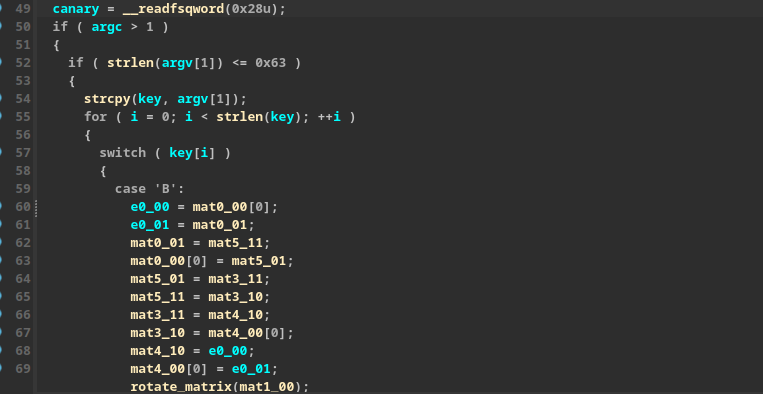
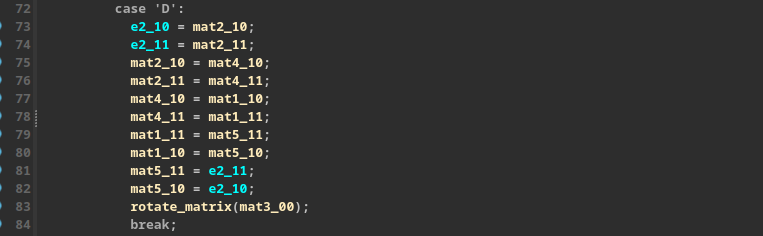
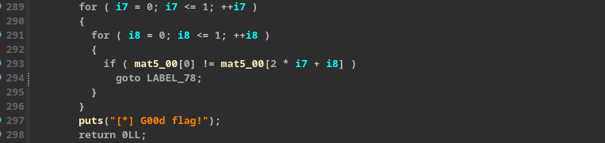
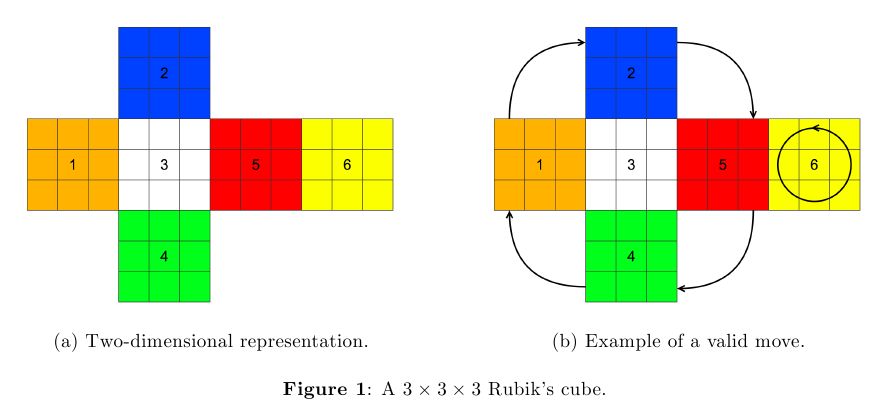
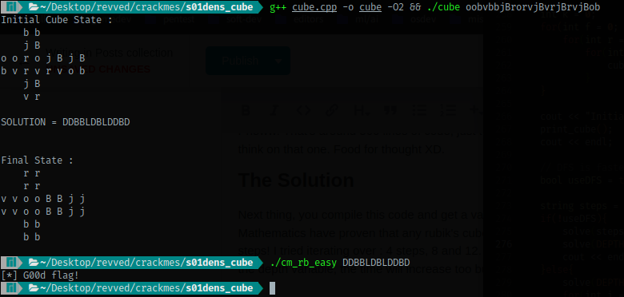

This crackme is less about actual reverse engineering and more on the programming side. You must have some decent knowledge of computer science and algorithms to solve this. Figuring out what the crackme is actually asking was a lot easier than convincing myself to actually solve it after that! I spent almost three days to solve this one. I figured out what I have to do on the second day of starting but I'm kinda lazy so I spent the rest of day looking for easier solutions (this crackme has kinda different solution).

## Reversing

You can get the crackme from [here](https://crackmes.one/crackme/62d08a7a33c5d44a934e97bb). There's nothing much to do in reversing. First look, with so many switch cases, I thought this might be a VM, but no, it's not! 



The eye opening point was when I reversed that `rotate_matrix` function. Reversing that function gave me some idea that this program might be using matrices to encrypt/decrypt given key. I tried googling for some things related but got no good results. Since at this point I know that matrices are being used I did an xref to see where is the data it's manipulating. I saw a 24 byte contiguous ASCII string. From the `reverse_matrix` function I know that the matrices are of 2x2 size. So I know there had to be 6 matrices in total there. I renamed those bytes to `matx_yz`. Where x is the matrix index and yz are indices of element inside that matrix. This helped me understand the code more as you can see in the image above. That was all for first day!

The next day I woke up and suddenly this idea popped into my head that it might be a cube that it's trying to solve. Each face of that cube must be a 2x2 matrix. A cube has 6 faces. Now this sounds very much like a Rubik's cube. My suspicions were confirmed when I scrolled down to the decompiled code to see that it's actually checking whether all the six faces have same color (characters). I now knew what I had to do. So I tried searching for github projects that solve 2x2 matrices. Tried a few but they were either too slow or too complex to understand (mostly they were too slow!). This happened mostly because I wasn't able to figure out how the layout of the cube was in 3D. I am provided with a flat 1D array of string and I have to wrap it around a cube. If I place faces in wrong order, the cube will never have a solution, or might give wrong solutions. Day two passed like this.





Third day (today) I decide to write a solver on my own. So I started searching how we can approach this problem of solving a Rubik's cube. It's quite interesting! Turns out you can apply the concept of graphs and use graph searching algorithms to solve an NxN rubik's cube. Each state of a cube can be thought of as a node in the whole graph and each operation that you do on the cube takes you from one node to another. The cube will be considered solved when you reach a node in which all the six faces of cube contain same character. Also, that face ordering problem in 2nd day was solved by this [site](https://neos-guide.org/case-studies/pag/rubiks-cube/).



I used this ordering to wrap the 1D string around my 3D cube.

## Writing A Rubik's Cube Solver

There are two ways in which you can do a search on a graph.

* [Breadth-First Search](https://www.youtube.com/watch?v=pcKY4hjDrxk)
* [Depth-First Search](https://www.youtube.com/watch?v=pcKY4hjDrxk)

I implemented both. Turns out that Depth-First Search is way faster than Breadth-First Search in this case. BFS takes around 40 minutes to get the answer on my system (i3 7th gen with 120G SSD) and DFS takes around 5 seconds.

### Basic Utilities

First we need a function to show us current state of our rubik's cube.

```cpp
enum Colors {ORANGE = 0, BLUE = 1, WHITE = 2, GREEN = 3, RED = 4, YELLOW = 5};

void print_cube(){
    // face 1
    cout << "   " << " " << cube[BLUE][0][0] << " " << cube[BLUE][0][1] << " " << "   " << "\n";
    cout << "   " << " " << cube[BLUE][1][0] << " " << cube[BLUE][1][1] << " " << "   " << "\n";

    // face 0, 2, 4 and 5
    cout << cube[ORANGE][0][0] << " " << cube[ORANGE][0][1] << " ";
    cout << cube[WHITE][0][0] << " " << cube[WHITE][0][1] << " ";
    cout << cube[RED][0][0] << " " << cube[RED][0][1] << " ";
    cout << cube[YELLOW][0][0] << " " << cube[YELLOW][0][1] << " " << "\n";

    cout << cube[ORANGE][1][0] << " " << cube[ORANGE][1][1] << " ";
    cout << cube[WHITE][1][0] << " " << cube[WHITE][1][1] << " ";
    cout << cube[RED][1][0] << " " << cube[RED][1][1] << " ";
    cout << cube[YELLOW][1][0] << " " << cube[YELLOW][1][1] << " " << "\n";

    // face 3
    cout << "   " << " " << cube[GREEN][0][0] << " " << cube[GREEN][0][1] << " " << "   " << "\n";
    cout << "   " << " " << cube[GREEN][1][0] << " " << cube[GREEN][1][1] << " " << "   " << "\n";
}
```

Next we implement the `rotate_matrix` function.

```cpp
void rotate_face(int i){
    int t0 = cube[i][0][0];
    int t1 = cube[i][0][1];
    cube[i][0][0] = cube[i][1][0];
    cube[i][0][1] = t0;
    t0 = cube[i][1][1];
    cube[i][1][1] = t1;
    cube[i][1][0] = t0;
}

```

We also need a function to check whether we reached the destination node or not.

```cpp
bool solved(){
    for(int f = 0; f < 6; f++){
        for(int r = 0; r < 2; r++)
            for(int c = 0; c < 2; c++)
                if(cube[f][r][c] != cube[f][0][0]) return false;
    }

    return true;
}
```

Next task was to implement the operate function that'll perform an operation on cube. 

```cpp
void operate(char op){
    int t0, t1;
    switch(op){
    case 'B':
        t0 = cube[0][0][0];
        t1 = cube[0][0][1];
        cube[0][0][1] = cube[5][1][1];
        cube[0][0][0] = cube[5][0][1];
        cube[5][0][1] = cube[3][1][1];
        cube[5][1][1] = cube[3][1][0];
        cube[3][1][1] = cube[4][1][0];
        cube[3][1][0] = cube[4][0][0];
        cube[4][1][0] = t0;
        cube[4][0][0] = t1;
        rotate_face(1);
        break;
    case 'D':
        t0 = cube[2][1][0];
        t1 = cube[2][1][1];
        cube[2][1][0] = cube[4][1][0];
        cube[2][1][1] = cube[4][1][1];
        cube[4][1][0] = cube[1][1][0];
        cube[4][1][1] = cube[1][1][1];
        cube[1][1][1] = cube[5][1][1];
        cube[1][1][0] = cube[5][1][0];
        cube[5][1][1] = t1;
        cube[5][1][0] = t0;
        rotate_face(3);
        break;
    case 'F':
        t0 = cube[0][1][0];
        t1 = cube[0][1][1];
        cube[0][1][1] = cube[4][0][1];
        cube[0][1][0] = cube[4][1][1];
        cube[4][0][1] = cube[3][0][0];
        cube[4][1][1] = cube[3][0][1];
        cube[3][0][0] = cube[5][1][0];
        cube[3][0][1] = cube[5][0][0];
        cube[5][1][0] = t1;
        cube[5][0][0] = t0;
        rotate_face(2);
        break;
    case 'L':
        t0 = cube[2][0][0];
        t1 = cube[2][1][0];
        cube[2][0][0] = cube[0][0][0];
        cube[2][1][0] = cube[0][1][0];
        cube[0][0][0] = cube[1][1][1];
        cube[0][1][0] = cube[1][0][1];
        cube[1][1][1] = cube[3][0][0];
        cube[1][0][1] = cube[3][1][0];
        cube[3][0][0] = t0;
        cube[3][1][0] = t1;
        rotate_face(4);
        break;
    case 'R':
        t0 = cube[0][0][1];
        t1 = cube[0][1][1];
        cube[0][1][1] = cube[2][1][1];
        cube[0][0][1] = cube[2][0][1];
        cube[2][0][1] = cube[3][0][1];
        cube[2][1][1] = cube[3][1][1];
        cube[3][1][1] = cube[1][0][0];
        cube[3][0][1] = cube[1][1][0];
        cube[1][1][0] = t0;
        cube[1][0][0] = t1;
        rotate_face(5);
        break;
    case 'U':
        t0 = cube[2][0][0];
        t1 = cube[2][0][1];
        cube[2][0][0] = cube[5][0][0];
        cube[2][0][1] = cube[5][0][1];
        cube[5][0][0] = cube[1][0][0];
        cube[5][0][1] = cube[1][0][1];
        cube[1][0][0] = cube[4][0][0];
        cube[1][0][1] = cube[4][0][1];
        cube[4][0][1] = t1;
        cube[4][0][0] = t0;
        rotate_face(0);
        break;
    case 'b':
        for(t0 = 0; t0 < 3; t0++) operate('B');
        break;
    case 'd':
        for(t0 = 0; t0 < 3; t0++) operate('D');
        break;
    case 'f':
        for(t0 = 0; t0 < 3; t0++) operate('F');
        break;
    case 'l':
        for(t0 = 0; t0 < 3; t0++) operate('L');
        break;
    case 'r':
        for(t0 = 0; t0 < 3; t0++) operate('R');
        break;
    case 'u':
        for(t0 = 0; t0 < 3; t0++) operate('U');
        break;
    default:
        cout << "INVALID MOVE!" << endl;
        break;
    }
}

void operate(string steps){
    for(char s : steps){
        operate(s);
        print_cube();
        cout << endl;
    }
}
```

Now it's time to implement the BFS and DFS solution. First BFS, because it's easier : 

```cpp
/**
 * BREDTH FIRST SEARCH : Slower! Like eternity level slower!
 * */
constexpr int DEPTH = 12;
static const char* fwdmoves = "BDFLRUbdflru";
static const char* invmoves = "bdflruBDFLRU";
// flag1 = DBBlDBldrLuD
void solve(string& steps, int depth){
    // explore sibling nodes first
    for(int i = 0; i < maxmoves; i++){
        operate(fwdmoves[i]);

        // if cube is solved using the last move
        // then add this step to steps and break and return
        if(solved()){
            steps += fwdmoves[i];
            break;
        }else{
            // if cube is not solved then take an inverse move
            // inverse move for B is b, for R is r ...
            operate(invmoves[i]);
        }
    }

    // if the cube isn't solved yet then start exploring child nodes
    if(!solved() && depth > 1){
        for(int i = 0; i < maxmoves; i++){
            steps += fwdmoves[i];
            solve(steps, depth-1);

            // if this child node solved the cube then break
            // otherwise take a step back and exit
            if(solved()){
                break;
            }else{
                steps.pop_back();
            }
        }
    }
}
```

Next method is DFS. This one took some time to implement correctly. DFS uses backtracking and it was hard to impelement since I haven't practiced these algorithms much.

```cpp
/**
 * DEPTH FIRST SEARCH : FASTER!!
 * */
int stk[DEPTH+1];
int top = 0;
void solve(int depth){
    if(solved() || depth == 0) return;

    for(int s = 0; s < 6; s++){
        if(top < 0 || top > DEPTH) cout << "STACK IS WRONG : top = " << top << endl;

        operate(fwdmoves[s]);
        stk[top++] = s;

        if(solved()){
            return;
        }else{
            if(depth != 0) {
                solve(depth - 1);
                if(solved()) return;
            }

            operate(invmoves[stk[--top]]); //backtrack
        }
    }
}
```

If you know these algorithms then these code blocks must be quite easy for you to understand.

Next thing is using all these functions to solve the cube : 

```cpp
int main(int argc, char** argv){
    if(argc != 2){
        cerr << "USAGE : ./cube pattern\n";
        return 0;
    }

    char* pattern = argv[1];

    int k = 0;
    for(int f = 0; f < 6; f++){
        for(int r = 0; r < 2; r++)
            for(int c = 0; c < 2; c++){
                cube[f][r][c] = pattern[k++];
            }
    }

    cout << "Initial Cube State : \n";
    print_cube();
    cout << endl;

    // DFS is faster in this case
    bool useDFS = true;

    string steps = "";
    if(!useDFS){
        solve(steps, DEPTH);
        solve(DEPTH);
        cout << endl << endl;
    }else{
        solve(DEPTH);
        for(int i = 0; i < top; i++){
            steps += fwdmoves[stk[i]];
        }
    }

    cout << "SOLUTION = " << steps << endl;

    cout << "\n\nFinal State :\n";
    print_cube();
    cout << endl;

    return 0;
}
```

After you sum up all these blocks the complete code looks like this : 

```cpp
#include <iostream>
#include <stack>
#include <algorithm>

using namespace std;

enum Colors {ORANGE = 0, BLUE = 1, WHITE = 2, GREEN = 3, RED = 4, YELLOW = 5};
static const char* fwdmoves = "BDFLRUbdflru";
static const char* invmoves = "bdflruBDFLRU";
// static const char* fwdmoves = "BDFLRU";
// static const char* invmoves = "bdflru";
static constexpr int maxmoves = 12;
static char cube[6][2][2];

void print_cube(){
    // face 1
    cout << "   " << " " << cube[BLUE][0][0] << " " << cube[BLUE][0][1] << " " << "   " << "\n";
    cout << "   " << " " << cube[BLUE][1][0] << " " << cube[BLUE][1][1] << " " << "   " << "\n";

    // face 0, 2, 4 and 5
    cout << cube[ORANGE][0][0] << " " << cube[ORANGE][0][1] << " ";
    cout << cube[WHITE][0][0] << " " << cube[WHITE][0][1] << " ";
    cout << cube[RED][0][0] << " " << cube[RED][0][1] << " ";
    cout << cube[YELLOW][0][0] << " " << cube[YELLOW][0][1] << " " << "\n";

    cout << cube[ORANGE][1][0] << " " << cube[ORANGE][1][1] << " ";
    cout << cube[WHITE][1][0] << " " << cube[WHITE][1][1] << " ";
    cout << cube[RED][1][0] << " " << cube[RED][1][1] << " ";
    cout << cube[YELLOW][1][0] << " " << cube[YELLOW][1][1] << " " << "\n";

    // face 3
    cout << "   " << " " << cube[GREEN][0][0] << " " << cube[GREEN][0][1] << " " << "   " << "\n";
    cout << "   " << " " << cube[GREEN][1][0] << " " << cube[GREEN][1][1] << " " << "   " << "\n";
}

void rotate_face(int i){
    int t0 = cube[i][0][0];
    int t1 = cube[i][0][1];
    cube[i][0][0] = cube[i][1][0];
    cube[i][0][1] = t0;
    t0 = cube[i][1][1];
    cube[i][1][1] = t1;
    cube[i][1][0] = t0;
}

bool check_cube(){
    const char* chars = "obvjBr";
    for(int i = 0; i < 6; i++){
        char chr = chars[i];

        int cnt = 0;
        for(int f = 0; f < 6; f++)
            for(int r = 0; r < 2; r++)
                for(int c = 0; c < 2; c++)
                    if(chr == cube[f][r][c]) ++cnt;

        if(cnt > 4) return false;
    }

    return true;
}

void operate(char op){
    int t0, t1;
    switch(op){
    case 'B':
        t0 = cube[0][0][0];
        t1 = cube[0][0][1];
        cube[0][0][1] = cube[5][1][1];
        cube[0][0][0] = cube[5][0][1];
        cube[5][0][1] = cube[3][1][1];
        cube[5][1][1] = cube[3][1][0];
        cube[3][1][1] = cube[4][1][0];
        cube[3][1][0] = cube[4][0][0];
        cube[4][1][0] = t0;
        cube[4][0][0] = t1;
        rotate_face(1);
        break;
    case 'D':
        t0 = cube[2][1][0];
        t1 = cube[2][1][1];
        cube[2][1][0] = cube[4][1][0];
        cube[2][1][1] = cube[4][1][1];
        cube[4][1][0] = cube[1][1][0];
        cube[4][1][1] = cube[1][1][1];
        cube[1][1][1] = cube[5][1][1];
        cube[1][1][0] = cube[5][1][0];
        cube[5][1][1] = t1;
        cube[5][1][0] = t0;
        rotate_face(3);
        break;
    case 'F':
        t0 = cube[0][1][0];
        t1 = cube[0][1][1];
        cube[0][1][1] = cube[4][0][1];
        cube[0][1][0] = cube[4][1][1];
        cube[4][0][1] = cube[3][0][0];
        cube[4][1][1] = cube[3][0][1];
        cube[3][0][0] = cube[5][1][0];
        cube[3][0][1] = cube[5][0][0];
        cube[5][1][0] = t1;
        cube[5][0][0] = t0;
        rotate_face(2);
        break;
    case 'L':
        t0 = cube[2][0][0];
        t1 = cube[2][1][0];
        cube[2][0][0] = cube[0][0][0];
        cube[2][1][0] = cube[0][1][0];
        cube[0][0][0] = cube[1][1][1];
        cube[0][1][0] = cube[1][0][1];
        cube[1][1][1] = cube[3][0][0];
        cube[1][0][1] = cube[3][1][0];
        cube[3][0][0] = t0;
        cube[3][1][0] = t1;
        rotate_face(4);
        break;
    case 'R':
        t0 = cube[0][0][1];
        t1 = cube[0][1][1];
        cube[0][1][1] = cube[2][1][1];
        cube[0][0][1] = cube[2][0][1];
        cube[2][0][1] = cube[3][0][1];
        cube[2][1][1] = cube[3][1][1];
        cube[3][1][1] = cube[1][0][0];
        cube[3][0][1] = cube[1][1][0];
        cube[1][1][0] = t0;
        cube[1][0][0] = t1;
        rotate_face(5);
        break;
    case 'U':
        t0 = cube[2][0][0];
        t1 = cube[2][0][1];
        cube[2][0][0] = cube[5][0][0];
        cube[2][0][1] = cube[5][0][1];
        cube[5][0][0] = cube[1][0][0];
        cube[5][0][1] = cube[1][0][1];
        cube[1][0][0] = cube[4][0][0];
        cube[1][0][1] = cube[4][0][1];
        cube[4][0][1] = t1;
        cube[4][0][0] = t0;
        rotate_face(0);
        break;
    case 'b':
        for(t0 = 0; t0 < 3; t0++) operate('B');
        break;
    case 'd':
        for(t0 = 0; t0 < 3; t0++) operate('D');
        break;
    case 'f':
        for(t0 = 0; t0 < 3; t0++) operate('F');
        break;
    case 'l':
        for(t0 = 0; t0 < 3; t0++) operate('L');
        break;
    case 'r':
        for(t0 = 0; t0 < 3; t0++) operate('R');
        break;
    case 'u':
        for(t0 = 0; t0 < 3; t0++) operate('U');
        break;
    default:
        cout << "INVALID MOVE!" << endl;
        break;
    }

    // if(check_cube() == false){
    //     cout << "CUBE INVALID" << endl;
    //     exit(-1);
    // }
}

void operate(string steps){
    for(char s : steps){
        operate(s);
        print_cube();
        cout << endl;
    }
}

bool solved(){
    for(int f = 0; f < 6; f++){
        for(int r = 0; r < 2; r++)
            for(int c = 0; c < 2; c++)
                if(cube[f][r][c] != cube[f][0][0]) return false;
    }

    return true;
}

/**
 * BREDTH FIRST SEARCH : Slower! Like eternity level slower!
 * */
constexpr int DEPTH = 12;
// flag1 = DBBlDBldrLuD
void solve(string& steps, int depth){
    for(int i = 0; i < maxmoves; i++){
        operate(fwdmoves[i]);

        if(solved()){
            steps += fwdmoves[i];
            break;
        }else{
            operate(invmoves[i]);
        }
    }

    if(!solved() && depth > 1){
        for(int i = 0; i < maxmoves; i++){
            steps += fwdmoves[i];
            solve(steps, depth-1);

            if(solved()){
                break;
            }else{
                steps.pop_back();
            }
        }
    }
}

/**
 * DEPTH FIRST SEARCH : FASTER!!
 * */
int stk[DEPTH+1];
int top = 0;
void solve(int depth){
    if(solved() || depth == 0) return;

    for(int s = 0; s < 6; s++){
        if(top < 0 || top > DEPTH) cout << "STACK IS WRONG : top = " << top << endl;

        operate(fwdmoves[s]);
        stk[top++] = s;

        if(solved()){
            return;
        }else{
            if(depth != 0) {
                solve(depth - 1);
                if(solved()) return;
            }

            operate(invmoves[stk[--top]]); //backtrack
        }
    }
}


int main(int argc, char** argv){
    if(argc != 2){
        cerr << "USAGE : ./cube pattern\n";
        return 0;
    }

    char* pattern = argv[1];

    int k = 0;
    for(int f = 0; f < 6; f++){
        for(int r = 0; r < 2; r++)
            for(int c = 0; c < 2; c++){
                cube[f][r][c] = pattern[k++];
            }
    }

    cout << "Initial Cube State : \n";
    print_cube();
    cout << endl;

    // DFS is faster in this case
    bool useDFS = true;

    string steps = "";
    if(!useDFS){
        solve(steps, DEPTH);
        solve(DEPTH);
        cout << endl << endl;
    }else{
        solve(DEPTH);
        for(int i = 0; i < top; i++){
            steps += fwdmoves[stk[i]];
        }
    }

    cout << "SOLUTION = " << steps << endl;

    cout << "\n\nFinal State :\n";
    print_cube();
    cout << endl;

    return 0;
}
```

Pheww! That's around 300 lines of code, just to solve a 2x2 rubik's cube. It can be optimized further. I'll let you think on that one. Food for thought XD.

## The Solution

Next thing, you compile this code and get a valid flag. Note that a rubik's cube can have infinitely many solutions. Mathematics have proven that any rubik's cube state can be solved in about 20 steps, with the median being 18 steps! I tried iterating over : 4 steps, 8 and 12. 12 steps got me the answer so that's what I keep. If you increase the depth variable, the time will increase too but you will get different solutions.



There you go! Another crackme solved!

See you next time in some other crazy crackme writeup! Or any other type of post :-)