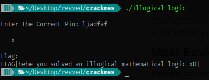
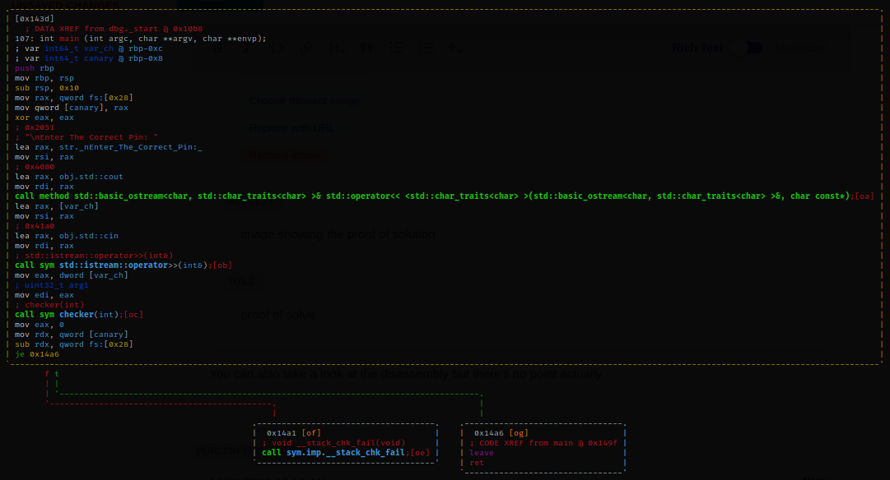
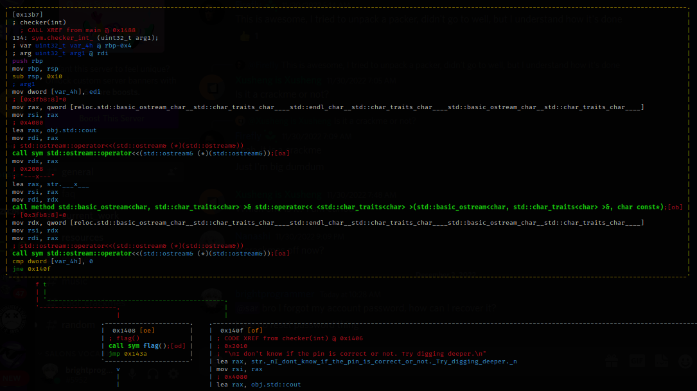

Hi folks! My exams ended recently and I started working on my skills again. I've been learning cryptography and binary exploitation for past few days but my reversing skills havent improved much since past year. So I plan to solve atleast one crackme per day and write about it on my blog. This gives me motivation to keep on going (but I never actually go on)

## Most Easiest Crackme Of All Time

Probably one of the main reasons I'm writing about this is because this binary failed to load when loaded in IDA due to some bad sections. You can download the binary from [here](https://crackmes.one/crackme/637c66b633c5d43ab4ecec2a).

## Solution

Just run the binary (after maybe checking for malicious behaviour on VirusTotal) and then enter the key! What's the key you ask? Enter anything other than a non zero integer and you'll get a solve. It was a complete by chance solution so I went to check the assembly in radare and it actually is the real flag! So easy that you start doubting yourself!

You can also take a look at the disassembly but there's no point actually.

Program takes input in an integer and gives this integer to the checker function. Let's take a look at the checker function now.

This will check whether the argument given to checker (the integer taken as input) is equal to 0 or not. If it's not zero then it'll spit out a flag else it'll throw some tantrums.