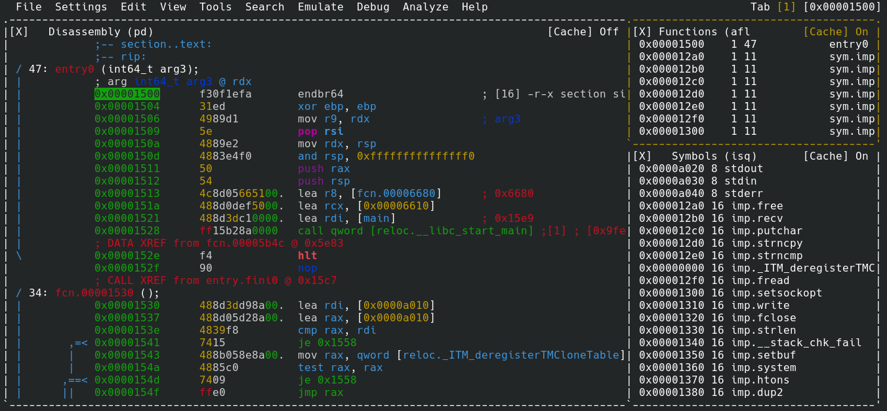

- - -

> “Arguing that you don't care about the right to privacy because you have nothing to hide is no different than saying you don't care about free speech because you have nothing to say.”
> ― Edward Snowden 

- - -

In this post, I will make an attempt to solve [X3eRo0](https://crackmes.one/user/X3eRo0)'s crackme named [Pyaz](https://crackmes.one/crackme/60be2a6033c5d410b8842c91). Below is the information provided on crackme's page

```
;------------------;----------------;------------;
| Platform         |   Difficulty:  |   Quality: |
| Unix/linux etc.  |   4.0          |   4.0      |
;------------------;----------------;------------;

;-------------;
| Description |
;-------------;-------------------------------------------------------------------;
| x86_64 linux binary (tested on ubuntu, should run on any distro). Takes input   |
| through stdin and outputs "Correct Password" if it's correct, "Wrong Password"  |
| if it's not.                                                                    |
| Written in C                                                                    |
| Don't patch the binary, of course - find the correct input.                     |
;---------------------------------------------------------------------------------;
| SHA256: 2078795d5f56c25c09301d345f07a93df915693f9976633040d9093d1a303e98  ./xvm |
| 29bea5fdd57949fb349e7e06c40ad4578aca6b8af6787bf39a9474857db01649  ./pyaz.xvm    |
;---------------------------------------------------------------------------------;
```

- - -

We will reverse this one by looking at the disassembly only (unlike last time we used Ghidra). This is because, unlike last crackme, this is a complex one and ***I like to feel like GOD after solving a difficult crackme by looking at the disassembly!*** (obviously many can do the same but that's just how I feel!)  

Tools you will need are : 

* [Radare2](https://rada.re/n/)
* This post for helping you
* you to solve this crackme
* air to breathe  

and this list goes on and on!

- - -

Like always we begin by downloading crackme and then checking it for viruses on [VirusTotal](https://www.virustotal.com/gui/). But there are two files provided.

```zsh
➜  Pyaz ls 
pyaz.xvm  xvm
```

Let's check the file information for both files : 

```zsh
➜  Pyaz file pyaz.xvm
pyaz.xvm: data
➜  Pyaz file xvm
xvm: ELF 64-bit LSB pie executable, x86-64, version 1 (SYSV), dynamically linked, interpreter /lib64/ld-linux-x86-64.so.2, BuildID[sha1]=e530d24c819909a315a0a54478313907490896a4, for GNU/Linux 3.2.0, stripped
➜  Pyaz 
```

This means the `xvm` file is an executable and `pyaz.xvm` is "I don't know what". Let's check `xvm` on VirusTotal for viruses.
You will see that the `xvm` executable is flagged as various malwares! This can be only possible in two cases :

* This file is really a virus
* It is packed by a packer like [UPX](https://upx.github.io/)  

We can check this by checking for the presence of `UPX` string in the crackme.

```zsh
➜  Pyaz strings xvm
UPX!P
tdoP
BoQ7
Roca
/lib64
nux-x86-
so.2
Dx19
mfUa
)Dw 6
w"/i
cket
exihtonl
fopen
trncmp
nect
__      a8_ch
4put
7real
lY/diEduDfgh
mems|biw
f       ek
"deDm
k_2>oXMc!#
_addcfcZ,At
 mmer
Afwr
ntfycce0
8izJbuf\k
GLIBC_2.4
5,ITM_oeg
_*(7
i       38
me]!
C2$C
)a?Y
:rY{
&M~{
4Sr 
8 \U
D9D:
Q(9!t
%L%/9
em      P
)K@^rB
yt?W
;4e*y
x0(~ 
)JeK!C
I       @r
"9$F
RD)Jx
(!^A
 l%W
8@B5
)]H 
6`H`
Qt0!
=n72
&lC0
x  |
a-6{
']3t
3B C
        ')
*wi@
&>xvm
2_#y
1h3/I
*w<9/
\'t.
|N1%2`
# }l
`)8P
aBZ8+%#
B `3
`@(
t2zHlFa
tPcc
(kpK
 J[r!)
IPHgH
,8FltZ4
X ;h
lH$sl
>cC-
2P[V
%t07
P(!<X
|#!p`+
X.5H
4SAy
L3!Ys
>AWL!s6
wPO[]A\A
Usage: xvm <bytecode>
stack
[31m-
0m] 
Divi
# , 0 8%s @
Illegal In>ruction!
_XVM BRUH MOMENT
<vB` RJiFei
4M-7AKU_kn
`FATAL
4m#r.
wCor
Cannot ope
Lr~GLoa)F
w(P)3
gs={l
hg="0" N_)Kd
Found
symbo
f@iBD
06&2
Faul;|a
-%d-
CAddres
Code
w/ \
:*3$"'?
hBXv_G
2!Mw
9RI
jHw`
Ir?i
0!Mw
+-aB
$<g
P`p2
@P`p
USQRH
W^YH
PROT_EXEC|PROT_WRITE failed.
$Info: This file is packed with the UPX executable packer http://upx.sf.net $
$Id: UPX 3.96 Copyright (C) 1996-2020 the UPX Team. All Rights Reserved. $
_j<X
RPI)
WQM)
j"AZR^j
Y^_]j
/proc/self/exe
IuDSWH
s2V^
XAVAWPH
YT_j
AY^_
D$ [E)
UPX!u
D.{a
vT$}
_w%93u
mk#N
([]A\A]
USRhL
o fk
.<!@
V4II
$uB4I
@bQsK
|)      lb
#-ug
5(Nt0
A^A_
m@S 
vlcM
n5hS()}8t
JAPC
q2H-
GCC: (Ubuntu 9.3.0-17u
.shstrtab       i
no.gnu.prop
Cild-id
>ABI-;g
haK
dynsym
sion
rela(
        plt
secmx
-odav
eh_frame_hdr
C_ar
com2
Pv ?G
A8ya
/X7d
UPX!
UPX!
➜  Pyaz 
```

Clearly we can see `UPX!` in the beginning and at the end of this huge list!.
Also we see this in the list:

* This file is packed with the UPX executable packer http://upx.sf.net  
* UPX 3.96 Copyright (C) 1996-2020 the UPX Team. All Rights Reserved. 

This prove's our suspicion that this crackme is packed with upx. Let's try to unpack it and check again!

```zsh
➜  Pyaz upx -d xvm
                       Ultimate Packer for eXecutables
                          Copyright (C) 1996 - 2020
UPX git-d7ba31+ Markus Oberhumer, Laszlo Molnar & John Reiser   Jan 23rd 2020

        File size         Ratio      Format      Name
   --------------------   ------   -----------   -----------
     39048 <-     12584   32.23%   linux/amd64   xvm

Unpacked 1 file.
➜  Pyaz 
```

This time on checking, you will see no virus flags being raised!.
I am providing this section in detail because I was afraid when I saw virus flags being raised but then *X3eRo0* helped me (thank him for that 😀).

- - -

Let's begin reversing the crackme! When we execute this executable we see the following statement : 

```zsh
➜  Pyaz ./xvm
Usage: xvm <bytecode>
➜  Pyaz 
```

This means this program takes a file as input. I guess this is what `pyaz.xvm` is for. Let's pass that as argument.

```zsh
➜  Pyaz ./xvm pyaz.xvm
Enter Password: idunno  
Wrong Password
➜  Pyaz 
```

On taking `pyaz.xvm` as input this file asks for password. Since I don't know it, I'll just enter anything. This means that `pyaz.xvm` contains our password but on opening the file you see some random values (all gibberish).

The next step in protocol is to check `strace` and `ltrace` to see what is happening during runtime (what functions are called, print statements, reads etc...).

```zsh
➜  Pyaz strace ./xvm pyaz.xvm
execve("./xvm", ["./xvm", "pyaz.xvm"], 0x7ffc3cbf42d8 /* 56 vars */) = 0
brk(NULL)                               = 0x557a9d9b0000
arch_prctl(0x3001 /* ARCH_??? */, 0x7ffd996f3340) = -1 EINVAL (Invalid argument)
access("/etc/ld.so.preload", R_OK)      = -1 ENOENT (No such file or directory)
openat(AT_FDCWD, "/etc/ld.so.cache", O_RDONLY|O_CLOEXEC) = 3
newfstatat(3, "", {st_mode=S_IFREG|0644, st_size=210252, ...}, AT_EMPTY_PATH) = 0
mmap(NULL, 210252, PROT_READ, MAP_PRIVATE, 3, 0) = 0x7f8b26869000
close(3)                                = 0
openat(AT_FDCWD, "/usr/lib/libc.so.6", O_RDONLY|O_CLOEXEC) = 3
read(3, "\177ELF\2\1\1\3\0\0\0\0\0\0\0\0\3\0>\0\1\0\0\0`|\2\0\0\0\0\0"..., 832) = 832
pread64(3, "\6\0\0\0\4\0\0\0@\0\0\0\0\0\0\0@\0\0\0\0\0\0\0@\0\0\0\0\0\0\0"..., 784, 64) = 784
pread64(3, "\4\0\0\0@\0\0\0\5\0\0\0GNU\0\2\0\0\300\4\0\0\0\3\0\0\0\0\0\0\0"..., 80, 848) = 80
pread64(3, "\4\0\0\0\24\0\0\0\3\0\0\0GNU\0K@g7\5w\10\300\344\306B4Zp<G"..., 68, 928) = 68
newfstatat(3, "", {st_mode=S_IFREG|0755, st_size=2150424, ...}, AT_EMPTY_PATH) = 0
mmap(NULL, 8192, PROT_READ|PROT_WRITE, MAP_PRIVATE|MAP_ANONYMOUS, -1, 0) = 0x7f8b26867000
pread64(3, "\6\0\0\0\4\0\0\0@\0\0\0\0\0\0\0@\0\0\0\0\0\0\0@\0\0\0\0\0\0\0"..., 784, 64) = 784
mmap(NULL, 1880536, PROT_READ, MAP_PRIVATE|MAP_DENYWRITE, 3, 0) = 0x7f8b2669b000
mmap(0x7f8b266c1000, 1355776, PROT_READ|PROT_EXEC, MAP_PRIVATE|MAP_FIXED|MAP_DENYWRITE, 3, 0x26000) = 0x7f8b266c1000
mmap(0x7f8b2680c000, 311296, PROT_READ, MAP_PRIVATE|MAP_FIXED|MAP_DENYWRITE, 3, 0x171000) = 0x7f8b2680c000
mmap(0x7f8b26858000, 24576, PROT_READ|PROT_WRITE, MAP_PRIVATE|MAP_FIXED|MAP_DENYWRITE, 3, 0x1bc000) = 0x7f8b26858000
mmap(0x7f8b2685e000, 33240, PROT_READ|PROT_WRITE, MAP_PRIVATE|MAP_FIXED|MAP_ANONYMOUS, -1, 0) = 0x7f8b2685e000
close(3)                                = 0
mmap(NULL, 8192, PROT_READ|PROT_WRITE, MAP_PRIVATE|MAP_ANONYMOUS, -1, 0) = 0x7f8b26699000
arch_prctl(ARCH_SET_FS, 0x7f8b26868580) = 0
mprotect(0x7f8b26858000, 12288, PROT_READ) = 0
mprotect(0x557a9be22000, 4096, PROT_READ) = 0
mprotect(0x7f8b268cb000, 8192, PROT_READ) = 0
munmap(0x7f8b26869000, 210252)          = 0
brk(NULL)                               = 0x557a9d9b0000
brk(0x557a9d9d1000)                     = 0x557a9d9d1000
openat(AT_FDCWD, "pyaz.xvm", O_RDONLY)  = 3
newfstatat(3, "", {st_mode=S_IFREG|0644, st_size=45423, ...}, AT_EMPTY_PATH) = 0
lseek(3, 0, SEEK_SET)                   = 0
read(3, "xvm\3\0\0207\23\0\0\0\0V\5\0\0\16\0\0\0\357\276\255\336.text\0\0\20"..., 4096) = 4096
read(3, "\235\227\205o[\177ssmta\25nvbfn\26Ewrdpf\\`x\1\2KtW"..., 4096) = 4096
read(3, "ooje|mdv;\300\233\307\311nvI7f\221\221\225\234y\2fr\177s945o"..., 4096) = 4096
read(3, "6\210\224\234\3179wxxC5Z\215Z\to\27a\304\211\234\212cexl8\tx6\315\227"..., 4096) = 4096
read(3, "\207y\37phhzn97yt\207\315\314\234w4I`w\337\214\232\2340F6~gar"..., 4096) = 4096
read(3, "`\t\316P@b\36\177\217\314\216\214gq1m\31u\276\224J_oO;\222\314\311\311nlg"..., 4096) = 4096
read(3, "g\2sx\305\232\214\232\25n;mv\0227l6vd?v`k\202\205\315\217`w\10f>"..., 4096) = 4096
read(3, "j6}y\207\224\311\214y5@ew\237\235\311\226dAjoRa9k{va\226\313\233\225"..., 4096) = 4096
read(3, "\234X[uRk\314\231\226\3110erlDdl\301Q\4oU<\205\310\227\2276y1cd"..., 4096) = 4096
read(3, "0{\303\223\233\3119E38feyht%=\216\317\220\215cb@<o\237\311\207\313y\27"..., 4096) = 4096
read(3, "\227\317b8fz\31p\24\201\3IxUh\230\205\236\314wblcl\4k;\235\227\217\227@"..., 4096) = 4096
read(3, "\315\220\2112k\2ax\201\210\235\222l\02228yf8o8qc\202\206\210\31326\31=<"..., 4096) = 367
write(1, "Enter Password: ", 16Enter Password: )        = 16
read(0, idontknow
"idontknow\n", 255)             = 10
write(1, "Wrong Password", 14Wrong Password)          = 14
write(1, "\n", 1
)                       = 1
close(3)                                = 0
exit_group(0)                           = ?
+++ exited with 0 +++
➜  Pyaz 
```

Taking a look at this dump, it is clearly visible that `pyaz.xvm` is not a bluff and the program is actually reading values from file and might be interpreting in some way. Note that `strace` only traces system calls and not user defined functions.   

We can see file reads in these lines : 

```zsh
openat(AT_FDCWD, "pyaz.xvm", O_RDONLY)  = 3
newfstatat(3, "", {st_mode=S_IFREG|0644, st_size=45423, ...}, AT_EMPTY_PATH) = 0
lseek(3, 0, SEEK_SET)                   = 0
read(3, "xvm\3\0\0207\23\0\0\0\0V\5\0\0\16\0\0\0\357\276\255\336.text\0\0\20"..., 4096) = 4096
read(3, "\235\227\205o[\177ssmta\25nvbfn\26Ewrdpf\\`x\1\2KtW"..., 4096) = 4096
read(3, "ooje|mdv;\300\233\307\311nvI7f\221\221\225\234y\2fr\177s945o"..., 4096) = 4096
read(3, "6\210\224\234\3179wxxC5Z\215Z\to\27a\304\211\234\212cexl8\tx6\315\227"..., 4096) = 4096
read(3, "\207y\37phhzn97yt\207\315\314\234w4I`w\337\214\232\2340F6~gar"..., 4096) = 4096
read(3, "`\t\316P@b\36\177\217\314\216\214gq1m\31u\276\224J_oO;\222\314\311\311nlg"..., 4096) = 4096
read(3, "g\2sx\305\232\214\232\25n;mv\0227l6vd?v`k\202\205\315\217`w\10f>"..., 4096) = 4096
read(3, "j6}y\207\224\311\214y5@ew\237\235\311\226dAjoRa9k{va\226\313\233\225"..., 4096) = 4096
read(3, "\234X[uRk\314\231\226\3110erlDdl\301Q\4oU<\205\310\227\2276y1cd"..., 4096) = 4096
read(3, "0{\303\223\233\3119E38feyht%=\216\317\220\215cb@<o\237\311\207\313y\27"..., 4096) = 4096
read(3, "\227\317b8fz\31p\24\201\3IxUh\230\205\236\314wblcl\4k;\235\227\217\227@"..., 4096) = 4096
read(3, "\315\220\2112k\2ax\201\210\235\222l\02228yf8o8qc\202\206\210\31326\31=<"..., 4096) = 367
write(1, "Enter Password: ", 16Enter Password: )        = 16
read(0, idontknow
"idontknow\n", 255)             = 10
write(1, "Wrong Password", 14Wrong Password)          = 14
write(1, "\n", 1
)                       = 1
close(3)                                = 0
exit_group(0)                           = ?
```

I'll show you how to read the `strace` dump in some another post in detail. This one's pretty easy to read. The function `openat()` opens file `pyaz.xvm` and returns file descriptor `3`. We use that descriptor to read multiple values int he `read()` calls. After multiple file reads, we see the program write at `File Descriptor` 1 (`stdout`) and read at `File Descriptor` 0 (`stdin`) after which I enter my password *idontknow* and the program exits after writing *"Wrong Password\n"* in `stdout`. and then closes.

Next stept is to fireup `radare` to see the disassembly. We analyse the file by typing `aaaa` in the prompt.

```zsh
➜  Pyaz r2 xvm
Warning: run r2 with -e bin.cache=true to fix relocations in disassembly
WARNING: No calling convention defined for this file, analysis may be inaccurate.
 -- 255 shades of (truecolor) grey
[0x00001500]> aaaa
[Warning: set your favourite calling convention in `e anal.cc=?`
[x] Analyze all flags starting with sym. and entry0 (aa)
[x] Analyze function calls (aac)
[x] Analyze len bytes of instructions for references (aar)
[x] Finding and parsing C++ vtables (avrr)
[x] Type matching analysis for all functions (aaft)
[x] Propagate noreturn information (aanr)
[x] Finding function preludes
[x] Enable constraint types analysis for variables
[0x00001500]> 
```

Next to see the disassembly, type `v`! after which you will see a window similar to this :



The big window on left is the one that contains our disassembly code. One in the top right corner contains function names/symbols and in bottom right contains symbol names.\
At the very beginning you see the `entry` function, this is the very first function that is called when our program executes! and this function calls `main()`(indirectly). This function passes those `argc` and `argv` values to `main()`! Let's take a look at this function and try to find our `main()` from here :

```
            ;-- section..text:
            ;-- rip:
/ 47: entry0 (int64_t arg3);
|           ; arg int64_t arg3 @ rdx
|           0x00001500      f30f1efa       endbr64                     ; [16] -r-x section size 20869 named .text
|           0x00001504      31ed           xor ebp, ebp
|           0x00001506      4989d1         mov r9, rdx                 ; arg3
|           0x00001509      5e             pop rsi
|           0x0000150a      4889e2         mov rdx, rsp
|           0x0000150d      4883e4f0       and rsp, 0xfffffffffffffff0
|           0x00001511      50             push rax
|           0x00001512      54             push rsp
|           0x00001513      4c8d05665100.  lea r8, [fcn.00006680]      ; 0x6680
|           0x0000151a      488d0def5000.  lea rcx, [0x00006610]
|           0x00001521      488d3dc10000.  lea rdi, [main]             ; 0x15e9
|           0x00001528      ff15b28a0000   call qword [reloc.__libc_start_main] ; [0x9fe0:8]=0
|           ; DATA XREF from fcn.00005b4c @ 0x5e83
\           0x0000152e      f4             hlt
```

Let's understand this one by one : 

* `endbr64` is an instruction to end an [indirect branch](https://en.wikipedia.org/wiki/Indirect_branch) made by some other function/process.
* `xor ebp, ebp` is same as `ebp = 0` but [faster](https://stackoverflow.com/a/29156824).
* `mov r9, rdx` stores the address of termination in `r9` register which acts as 6th argument in a function call on linux. `rdx` register stores the address of termination function. This is mentioned in the [ELF](http://flint.cs.yale.edu/cs422/doc/ELF_Format.pdf) specification as : "After the dynamic linker has built the process image and performed the relocations, each shared object gets the opportunity to execute some initialization code. ... Similarly, shared objects may have termination functions, which are executed with the `atexit` (BA_OS) mechanism after the base process begins its termination sequence."
* `pop rsi` stores `argc` in rsi. (rsi is 2nd argument)
* `mov rdx, rsp` is storing stack pointer in rdx. (rdx is 3rd argument)
* `and rsp, 0xfffffffffffffff0` is aligning the stack to 16 multiples of bytes. Take a look at [this answer](https://stackoverflow.com/a/4175400) to understand better.
* `push rax` stores value of rax on stack
* `push rsp` stores value of rsp on stack (this will act as 7th argument i.e return address)
* `lea r8, [fcn.00006680]` loads the address stored in given symbol in r8 (r8 is 5th argument).
* `lea rcx, [0x00006610]` loads the value stored at memory in `rcx` (rcx is 4th argument)
* `lea rdi, [main]` loads the address stored in symbol `main` in `rdi` (`rdi` is first argument)
* `call qword[reloc.__libc_start_main]` calls the `__libc_start_main` function from `libc` of linux. This function is the one that calls `main`

The effective function in simple C code will look similar to this : 

```c
void entry(int64_t rdx){
    // rdi = address of main
    // rsi = argc
    // rdx = argv
    // rcx = address of .init
    // r9  = address of fini
    // r9  = address of rtld_fini
    // rsi = return address 
    __libc_start_main(rdi, rsi, rdx, rcx, r8, r9, rsp);
}
```

You can click on symbols and go to their disassembly so click on `main` and this will take you to disassembly of `main` or you can seek to a main by doing `s main` and then print the disassembly of `main` by doing entering `pdf` (*Print Disassembly of Function*) into the Radare2 command line.

```
            ; DATA XREF from entry0 @ 0x1521
/ 294: int main (uint32_t argc, char **argv);
|           ; var char **var_20h @ rbp-0x20
|           ; var uint32_t var_14h @ rbp-0x14
|           ; var int64_t var_10h @ rbp-0x10
|           ; var int64_t var_8h @ rbp-0x8
|           ; arg uint32_t argc @ rdi
|           ; arg char **argv @ rsi
|           0x000015e9      f30f1efa       endbr64
|           0x000015ed      55             push rbp
|           0x000015ee      4889e5         mov rbp, rsp
|           0x000015f1      4883ec20       sub rsp, 0x20
|           0x000015f5      897dec         mov dword [var_14h], edi    ; argc
|           0x000015f8      488975e0       mov qword [var_20h], rsi    ; argv
|           0x000015fc      837dec02       cmp dword [var_14h], 2
|       ,=< 0x00001600      742a           je 0x162c
|       |   0x00001602      488b05378a00.  mov rax, qword [obj.stderr] ; [0xa040:8]=0
|       |   0x00001609      4889c1         mov rcx, rax                ; FILE *stream
|       |   0x0000160c      ba16000000     mov edx, 0x16               ; size_t nitems
|       |   0x00001611      be01000000     mov esi, 1                  ; size_t size
|       |   0x00001616      488d3de75900.  lea rdi, str.Usage:_xvm__bytecode__n ; 0x7004 ; "Usage: xvm <bytecode>\n" ; const void *ptr
|       |   0x0000161d      e89efeffff     call sym.imp.fwrite         ; size_t fwrite(const void *ptr, size_t size, size_t nitems, FILE *stream)
|       |   0x00001622      bfffffffff     mov edi, 0xffffffff         ; -1
|       |   0x00001627      e874feffff     call sym.imp.exit
|       |   ; CODE XREF from main @ 0x1600
|       `-> 0x0000162c      488b05fd8900.  mov rax, qword [obj.stdin]  ; [0xa030:8]=0
|           0x00001633      be00000000     mov esi, 0                  ; char *buf
|           0x00001638      4889c7         mov rdi, rax                ; FILE *stream
|           0x0000163b      e810fdffff     call sym.imp.setbuf         ; void setbuf(FILE *stream, char *buf)
|           0x00001640      488b05d98900.  mov rax, qword [obj.stdout] ; [0xa020:8]=0
|           0x00001647      be00000000     mov esi, 0                  ; char *buf
|           0x0000164c      4889c7         mov rdi, rax                ; FILE *stream
|           0x0000164f      e8fcfcffff     call sym.imp.setbuf         ; void setbuf(FILE *stream, char *buf)
|           0x00001654      b800000000     mov eax, 0
|           0x00001659      e846020000     call fcn.000018a4
|           0x0000165e      488945f0       mov qword [var_10h], rax
|           0x00001662      b800000000     mov eax, 0
|           0x00001667      e8622b0000     call fcn.000041ce
|           0x0000166c      488945f8       mov qword [var_8h], rax
|           0x00001670      488b45e0       mov rax, qword [var_20h]
|           0x00001674      4883c008       add rax, 8
|           0x00001678      488b10         mov rdx, qword [rax]
|           0x0000167b      488b45f8       mov rax, qword [var_8h]
|           0x0000167f      4889d6         mov rsi, rdx                ; int64_t arg2
|           0x00001682      4889c7         mov rdi, rax                ; void *arg1
|           0x00001685      e8a52b0000     call fcn.0000422f
|           0x0000168a      488b45f8       mov rax, qword [var_8h]
|           0x0000168e      488b4010       mov rax, qword [rax + 0x10]
|           0x00001692      41b803000000   mov r8d, 3                  ; void **arg5
|           0x00001698      b90030feca     mov ecx, 0xcafe3000         ; void **arg4
|           0x0000169d      ba00300000     mov edx, 0x3000             ; "\n\xba" ; size_t *arg3
|           0x000016a2      488d35725900.  lea rsi, [0x0000701b]       ; "stack" ; size_t *arg2
|           0x000016a9      4889c7         mov rdi, rax                ; uint32_t arg1
|           0x000016ac      e8643c0000     call fcn.00005315
|           0x000016b1      488b45f8       mov rax, qword [var_8h]
|           0x000016b5      488b00         mov rax, qword [rax]
|           0x000016b8      8b5004         mov edx, dword [rax + 4]
|           0x000016bb      488b45f0       mov rax, qword [var_10h]
|           0x000016bf      895034         mov dword [rax + 0x34], edx
|           0x000016c2      488b45f0       mov rax, qword [var_10h]
|           0x000016c6      c7403cfc3ffe.  mov dword [rax + 0x3c], 0xcafe3ffc ; [0xcafe3ffc:4]=-1
|           0x000016cd      488b55f8       mov rdx, qword [var_8h]
|           0x000016d1      488b45f0       mov rax, qword [var_10h]
|           0x000016d5      4889d6         mov rsi, rdx                ; int64_t arg2
|           0x000016d8      4889c7         mov rdi, rax                ; int64_t arg1
|           0x000016db      e8b7020000     call fcn.00001997
|           0x000016e0      488b45f0       mov rax, qword [var_10h]
|           0x000016e4      4889c7         mov rdi, rax                ; void *arg1
|           0x000016e7      e8f2020000     call fcn.000019de
|           0x000016ec      48c745f00000.  mov qword [var_10h], 0
|           0x000016f4      488b45f8       mov rax, qword [var_8h]
|           0x000016f8      4889c7         mov rdi, rax                ; void *arg1
|           0x000016fb      e8b3300000     call fcn.000047b3
|           0x00001700      48c745f80000.  mov qword [var_8h], 0
|           0x00001708      b800000000     mov eax, 0
|           0x0000170d      c9             leave
\           0x0000170e      c3             ret
```

We start by decompiling `main` but since the code for this program is very large and we just cannot just remember which function does what, so it's better to make atleast a pseudocode in order to understand what the function is doing. I will create a file called `solution.c`. 

At the very beginning we again see `endbr64`. then we have function prologue to save stack pointer of caller :

```
; this is called prologue
 0x000015ed      55             push rbp        ; stores stack's base on stack
 0x000015ee      4889e5         mov rbp, rsp    ; set's stack's top as base
 ; this will set the top of stack as base of stack for the callee function (main in this case)
```

Next the program is allocating a memory space of 32 bytes in instruction `sub rsp, 0x20`. Why `sub`?, well because the stack grows down and not up. So when you need to allocate x bytes of space on stack, you subtract x from top of stack (actually bottom of stack). Here is how this works : 

```
; address shown are last 32 bits of a 64-bit memory address
0x00000000 ;--------;  <- rbp = rsp (initially)
```

In every function there are multiple temporary variables used, they are allocated on the stack. Let's say you are using 5 variables which sum up to memory of 100 bytes (20 bytes each), then the program will allocate that much memory all at once and then use first 20 bytes for 1st variable, next 20 bytes for 2nd variable and so on. This is what we mean when we say we loose all information of data structures and algorithm in assembly. That 20 bytes can be a struct, a class, an array of 20 characters, an array of 5 integers, anything!

After doing : [ `sub rsp, 20` ], we have the following situation : 

```
; address shown are last 32 bits of a 64-bit memory address
0x00000000 ;--------;  <- rbp remains same (base pointer)
0x00000001 ;        ;      |
0x00000002 ;        ;      |
.        . .        .      |
.        . .        .      | stack growing down
.        . .        .      |
0x0000001d ;        ;      |
0x0000001e ;        ;      |
0x0000001f ;        ;      v
0x00000020 ;--------;  <- rsp changed (stack pointer)
; So effectively rsp is the top of stack in sense of direction of growth
```

Then here we are moving the `argv` and `argc` params in variables, we just allocated and then comparing whether argc is 2. If it's not 2 then it continues, else it jumps to the given address.

```
0x000015f5      897dec         mov dword [var_14h], edi    ; arg1
0x000015f8      488975e0       mov qword [var_20h], rsi    ; arg2
0x000015fc      837dec02       cmp dword [var_14h], 2
0x00001600      742a           je 0x162c
```

Let's take a look at the whole jump context.

```
    0x000015f5      897dec         mov dword [var_14h], edi    ; arg1
    0x000015f8      488975e0       mov qword [var_20h], rsi    ; arg2
    0x000015fc      837dec02       cmp dword [var_14h], 2
,=< 0x00001600      742a           je 0x162c
|   0x00001602      488b05378a00.  mov rax, qword [obj.stderr] ; [0xa040:8]=0
|   0x00001609      4889c1         mov rcx, rax
|   0x0000160c      ba16000000     mov edx, 0x16
|   0x00001611      be01000000     mov esi, 1
|   0x00001616      488d3de75900.  lea rdi, str.Usage:_xvm__bytecode__n ; 0x7004 ; "Usage: xvm <bytecode>\n"
|   0x0000161d      e89efeffff     call sym.imp.fwrite
|   0x00001622      bfffffffff     mov edi, 0xffffffff         ; -1
|   0x00001627      e874feffff     call sym.imp.exit
|   ; CODE XREF from main @ 0x1600
`-> 0x0000162c      488b05fd8900.  mov rax, qword [obj.stdin]  ; [0xa030:8]=0
```

The above code decompiles to the following : 

```c
int main(int argc /*edi*/ , char** argv /*rsi*/){
    int32_t var14_h = argc; // because dword in 32 bits
    int64_t var20_h = (uint64_t)argv; // because qword is 64 bits
    // note that I've used uint64_t for var20_h, instead it must be char**
    // I did this because char** is a pointer and all pointers are 64 bit
    // sized in a 64-bit os

    // check if argc is 2
    if(var14_h != 2){
        // symbol str.Usage:_xvm__bytecode__n stores the string 
        // as shown in comment in disassembly
        // refer : https://www.cplusplus.com/reference/cstdio/fwrite/
        fwrite("xvm <bytecode>\n" /*rdi*/, 1 /*rsi*/, 0x16 /*rdx*/, stderr/*rcx*/);
    
        // then -1 is passed as parameter to exit function
        exit(-1);
    }

    // some other code that we jumped to ...
    .
    .
    .
}
```

Let's jump to `0x162c` and check it's disassembly too : 

```
|   ; CODE XREF from main @ 0x1600
`-> 0x0000162c      488b05fd8900.  mov rax, qword [obj.stdin]  ; [0xa030:8]=0
    0x00001633      be00000000     mov esi, 0
    0x00001638      4889c7         mov rdi, rax
    0x0000163b      e810fdffff     call sym.imp.setbuf
    0x00001640      488b05d98900.  mov rax, qword [obj.stdout] ; [0xa020:8]=0
    0x00001647      be00000000     mov esi, 0
    0x0000164c      4889c7         mov rdi, rax
    0x0000164f      e8fcfcffff     call sym.imp.setbuf
    0x00001654      b800000000     mov eax, 0
```

This part is setting the buffering of `stdin` and `stdout` to no buffering. The decompiled code of this part is : 

```c
int main(int argc, char** argv){
    // other code
    if(...){
        .
        .
        .
    }

    // new code
    setbuf(stdin, NULL);    // \0 is same as NULL in C and nullptr in C++
    setbuf(stdout, NULL); 
    // these functions do not return or their return values are not used
    // because the value in rax/eax is never used by the program
    // return values of functions are stored in rax before ret is called
}
```

Next we see that `main` is calling some user defined functions. Some are with arguments and some are not : 

```
0x00001659      e846020000     call fcn.000018a4
0x0000165e      488945f0       mov qword [var_10h], rax
0x00001662      b800000000     mov eax, 0
0x00001667      e8622b0000     call fcn.000041ce
0x0000166c      488945f8       mov qword [var_8h], rax
0x00001670      488b45e0       mov rax, qword [var_20h]
0x00001674      4883c008       add rax, 8
0x00001678      488b10         mov rdx, qword [rax]
0x0000167b      488b45f8       mov rax, qword [var_8h]
0x0000167f      4889d6         mov rsi, rdx
0x00001682      4889c7         mov rdi, rax
0x00001685      e8a52b0000     call fcn.0000422f
0x0000168a      488b45f8       mov rax, qword [var_8h]
```

Decompilation : 

```c
int main(int argc, char** argv){
    // other code
    if(...){
        .
        .
        .
    }

    .
    .
    .
    
    // new code
    // I will use "_" instead of "." inc function names
    uint64_t var_10h = fcn_18a4();
    uint64_t var_8h = fcn_41ce();

    // ;--------------------------;
    // ; mov qword [var_8h], rax  ;
    // ; mov rax, qword [var_20h] ;
    // ; add rax, 8               ;
    // ; mov rdx, qword [rax]     ;
    // ;--------------------------;
    // var20_h holds address of argv, we get the first 8 bytes of
    // array pointed by var20_h. In this case the array contains only one
    // element, i.e the address of argv and i.e why there is no offset
    // argv is stored in rax and then rax is incremented by 8
    // then first 8 bytes of array pointed by memory address in rax
    // is stored in rdx
    // this is same as storing argv[1] in rdx
    // this is also same as rdx = (char*)(argv + 8)
    fcn_422f(var8_h, argv[1]);
    // again return value is ignored or this function does not return.
}
```

Next we have :

```
0x0000168a      488b45f8       mov rax, qword [var_8h]
0x0000168e      488b4010       mov rax, qword [rax + 0x10]
0x00001692      41b803000000   mov r8d, 3
0x00001698      b90030feca     mov ecx, 0xcafe3000
0x0000169d      ba00300000     mov edx, 0x3000             ; "\n\xba"
0x000016a2      488d35725900.  lea rsi, [0x0000701b]       ; "stack"
0x000016a9      4889c7         mov rdi, rax
0x000016ac      e8643c0000     call fcn.00005315
0x000016b1      488b45f8       mov rax, qword [var_8h]
```

Decompilation : 

```c
int main(int argc, char** argv){
    // other code
    if(...){
        .
        .
        .
    }

    .
    .
    .
    
    // new code
    // lea will just store the address and not the value at the address in rsi
    // is 3 here the file descriptor we saw in strace? 
    fcn_5315(var_8h[2], "stack", 0x3000, 0xcafe3000, 3);
}
```

Next function call :

```
0x000016b1      488b45f8       mov rax, qword [var_8h]
0x000016b5      488b00         mov rax, qword [rax]
0x000016b8      8b5004         mov edx, dword [rax + 4]
0x000016bb      488b45f0       mov rax, qword [var_10h]
0x000016bf      895034         mov dword [rax + 0x34], edx
0x000016c2      488b45f0       mov rax, qword [var_10h]
0x000016c6      c7403cfc3ffe.  mov dword [rax + 0x3c], 0xcafe3ffc ; [0xcafe3ffc:4]=-1
0x000016cd      488b55f8       mov rdx, qword [var_8h]
0x000016d1      488b45f0       mov rax, qword [var_10h]
0x000016d5      4889d6         mov rsi, rdx
0x000016d8      4889c7         mov rdi, rax
0x000016db      e8b7020000     call fcn.00001997
0x000016e0      488b45f0       mov rax, qword [var_10h]
```

Decompilation :

```c
int main(int argc, char** argv){
    // other code
    if(...){
        .
        .
        .
    }

    .
    .
    .
    
    // new code
    // this part is a homework
    // most probably var_8h is an array of array of pointers
    // or some other thing 😉 as we'll see after we start decompiling
    // these functions
    *(int32_t*)(var_10+0x34) = var_8h[0][1];
    *(int32_t*)(var_10+0x3c) = 0xcafe3ffc;
    fcn_1997(var_10h, var_8h);
}
```

Next part : 

```
0x000016e0      488b45f0       mov rax, qword [var_10h]
0x000016e4      4889c7         mov rdi, rax
0x000016e7      e8f2020000     call fcn.000019de
0x000016ec      48c745f00000.  mov qword [var_10h], 0
0x000016f4      488b45f8       mov rax, qword [var_8h]
0x000016f8      4889c7         mov rdi, rax
0x000016fb      e8b3300000     call fcn.000047b3
```

Decompile : 

```c
int main(int argc, char** argv){
    // other code
    if(...){
        .
        .
        .
    }

    .
    .
    .
    
    // new code
    fcn_19de(var_10h);
    var_10h = 0;
    fcn_47b3(var_8h);
}   
```

Phew! that was huge!. After doing all this, your `main()` will look something like this : 

```c
int main(int argc , char** argv){
    int32_t var14_h = argc;
    int64_t var20_h = (uint64_t)argv;
    
    if(var14_h != 2){
        fwrite("xvm <bytecode>\n" , 1, 0x16 , stderr);
        exit(-1);
    }

	setbuf(stdin, NULL);
    setbuf(stdout, NULL); 

    uint64_t var_10h = fcn_18a4();
    uint64_t var_8h = fcn_41ce();

    fcn_422f(var8_h, argv[1]);

    // lea rsi, [0x0000701b]
    // value at address 0x0000701b is stored in rsi
    // which our sweet radare says to be the string "stack"!
    fcn_5315(var_8h[2], "stack", 0x3000, 0xcafe3000, 3);

    *(int32_t*)(var_10+0x34) = var_8h[0][1];
    *(int32_t*)(var_10+0x3c) = 0xcafe3ffc;
    fcn_1997(var_10h[0], var_8h[0]);

	fcn_19de(var_10h);
    var_10h = 0;
    fcn_47b3(var_8h);
    var_8h = 0;
}
```

The very first unknown function we have here is `fcn_18a4()` which takes no argument but returns something! This is quite odd! This can be possible in the following few cases : 

* Function is just to mislead us and it does nothing.
* Function is creating something and returning it's address (because it's returning 64bit variable).

But as we see in the main function, the value returned by this function is acting as an array of uint64_t values. Whenever there is a uint64_t value, it can either be a pointer or an acutal uint64_t value! Remember that!

Let's take a look at the disassembly of this function : 

```
            ; CALL XREF from main @ 0x1659
/ 60: fcn.000018a4 ();
|           ; var int64_t var_8h @ rbp-0x8
|           0x000018a4      f30f1efa       endbr64
|           0x000018a8      55             push rbp
|           0x000018a9      4889e5         mov rbp, rsp
|           0x000018ac      4883ec10       sub rsp, 0x10
|           0x000018b0      bf44000000     mov edi, 0x44               ; 'D'
|           0x000018b5      e866fbffff     call sym.imp.malloc
|           0x000018ba      488945f8       mov qword [var_8h], rax
|           0x000018be      488b45f8       mov rax, qword [var_8h]
|           0x000018c2      4889c7         mov rdi, rax
|           0x000018c5      e845feffff     call fcn.0000170f
|           0x000018ca      488b45f8       mov rax, qword [var_8h]
|           0x000018ce      4883c040       add rax, 0x40               ; elf_phdr
|           0x000018d2      4889c7         mov rdi, rax
|           0x000018d5      e87ffeffff     call fcn.00001759
|           0x000018da      488b45f8       mov rax, qword [var_8h]
|           0x000018de      c9             leave
\           0x000018df      c3             ret
```

From now on, I won't be explaining everything, just the hard parts. Here is the decompiled program : 

```c
uint64_t fcn_18a4(void){
    // allocate 68 bytes of memory
    int64_t var_8h = malloc(0x44);


    fcn_170f(var_8h);
    fcn_1759(var_8h+0x40); // skip 8 uint64_t values

    return var_8h;
}
```

Lets see disassembly of these two functions also : 

```
            ; CALL XREF from fcn.000018a4 @ 0x18c5
/ 74: fcn.0000170f (int64_t arg1);
|           ; var int64_t var_8h @ rbp-0x8
|           ; arg int64_t arg1 @ rdi
|           0x0000170f      f30f1efa       endbr64
|           0x00001713      55             push rbp
|           0x00001714      4889e5         mov rbp, rsp
|           0x00001717      4883ec10       sub rsp, 0x10
|           0x0000171b      48897df8       mov qword [var_8h], rdi     ; arg1
|           0x0000171f      488b45f8       mov rax, qword [var_8h]
|           0x00001723      ba40000000     mov edx, 0x40               ; elf_phdr
|           0x00001728      be00000000     mov esi, 0
|           0x0000172d      4889c7         mov rdi, rax
|           0x00001730      e88bfcffff     call sym.imp.memset
|           0x00001735      488b45f8       mov rax, qword [var_8h]
|           0x00001739      c74034001037.  mov dword [rax + 0x34], 0x13371000 ; [0x13371000:4]=-1
|           0x00001740      488b45f8       mov rax, qword [var_8h]
|           0x00001744      c7403cfc3ffe.  mov dword [rax + 0x3c], 0xcafe3ffc ; [0xcafe3ffc:4]=-1
|           0x0000174b      488b45f8       mov rax, qword [var_8h]
|           0x0000174f      c74038fc3ffe.  mov dword [rax + 0x38], 0xcafe3ffc ; [0xcafe3ffc:4]=-1
|           0x00001756      90             nop
|           0x00001757      c9             leave
\           0x00001758      c3             ret
            ; CALL XREF from fcn.000018a4 @ 0x18d5
/ 22: fcn.00001759 (int64_t arg1);
|           ; var int64_t var_8h @ rbp-0x8
|           ; arg int64_t arg1 @ rdi
|           0x00001759      f30f1efa       endbr64
|           0x0000175d      55             push rbp
|           0x0000175e      4889e5         mov rbp, rsp
|           0x00001761      48897df8       mov qword [var_8h], rdi     ; arg1
|           0x00001765      488b45f8       mov rax, qword [var_8h]
|           0x00001769      c60004         mov byte [rax], 4
|           0x0000176c      90             nop
|           0x0000176d      5d             pop rbp
\           0x0000176e      c3             ret
```

Thank god that these functions aren't calling some other function 🥲. Let's decompile these two functions 😤 : 

```c
void fcn_170f(uint64_t arg1){
    // I renamed var_8h to pointer for ease in understanding
    uint64_t pointer = arg1;
    
    // setting first 64 bytes to 0, meaning all values
    // in this array are set to 0 (if pointer to numbers) or nullptr (if pointer to pointers)
    memset((void*)pointer, 0, 0x40);

    // then we setting some selected indices in this array
    *(int32_t*)(pointer+0x34) = 0x13371000;
    *(int32_t*)(pointer+0x38) = 0xcafe3ffc;
    *(int32_t*)(pointer+0x3c) = 0xcafe3ffc;
}

void fcn_17f9(uint64_t arg1){
    uint64_t pointer = arg1;
    *(uint8_t*)(pointer) = 4;
}
```

Ok, here is the summary : 

* fcn_18a4 allocates 68 bytes and stores the return address in a pointer (say `ptr`)
* then it passes `ptr` to `fcn_170f`
* `fcn_170f` modifies first 64 bytes of memory pointed by this pointer
* it sets first 64 bytes to 0 first
* then modifies the "integer" values at offsets 0x34, 0x38 and 0x3c
* then `fcn_18a4` passes `ptr+0x40` which is last 4 bytes (integer) of the allocated memory to `fcn_17f9`
* then `fcn_17f9` stores a value of 4 in the very first byte of this memory location!

Points to be noted here are :

* the offsets 0x34, 0x38, 0x3c each are 4 bytes apart with each other and hence cannot be memory address
* we don't know what first 0x34 bytes do! they may be integers or they may be pointers
* the last 4 bytes of this allocated region may be an array of uint8_t values! Why? because, the way first byte is modified clearly shows that there was no bitwise operation done!

Damn! All this complicacy can be handled in two ways by two types of persons.

* First one uses arrays only instead of data structurs and he/she is super human
* Second one uses data structures and he/she is smart

I am a smart guy 😤 so I will go with the latter option which means that this function `fcn_18a4` is actually allocating an data structure which takes 68 bytes in total!. Because that way handling of an array of `uint32_t` and array of `uint8_t` values will be much easier if same base address is to be used everytime!

So our ill-formed struct will look something like :

```c
// name it anyting because for now we don't know what it does
struct StructOne{
    // first 48 bytes of memory (0x00 -> 0x30)
    uint64_t uint64arr[6];

    // from 48 to 60 bytes (0x30 -> 0x40)
    uint32_t uint32arr[4];

    // last 4 bytes (0x40 -> 0x44)
    uint8_t uint8arr[4];
}
```

These values look like an array but they might be independent fields too! Let's modify our functions accordingly :

```c
// since this allocates a StructOne, I'll rename it to structOneCtor
StructOne* structOneCtor(void){
    // allocate 68 bytes of memory
    StructOne* pStructOne = (StuctOne*)malloc(sizeof(StructOne));

    fcn_170f(pStructOne);
    fcn_1759(pStructOne.uint8arr); // skip 8 uint64_t values

    return pStructOne;
}

void fcn_170f(StructOne* pStructOne){
    // setting first 64 bytes to 0, meaning all values
    // in this array are set to 0 (if pointer to numbers) or nullptr (if pointer to pointers)
    memset((void*)pStructOne, 0, 0x40);

    // then we setting some selected indices in this array
    pStructOne.uint32arr[1] = 0x13371000;
    pStructOne.uint32arr[2] = 0xcafe3ffc;
    pStructOne.uint32arr[3] = 0xcafe3ffc;
}

void fcn_17f9(uint8_t* pUint8Arr){
    pUint8Arr[0] = 4;
}
```

Merging all this in one function : 

```c
struct StructOne{
    // first 48 bytes of memory (0x00 -> 0x30)
    uint64_t uint64arr[6];

    // from 48 to 60 bytes (0x30 -> 0x40)
    uint32_t uint32arr[4];

    // last 4 bytes (0x40 -> 0x44)
    uint8_t uint8arr[4];
}

StructOne* structOneCtor(void){
    StructOne* pStructOne = (StructOne*)malloc(sizeof(StructOne));

    memset((void*)pStructOne, 0, 0x40);

    // then we setting some selected indices in this array
    pStructOne->uint32arr[1] = 0x13371000;
    pStructOne->uint32arr[2] = 0xcafe3ffc;
    pStructOne->uint32arr[3] = 0xcafe3ffc;

    pStructOne->uint8arr[0] = 4;

    return pStructOne;
}
```

After this main changes to : 

```c
int main(int argc , char** argv){
    int32_t var14_h = argc;
    int64_t var20_h = (uint64_t)argv;
    
    if(var14_h != 2){
        fwrite("xvm <bytecode>\n" , 1, 0x16 , stderr);
        exit(-1);
    }

	setbuf(stdin, NULL);
    setbuf(stdout, NULL); 

    struct StructOne* pStructOne = structOneCtor();
    uint64_t var_8h = fcn_41ce();

    fcn_422f(var8_h, argv[1]);

    fcn_5315(var_8h[0][2], "stack", 0x3000, 0xcafe3000, 3);

    pStructOne->uint64arr[1] = var_8h[0][1];
    pStructOne->uint64arr[3] = 0xcafe3ffc;
    fcn_1997(pStructOne->uint64arr, var_8h[0]);

	fcn_19de(pStructOne);
    pStructOne = NULL;
    fcn_47b3(var_8h);
    var_8h = 0;
}

```

Wow! take a look at this, we started from nothing and now we are starting to understand the code bit by bit. Our next task will be to understand and decompile function `fcn_41ce()` which I guess is similar to `fcn_18a4()` as it does not take an argument similar to `fcn_18a4()` and returns a `uint64_t` value. In C, there is no concept of object oriented programming. So there are no constructors within structs and constructors are defined as separate function, i.e why you see functions like `createObjectXXXX()` in some pure C libraries. Let’s take a look at the disassembly of `fcn_41ce` :

```
            ; CALL XREF from main @ 0x1667
/ 97: fcn.000041ce ();
|           ; var int64_t var_8h @ rbp-0x8
|           0x000041ce      f30f1efa       endbr64
|           0x000041d2      55             push rbp
|           0x000041d3      4889e5         mov rbp, rsp
|           0x000041d6      4883ec10       sub rsp, 0x10
|           0x000041da      bf20000000     mov edi, 0x20               ; "@"
|           ; DATA XREF from fcn.00001f5e @ 0x2f22
|           0x000041df      e83cd2ffff     call sym.imp.malloc
|           0x000041e4      488945f8       mov qword [var_8h], rax
|           0x000041e8      b800000000     mov eax, 0
|           0x000041ed      e8d9fcffff     call fcn.00003ecb
|           0x000041f2      488b55f8       mov rdx, qword [var_8h]
|           0x000041f6      488902         mov qword [rdx], rax
|           0x000041f9      b800000000     mov eax, 0
|           0x000041fe      e8e2f8ffff     call fcn.00003ae5
|           0x00004203      488b55f8       mov rdx, qword [var_8h]
|           0x00004207      48894208       mov qword [rdx + 8], rax
|           0x0000420b      b800000000     mov eax, 0
|           0x00004210      e8ca100000     call fcn.000052df
|           0x00004215      488b55f8       mov rdx, qword [var_8h]
|           0x00004219      48894210       mov qword [rdx + 0x10], rax
|           0x0000421d      488b45f8       mov rax, qword [var_8h]
|           0x00004221      48c740180000.  mov qword [rax + 0x18], 0
|           0x00004229      488b45f8       mov rax, qword [var_8h]
|           0x0000422d      c9             leave
\           0x0000422e      c3             ret

```

and this one calls 3 more functions! Imagine the task that decompilers do for us! and imagine those who writes these decompilers and disassemblers! *Hats Off* to all of them 🤠.

Let’s decompile this function!

```cpp
uint64_t* fcn_41ce(){
    uint64_t* var_8h = (uint64_t*)malloc(0x20); // array of 4 uint64_t values
    var_8h[0] = fcn_3ecb();
    var_8h[1] = fcn_3ae5();
    var_8h[2] = fcn_52df();
    var_8h[3] = 0;
    return var_8h;
}

```

I guess this time it’s again a struct but let’s not get ahead of oursleves and take a look at what those functions are doing. Below is the disassembly of `fcn.00003ecb()`

```
            ; CALL XREF from fcn.000041ce @ 0x41ed
/ 86: fcn.00003ecb ();
|           ; var int64_t var_8h @ rbp-0x8
|           0x00003ecb      f30f1efa       endbr64
|           0x00003ecf      55             push rbp
|           0x00003ed0      4889e5         mov rbp, rsp
|           0x00003ed3      4883ec10       sub rsp, 0x10
|           0x00003ed7      bf14000000     mov edi, 0x14
|           0x00003edc      e83fd5ffff     call sym.imp.malloc
|           0x00003ee1      488945f8       mov qword [var_8h], rax
|           0x00003ee5      488b45f8       mov rax, qword [var_8h]
|           0x00003ee9      c70078766d03   mov dword [rax], 0x36d7678  ; [0x36d7678:4]=-1
|           0x00003eef      488b45f8       mov rax, qword [var_8h]
|           0x00003ef3      c74004001037.  mov dword [rax + 4], 0x13371000 ; [0x13371000:4]=-1
|           0x00003efa      488b45f8       mov rax, qword [var_8h]
|           0x00003efe      c74008000000.  mov dword [rax + 8], 0
|           0x00003f05      488b45f8       mov rax, qword [var_8h]
|           0x00003f09      c74010000000.  mov dword [rax + 0x10], 0
|           0x00003f10      488b45f8       mov rax, qword [var_8h]
|           0x00003f14      c7400c000000.  mov dword [rax + 0xc], 0
|           0x00003f1b      488b45f8       mov rax, qword [var_8h]
|           0x00003f1f      c9             leave
\           0x00003f20      c3             ret

```

This one’s again mallocing something without taking any parameter. As I mentioned earlier that in C there is no concept of class object constructor and destructor, you just malloc and return pointer or create an object the regular way. Since pointers are lightweight, it’s generally preferred over the whole struct as parameter in a function. I guess this is what is being done in here. These functions that don’t take any argument and are returning some mallocated variables are indeed pointers to these structs created. Imagine yourself who would use such a complex array we found in `fnc_18a4()`?. Let’s decompile this one too :

```cpp
uint64_t fcn_3ecb(){
    // this is a uint32 array because values filled in this memory location are of size = 4 bytes
    // which is same as size of a uint32_t
    uint32_t* var_8h = (uint32_t*)(malloc(0x14)); // 20 bytes of memory meaning 5 int32_t
    var_8h[0] = 0x036d7678; // this one's actually "xvm" written backwars, i.e "mvx"
    var_8h[1] = 0x13371000;
    var_8h[2] = 0;
    var_8h[3] = 0;
    var_8h[4] = 0;
}

```

Maybe this one’s not a struct and just a simple array of uint32_t values because this is not as complex as previous one. This also looks like some type of magic value found in the beginning of executable formats like `ELF`, `PE` etc… Remember that the program asked for the bytecode, so maybe that `pyaz.xvm` contains code that this program will execute. But that is surely not a native executable file like an `elf` or `PE` executable because the `file` program wasn’t able to identify it as a know format. This means that this `xvm` executable is a vm for that bytecode. That’s awesome! 😍. This means that the allocated variable in function `fcn_41ce()` must be some type of a struct that will store `xvm` bytecode header information. If this hypothesis is true then observing the usage of this struct will show us exactly how that bytecode is being run! This is nice, and now we have a vector to work with 🧐😉! Okay, next function :

```
            ; CALL XREF from fcn.000041ce @ 0x41fe
/ 68: fcn.00003ae5 ();
|           ; var uint32_t var_8h @ rbp-0x8
|           0x00003ae5      f30f1efa       endbr64
|           0x00003ae9      55             push rbp
|           0x00003aea      4889e5         mov rbp, rsp
|           0x00003aed      4883ec10       sub rsp, 0x10
|           0x00003af1      bf10000000     mov edi, 0x10
|           0x00003af6      e825d9ffff     call sym.imp.malloc
|           ; DATA XREF from fcn.00001f5e @ 0x3606
|           0x00003afb      488945f8       mov qword [var_8h], rax
|           0x00003aff      48837df800     cmp qword [var_8h], 0
|       ,=< 0x00003b04      7507           jne 0x3b0d
|       |   0x00003b06      b800000000     mov eax, 0
|      ,==< 0x00003b0b      eb1a           jmp 0x3b27
|      ||   ; CODE XREF from fcn.00003ae5 @ 0x3b04
|      |`-> 0x00003b0d      488b45f8       mov rax, qword [var_8h]
|      |    0x00003b11      48c700000000.  mov qword [rax], 0
|      |    0x00003b18      488b45f8       mov rax, qword [var_8h]
|      |    0x00003b1c      c74008000000.  mov dword [rax + 8], 0
|      |    0x00003b23      488b45f8       mov rax, qword [var_8h]
|      |    ; CODE XREF from fcn.00003ae5 @ 0x3b0b
|      `--> 0x00003b27      c9             leave
\           0x00003b28      c3             ret
```

Decompile :

```ags
uint64_t* fcn_3ae5(){
    uint64_t* var_8h = (uint64_t*)(malloc(0x10)); // 16 bytes of memory for 2 uint64_t values
    
    // checking if value at var_8h is 0 is same as checking it it's nullptr (C++) or NULL (C)
    if(var_8h == NULL){
        return NULL;
    }

    var_8h[0] = 0;
    var_8h[1] = 0;

    return var_8h;
}

```

This was a simple one 🤓! Next one 🧐 :

```
            ; CALL XREF from fcn.000041ce @ 0x4210
/ 54: fcn.000052df ();
|           ; var int64_t var_8h @ rbp-0x8
|           0x000052df      f30f1efa       endbr64
|           0x000052e3      55             push rbp
|           0x000052e4      4889e5         mov rbp, rsp
|           0x000052e7      4883ec10       sub rsp, 0x10
|           0x000052eb      bf10000000     mov edi, 0x10
|           0x000052f0      e82bc1ffff     call sym.imp.malloc
|           0x000052f5      488945f8       mov qword [var_8h], rax
|           0x000052f9      488b45f8       mov rax, qword [var_8h]
|           0x000052fd      48c700000000.  mov qword [rax], 0
|           0x00005304      488b45f8       mov rax, qword [var_8h]
|           0x00005308      c74008000000.  mov dword [rax + 8], 0
|           0x0000530f      488b45f8       mov rax, qword [var_8h]
|           0x00005313      c9             leave
\           0x00005314      c3             ret

```

Decompile :

```ags
uint64_t* fcn_52df(){
    uint64_t* var_8h = (uint64_t*)(malloc(0x10));
    var_8h[0] = 0;
    var_8h[1] = 0;
    return var_8h;
}
```

Okay so here is the decompilation in total :

```ags
// allocates an array of uint32_t values
// first 2 values are set to some non zero values
// last 3 values are set to 0
uint64_t fcn_3ecb(){
    uint32_t* var_8h = (uint32_t*)(malloc(0x14)); // 20 bytes of memory meaning 5 int32_t
    var_8h[0] = 0x036d7678; // this one's actually "xvm" written backwars, i.e "mvx"
    var_8h[1] = 0x13371000;
    var_8h[2] = 0;
    var_8h[3] = 0;
    var_8h[4] = 0;
}

// allocates an array of uint64_t values of size = 2
// checks if the memory is allocated or not
// if not then returns NULL
// else fills 0 in all places
// returns pointer to allocated array
uint64_t* fcn_3ae5(){
    uint64_t* var_8h = (uint64_t*)(malloc(0x10)); // 16 bytes of memory for 2 uint64_t values
    
    // checking if value at var_8h is 0 is same as checking it it's nullptr (C++) or NULL (C)
    if(var_8h == NULL){
        return NULL;
    }

    var_8h[0] = 0;
    var_8h[1] = 0;

    return var_8h;
}

// allocates an array of uint64_t values of size = 2
// fills 0 in all places
// returns pointer to allocated array
uint64_t* fcn_52df(){
    uint64_t* var_8h = (uint64_t*)(malloc(0x10));
    var_8h[0] = 0;
    var_8h[1] = 0;
    return var_8h;
}

// allocates an array of uint64_t values
// 
uint64_t* fcn_41ce(){
    uint64_t* var_8h = (uint64_t*)malloc(0x20); // array of 4 uint64_t values
    var_8h[0] = fcn_3ecb();
    var_8h[1] = fcn_3ae5();
    var_8h[2] = fcn_52df();
    var_8h[3] = 0;
    return var_8h;
}
```

One more point I would like to point out here is that we are not trying to get the acutal code that the author write. The author may have used pure arrays but we can use structures or classes based on our convinience as long as the code does the same thing.

> Reversing is not a reversible function - by stupid me

`Calculus 101 : A reversible function is one to one and onto`

Okay, so here is the summary :

* `fcn_41ce` may be allocating a struct in which first field is a pointer to an array of 5 `uint32_t` values
* the first field looks like some magic value to identify valid xvm headers like done in `ELF`
* the last field is set to 0 and the second and third field is set to two different pointers to array of uint64_t values which may be real numbers or pointers again. If they are used as pointers anywhere then they prove the suspicion that this allocated memory is a struct.

All of this is a hypothesis for now and is yet to be proven but let’s convert the array in `fcn_41ce` to a struct (I'll take my chances 😈) :

```cpp
// I suspect this to be the xvm header holder
typedef struct{
    uint32_t* magicValue;
    uint64_t* arr1;
    uint64_t* arr2;
    uint64_t val1;
} XVMHeader;

// I rename fcn_41ce to xvmHeaderCtor and merge functions 52d5, 3ae5 and 3ecb in it!
XVMHeader* xvmHeaderCtor(){
    // create struct
    XVMHeader* pXVMHeader = (XVMHeader*)(malloc(sizeof(XVMHeader)));
    
    // fill values in all fields
    pXVMHeader->magicValue = (uint32_t*)(malloc(sizeof(uint32_t) * 5));
    pXVMHeader->magicValue[0] = 0x036d7678;
    pXVMHeader->magicValue[0] = 0x13371000;
    pXVMHeader->magicValue[0] = 0;
    pXVMHeader->magicValue[0] = 0;
    pXVMHeader->magicValue[0] = 0;

    pXVMHeader->arr1 = (uint64_t*)(malloc(sizeof(uint64_t) * 2));
    if(pXVMHeader->arr1 != NULL){
        pXVMHeader->arr1[0] = 0;
        pXVMHeader->arr1[1] = 0;
    }

    pXVMHeader->arr2 = (uint64_t*)(malloc(sizeof(uint64_t) * 2));
    pXVMHeader->arr2[0] = 0;
    pXVMHeader->arr2[1] = 0;

    pXVMHeader->val1 = 0;

    return pXVMHeader;
}
```

After this main changes to :

```cpp
int main(int argc , char** argv){
    int32_t var14_h = argc;
    int64_t var20_h = (uint64_t)argv;
    
    if(var14_h != 2){
        fwrite("xvm <bytecode>\n" , 1, 0x16 , stderr);
        exit(-1);
    }

	setbuf(stdin, NULL);
    setbuf(stdout, NULL); 

    // constructors
    StructOne* pStructOne = structOneCtor();
    XVMHeader* pXVMHeader = xvmHeaderCtor();

    fcn_422f(pXVMHeader, argv[1]);

    fcn_5315(pXVMHeader[0].arr2, "stack", 0x3000, 0xcafe3000, 3);

    pStructOne->uint64arr[1] = pXVMHeader->magicValue[1];
    pStructOne->uint64arr[3] = 0xcafe3ffc;
    fcn_1997(pStructOne->uint64arr, pXVMHeader->magicValue);


    // I suspect these may be destructors!
	fcn_19de(pStructOne);
    pStructOne = NULL;
    fcn_47b3(pXVMHeader);
    pXVMHeader = NULL;
}
```

Wow, take a look at this! and take a look at the `main()` we decompiled before! So effectively we have only 3 functions to reverse

* `fcn_422f` : Note that it takes xvm header and filename as it's arguments, so it might be reading the file and storing information in header!
* `fcn_5315` : This is taking 3 as it's last input which looks suspicious to me. Remember we saw that a file descriptor of 3 was assigned to "pyaz.xvm" file when data was being read from it in the `strace`!
* `fcn_1997` : I don't have much insight on this function but soon we will!

Next function is `fcn_422f`. Be prepared for going down the rabbit hole!

```
            ; CALL XREF from main @ 0x1685
/ 1221: fcn.0000422f (uint32_t arg1, int64_t arg2);
|           ; var int64_t var_60h @ rbp-0x60
|           ; var uint32_t var_58h @ rbp-0x58
|           ; var int64_t var_50h @ rbp-0x50
|           ; var int64_t var_4ch @ rbp-0x4c
|           ; var int64_t var_48h @ rbp-0x48
|           ; var int64_t var_44h @ rbp-0x44
|           ; var int64_t var_40h @ rbp-0x40
|           ; var uint32_t var_3ch @ rbp-0x3c
|           ; var uint32_t var_38h @ rbp-0x38
|           ; var uint32_t var_34h @ rbp-0x34
|           ; var uint32_t var_30h @ rbp-0x30
|           ; var uint32_t var_2ch @ rbp-0x2c
|           ; var int64_t var_28h @ rbp-0x28
|           ; var int64_t var_20h @ rbp-0x20
|           ; var int64_t var_18h @ rbp-0x18
|           ; var uint32_t var_10h @ rbp-0x10
|           ; var int64_t var_8h @ rbp-0x8
|           ; arg uint32_t arg1 @ rdi
|           ; arg int64_t arg2 @ rsi
|           0x0000422f      f30f1efa       endbr64
|           0x00004233      55             push rbp
|           0x00004234      4889e5         mov rbp, rsp
|           0x00004237      4883ec60       sub rsp, 0x60
|           0x0000423b      48897da8       mov qword [var_58h], rdi    ; arg1
|           0x0000423f      488975a0       mov qword [var_60h], rsi    ; arg2
|           0x00004243      64488b042528.  mov rax, qword fs:[0x28]
|           0x0000424c      488945f8       mov qword [var_8h], rax
|           0x00004250      31c0           xor eax, eax
|           0x00004252      48837da800     cmp qword [var_58h], 0
|       ,=< 0x00004257      750a           jne 0x4263
|       |   0x00004259      b8ffffffff     mov eax, 0xffffffff         ; -1
|      ,==< 0x0000425e      e97b040000     jmp 0x46de
|      ||   ; CODE XREF from fcn.0000422f @ 0x4257
|      |`-> 0x00004263      488b55a0       mov rdx, qword [var_60h]
|      |    0x00004267      488b45a8       mov rax, qword [var_58h]
|      |    0x0000426b      4889d6         mov rsi, rdx
|      |    0x0000426e      4889c7         mov rdi, rax
|      |    0x00004271      e87e040000     call fcn.000046f4
|      |    0x00004276      83f8ff         cmp eax, 0xffffffff
|      |,=< 0x00004279      7529           jne 0x42a4
|      ||   0x0000427b      488b05be5d00.  mov rax, qword [obj.stderr] ; [0xa040:8]=0
|      ||   0x00004282      488b55a0       mov rdx, qword [var_60h]
|      ||   0x00004286      488d359b2f00.  lea rsi, str._e_31m_e_0m__Cannot_open___s__n ; 0x7228 ; "[\x1b[31m-\x1b[0m] Cannot open \"%s\"\n"
|      ||   0x0000428d      4889c7         mov rdi, rax
|      ||   0x00004290      b800000000     mov eax, 0
|      ||   0x00004295      e876d1ffff     call sym.imp.fprintf
|      ||   0x0000429a      bfffffffff     mov edi, 0xffffffff         ; -1
|      ||   0x0000429f      e8fcd1ffff     call sym.imp.exit
|      ||   ; CODE XREF from fcn.0000422f @ 0x4279
|      |`-> 0x000042a4      488b45a8       mov rax, qword [var_58h]
|      |    0x000042a8      4889c7         mov rdi, rax
|      |    0x000042ab      e84ffdffff     call fcn.00003fff
|      |    0x000042b0      488b45a8       mov rax, qword [var_58h]
|      |    0x000042b4      488b00         mov rax, qword [rax]
|      |    0x000042b7      8b4008         mov eax, dword [rax + 8]
|      |    0x000042ba      89c0           mov eax, eax
|      |    0x000042bc      48c1e003       shl rax, 3
|      |    0x000042c0      4889c7         mov rdi, rax
|      |    0x000042c3      e858d1ffff     call sym.imp.malloc
|      |    0x000042c8      488945e8       mov qword [var_18h], rax
|      |    0x000042cc      c745c4000000.  mov dword [var_3ch], 0
|      |,=< 0x000042d3      eb63           jmp 0x4338
|      ||   ; CODE XREF from fcn.0000422f @ 0x4345
|     .---> 0x000042d5      488b45a8       mov rax, qword [var_58h]
|     :||   0x000042d9      488b4018       mov rax, qword [rax + 0x18]
|     :||   0x000042dd      8b55c4         mov edx, dword [var_3ch]
|     :||   0x000042e0      488d0cd50000.  lea rcx, [rdx*8]
|     :||   0x000042e8      488b55e8       mov rdx, qword [var_18h]
|     :||   0x000042ec      4801ca         add rdx, rcx
|     :||   0x000042ef      4889d7         mov rdi, rdx
|     :||   0x000042f2      4889c1         mov rcx, rax
|     :||   0x000042f5      ba01000000     mov edx, 1
|     :||   0x000042fa      be04000000     mov esi, 4
|     :||   0x000042ff      e8eccfffff     call sym.imp.fread
|     :||   0x00004304      488b45a8       mov rax, qword [var_58h]
|     :||   0x00004308      488b4018       mov rax, qword [rax + 0x18]
|     :||   0x0000430c      8b55c4         mov edx, dword [var_3ch]
|     :||   0x0000430f      488d0cd50000.  lea rcx, [rdx*8]
|     :||   0x00004317      488b55e8       mov rdx, qword [var_18h]
|     :||   0x0000431b      4801ca         add rdx, rcx
|     :||   0x0000431e      488d7a04       lea rdi, [rdx + 4]
|     :||   0x00004322      4889c1         mov rcx, rax
|     :||   0x00004325      ba01000000     mov edx, 1
|     :||   0x0000432a      be04000000     mov esi, 4
|     :||   0x0000432f      e8bccfffff     call sym.imp.fread
|     :||   0x00004334      8345c401       add dword [var_3ch], 1
|     :||   ; CODE XREF from fcn.0000422f @ 0x42d3
|     :|`-> 0x00004338      488b45a8       mov rax, qword [var_58h]
|     :|    0x0000433c      488b00         mov rax, qword [rax]
|     :|    0x0000433f      8b4008         mov eax, dword [rax + 8]
|     :|    0x00004342      3945c4         cmp dword [var_3ch], eax
|     `===< 0x00004345      728e           jb 0x42d5
|      |    0x00004347      48c745f00000.  mov qword [var_10h], 0
|      |    0x0000434f      48c745d80000.  mov qword [var_28h], 0
|      |    0x00004357      48c745e00000.  mov qword [var_20h], 0
|      |    0x0000435f      c745b0000000.  mov dword [var_50h], 0
|      |    0x00004366      c745b4000000.  mov dword [var_4ch], 0
|      |    0x0000436d      c745b8000000.  mov dword [var_48h], 0
|      |    0x00004374      c745bc000000.  mov dword [var_44h], 0
|      |    0x0000437b      c745c0000000.  mov dword [var_40h], 0
|      |    0x00004382      c745c8000000.  mov dword [var_38h], 0
|      |,=< 0x00004389      e900020000     jmp 0x458e
|      ||   ; CODE XREF from fcn.0000422f @ 0x459b
|     .---> 0x0000438e      488b45a8       mov rax, qword [var_58h]
|     :||   0x00004392      488b5018       mov rdx, qword [rax + 0x18]
|     :||   0x00004396      488d45c0       lea rax, [var_40h]
|     :||   0x0000439a      4889d1         mov rcx, rdx
|     :||   0x0000439d      ba01000000     mov edx, 1
|     :||   0x000043a2      be04000000     mov esi, 4
|     :||   0x000043a7      4889c7         mov rdi, rax
|     :||   0x000043aa      e841cfffff     call sym.imp.fread
|     :||   0x000043af      8b45c0         mov eax, dword [var_40h]
|     :||   0x000043b2      3defbeadde     cmp eax, 0xdeadbeef
|    ,====< 0x000043b7      742a           je 0x43e3
|    |:||   0x000043b9      488b05805c00.  mov rax, qword [obj.stderr] ; [0xa040:8]=0
|    |:||   0x000043c0      4889c1         mov rcx, rax
|    |:||   0x000043c3      ba27000000     mov edx, 0x27               ; '''
|    |:||   0x000043c8      be01000000     mov esi, 1
|    |:||   0x000043cd      488d3d742e00.  lea rdi, str._e_31m_e_0m__Corrupted_Section_Headers_n ; 0x7248 ; "[\x1b[31m-\x1b[0m] Corrupted Section Headers\n"
|    |:||   0x000043d4      e8e7d0ffff     call sym.imp.fwrite
|    |:||   0x000043d9      bf01000000     mov edi, 1
|    |:||   0x000043de      e8bdd0ffff     call sym.imp.exit
|    |:||   ; CODE XREF from fcn.0000422f @ 0x43b7
|    `----> 0x000043e3      488b45a8       mov rax, qword [var_58h]
|     :||   0x000043e7      488b5018       mov rdx, qword [rax + 0x18]
|     :||   0x000043eb      488d75e0       lea rsi, [var_20h]
|     :||   0x000043ef      488d45d8       lea rax, [var_28h]
|     :||   0x000043f3      4889d1         mov rcx, rdx
|     :||   0x000043f6      ba00000000     mov edx, 0
|     :||   0x000043fb      4889c7         mov rdi, rax
|     :||   0x000043fe      e8ddd0ffff     call sym.imp.getdelim
|     :||   0x00004403      4885c0         test rax, rax
|    ,====< 0x00004406      7f2a           jg 0x4432
|    |:||   0x00004408      488b05315c00.  mov rax, qword [obj.stderr] ; [0xa040:8]=0
|    |:||   0x0000440f      4889c1         mov rcx, rax
|    |:||   0x00004412      ba27000000     mov edx, 0x27               ; '''
|    |:||   0x00004417      be01000000     mov esi, 1
|    |:||   0x0000441c      488d3d252e00.  lea rdi, str._e_31m_e_0m__Corrupted_Section_Headers_n ; 0x7248 ; "[\x1b[31m-\x1b[0m] Corrupted Section Headers\n"
|    |:||   0x00004423      e898d0ffff     call sym.imp.fwrite
|    |:||   0x00004428      bf01000000     mov edi, 1
|    |:||   0x0000442d      e86ed0ffff     call sym.imp.exit
|    |:||   ; CODE XREF from fcn.0000422f @ 0x4406
|    `----> 0x00004432      488b45a8       mov rax, qword [var_58h]
|     :||   0x00004436      488b5018       mov rdx, qword [rax + 0x18]
|     :||   0x0000443a      488d45b0       lea rax, [var_50h]
|     :||   0x0000443e      4889d1         mov rcx, rdx
|     :||   0x00004441      ba01000000     mov edx, 1
|     :||   0x00004446      be04000000     mov esi, 4
|     :||   0x0000444b      4889c7         mov rdi, rax
|     :||   0x0000444e      e89dceffff     call sym.imp.fread
|     :||   0x00004453      488b45a8       mov rax, qword [var_58h]
|     :||   0x00004457      488b5018       mov rdx, qword [rax + 0x18]
|     :||   0x0000445b      488d45bc       lea rax, [var_44h]
|     :||   0x0000445f      4889d1         mov rcx, rdx
|     :||   0x00004462      ba01000000     mov edx, 1
|     :||   0x00004467      be04000000     mov esi, 4
|     :||   0x0000446c      4889c7         mov rdi, rax
|     :||   0x0000446f      e87cceffff     call sym.imp.fread
|     :||   0x00004474      488b45a8       mov rax, qword [var_58h]
|     :||   0x00004478      488b5018       mov rdx, qword [rax + 0x18]
|     :||   0x0000447c      488d45b4       lea rax, [var_4ch]
|     :||   0x00004480      4889d1         mov rcx, rdx
|     :||   0x00004483      ba01000000     mov edx, 1
|     :||   0x00004488      be04000000     mov esi, 4
|     :||   0x0000448d      4889c7         mov rdi, rax
|     :||   0x00004490      e85bceffff     call sym.imp.fread
|     :||   0x00004495      488b45a8       mov rax, qword [var_58h]
|     :||   0x00004499      488b5018       mov rdx, qword [rax + 0x18]
|     :||   0x0000449d      488d45b8       lea rax, [var_48h]
|     :||   0x000044a1      4889d1         mov rcx, rdx
|     :||   0x000044a4      ba01000000     mov edx, 1
|     :||   0x000044a9      be04000000     mov esi, 4
|     :||   0x000044ae      4889c7         mov rdi, rax
|     :||   0x000044b1      e83aceffff     call sym.imp.fread
|     :||   0x000044b6      8b45b0         mov eax, dword [var_50h]
|     :||   0x000044b9      ba00000100     mov edx, 0x10000
|     :||   0x000044be      3d00000100     cmp eax, 0x10000
|     :||   0x000044c3      0f47c2         cmova eax, edx
|     :||   0x000044c6      8945b0         mov dword [var_50h], eax
|     :||   0x000044c9      8b45b8         mov eax, dword [var_48h]
|     :||   0x000044cc      ba00000100     mov edx, 0x10000
|     :||   0x000044d1      3d00000100     cmp eax, 0x10000
|     :||   0x000044d6      0f47c2         cmova eax, edx
|     :||   0x000044d9      8945b8         mov dword [var_48h], eax
|     :||   0x000044dc      8b55b8         mov edx, dword [var_48h]
|     :||   0x000044df      8b45b0         mov eax, dword [var_50h]
|     :||   0x000044e2      39c2           cmp edx, eax
|     :||   0x000044e4      0f46c2         cmovbe eax, edx
|     :||   0x000044e7      8945b8         mov dword [var_48h], eax
|     :||   0x000044ea      8b7db4         mov edi, dword [var_4ch]
|     :||   0x000044ed      8b4dbc         mov ecx, dword [var_44h]
|     :||   0x000044f0      8b55b0         mov edx, dword [var_50h]
|     :||   0x000044f3      488b75d8       mov rsi, qword [var_28h]
|     :||   0x000044f7      488b45a8       mov rax, qword [var_58h]
|     :||   0x000044fb      488b4010       mov rax, qword [rax + 0x10]
|     :||   0x000044ff      4189f8         mov r8d, edi
|     :||   0x00004502      4889c7         mov rdi, rax
|     :||   0x00004505      e80b0e0000     call fcn.00005315
|     :||   0x0000450a      488945f0       mov qword [var_10h], rax
|     :||   0x0000450e      48837df000     cmp qword [var_10h], 0
|    ,====< 0x00004513      752c           jne 0x4541
|    |:||   0x00004515      8b4dbc         mov ecx, dword [var_44h]
|    |:||   0x00004518      488b55d8       mov rdx, qword [var_28h]
|    |:||   0x0000451c      488b051d5b00.  mov rax, qword [obj.stderr] ; [0xa040:8]=0
|    |:||   0x00004523      488d35462d00.  lea rsi, str._e_31m_e_0m__Cannot_Load_Section____s___:_FATAL___0x_x_n ; 0x7270 ; "[\x1b[31m-\x1b[0m] Cannot Load Section (\"%s\") : FATAL @ 0x%x\n"
|    |:||   0x0000452a      4889c7         mov rdi, rax
|    |:||   0x0000452d      b800000000     mov eax, 0
|    |:||   0x00004532      e8d9ceffff     call sym.imp.fprintf
|    |:||   0x00004537      bfffffffff     mov edi, 0xffffffff         ; -1
|    |:||   0x0000453c      e85fcfffff     call sym.imp.exit
|    |:||   ; CODE XREF from fcn.0000422f @ 0x4513
|    `----> 0x00004541      c745cc000000.  mov dword [var_34h], 0
|     :||   0x00004548      c745d4000000.  mov dword [var_2ch], 0
|    ,====< 0x0000454f      eb18           jmp 0x4569
|    |:||   ; CODE XREF from fcn.0000422f @ 0x4588
|   .-----> 0x00004551      8b45d4         mov eax, dword [var_2ch]
|   :|:||   0x00004554      0fb6d0         movzx edx, al
|   :|:||   0x00004557      488b45f0       mov rax, qword [var_10h]
|   :|:||   0x0000455b      89d6           mov esi, edx
|   :|:||   0x0000455d      4889c7         mov rdi, rax
|   :|:||   0x00004560      e8fc060000     call fcn.00004c61
|   :|:||   0x00004565      8345cc01       add dword [var_34h], 1
|   :|:||   ; CODE XREF from fcn.0000422f @ 0x454f
|   :`----> 0x00004569      8b45b8         mov eax, dword [var_48h]
|   : :||   0x0000456c      3945cc         cmp dword [var_34h], eax
|   :,====< 0x0000456f      7319           jae 0x458a
|   :|:||   0x00004571      488b45a8       mov rax, qword [var_58h]
|   :|:||   0x00004575      488b4018       mov rax, qword [rax + 0x18]
|   :|:||   0x00004579      4889c7         mov rdi, rax
|   :|:||   0x0000457c      e84fceffff     call sym.imp.fgetc
|   :|:||   0x00004581      8945d4         mov dword [var_2ch], eax
|   :|:||   0x00004584      837dd4ff       cmp dword [var_2ch], 0xffffffff
|   `=====< 0x00004588      75c7           jne 0x4551
|    |:||   ; CODE XREF from fcn.0000422f @ 0x456f
|    `----> 0x0000458a      8345c801       add dword [var_38h], 1
|     :||   ; CODE XREF from fcn.0000422f @ 0x4389
|     :|`-> 0x0000458e      488b45a8       mov rax, qword [var_58h]
|     :|    0x00004592      488b00         mov rax, qword [rax]
|     :|    0x00004595      8b4010         mov eax, dword [rax + 0x10]
|     :|    0x00004598      3945c8         cmp dword [var_38h], eax
|     `===< 0x0000459b      0f82edfdffff   jb 0x438e
|      |    0x000045a1      488b45d8       mov rax, qword [var_28h]
|      |    0x000045a5      4889c7         mov rdi, rax
|      |    0x000045a8      e8f3ccffff     call sym.imp.free
|      |    0x000045ad      48c745d80000.  mov qword [var_28h], 0
|      |    0x000045b5      488b45a8       mov rax, qword [var_58h]
|      |    0x000045b9      488b4010       mov rax, qword [rax + 0x10]
|      |    0x000045bd      488d35e42c00.  lea rsi, [0x000072a8]       ; ".data"
|      |    0x000045c4      4889c7         mov rdi, rax
|      |    0x000045c7      e80f100000     call fcn.000055db
|      |    0x000045cc      488945f0       mov qword [var_10h], rax
|      |    0x000045d0      48837df000     cmp qword [var_10h], 0
|      |,=< 0x000045d5      752a           jne 0x4601
|      ||   0x000045d7      488b05625a00.  mov rax, qword [obj.stderr] ; [0xa040:8]=0
|      ||   0x000045de      4889c1         mov rcx, rax
|      ||   0x000045e1      ba3a000000     mov edx, 0x3a               ; ':'
|      ||   0x000045e6      be01000000     mov esi, 1
|      ||   0x000045eb      488d3dbe2c00.  lea rdi, str._e_31m_e_0m__Corrupted_section_headers:__.data__Not_Found_n ; 0x72b0 ; "[\x1b[31m-\x1b[0m] Corrupted section headers: \".data\" Not Found\n"
|      ||   0x000045f2      e8c9ceffff     call sym.imp.fwrite
|      ||   0x000045f7      bfffffffff     mov edi, 0xffffffff         ; -1
|      ||   0x000045fc      e89fceffff     call sym.imp.exit
|      ||   ; CODE XREF from fcn.0000422f @ 0x45d5
|      |`-> 0x00004601      c745d0000000.  mov dword [var_30h], 0
|      |,=< 0x00004608      e9a5000000     jmp 0x46b2
|      ||   ; CODE XREF from fcn.0000422f @ 0x46bf
|     .---> 0x0000460d      8b45d0         mov eax, dword [var_30h]
|     :||   0x00004610      488d14c50000.  lea rdx, [rax*8]
|     :||   0x00004618      488b45e8       mov rax, qword [var_18h]
|     :||   0x0000461c      4801d0         add rax, rdx
|     :||   0x0000461f      8b10           mov edx, dword [rax]
|     :||   0x00004621      488b45f0       mov rax, qword [var_10h]
|     :||   0x00004625      8b4010         mov eax, dword [rax + 0x10]
|     :||   0x00004628      39c2           cmp edx, eax
|    ,====< 0x0000462a      7639           jbe 0x4665
|    |:||   0x0000462c      8b45d0         mov eax, dword [var_30h]
|    |:||   0x0000462f      488d14c50000.  lea rdx, [rax*8]
|    |:||   0x00004637      488b45e8       mov rax, qword [var_18h]
|    |:||   0x0000463b      4801d0         add rax, rdx
|    |:||   0x0000463e      8b10           mov edx, dword [rax]
|    |:||   0x00004640      488b05f95900.  mov rax, qword [obj.stderr] ; [0xa040:8]=0
|    |:||   0x00004647      488d35a22c00.  lea rsi, str._e_31m_e_0m__Corrupted_section_headers:_symbol_offset__0x_x__is_out_of_bounds_for__.data__section_n ; 0x72f0 ; "[\x1b[31m-\x1b[0m] Corrupted section headers: symbol offset (0x%x) is out of bounds for \".data\" section\n"
|    |:||   0x0000464e      4889c7         mov rdi, rax
|    |:||   0x00004651      b800000000     mov eax, 0
|    |:||   0x00004656      e8b5cdffff     call sym.imp.fprintf
|    |:||   0x0000465b      bfffffffff     mov edi, 0xffffffff         ; -1
|    |:||   0x00004660      e83bceffff     call sym.imp.exit
|    |:||   ; CODE XREF from fcn.0000422f @ 0x462a
|    `----> 0x00004665      8b45d0         mov eax, dword [var_30h]
|     :||   0x00004668      488d14c50000.  lea rdx, [rax*8]
|     :||   0x00004670      488b45e8       mov rax, qword [var_18h]
|     :||   0x00004674      4801d0         add rax, rdx
|     :||   0x00004677      8b5004         mov edx, dword [rax + 4]
|     :||   0x0000467a      488b45f0       mov rax, qword [var_10h]
|     :||   0x0000467e      488b4008       mov rax, qword [rax + 8]
|     :||   0x00004682      8b4dd0         mov ecx, dword [var_30h]
|     :||   0x00004685      488d34cd0000.  lea rsi, [rcx*8]
|     :||   0x0000468d      488b4de8       mov rcx, qword [var_18h]
|     :||   0x00004691      4801f1         add rcx, rsi
|     :||   0x00004694      8b09           mov ecx, dword [rcx]
|     :||   0x00004696      89c9           mov ecx, ecx
|     :||   0x00004698      4801c1         add rcx, rax
|     :||   0x0000469b      488b45a8       mov rax, qword [var_58h]
|     :||   0x0000469f      488b4008       mov rax, qword [rax + 8]
|     :||   0x000046a3      4889ce         mov rsi, rcx
|     :||   0x000046a6      4889c7         mov rdi, rax
|     :||   0x000046a9      e87bf4ffff     call fcn.00003b29
|     :||   0x000046ae      8345d001       add dword [var_30h], 1
|     :||   ; CODE XREF from fcn.0000422f @ 0x4608
|     :|`-> 0x000046b2      488b45a8       mov rax, qword [var_58h]
|     :|    0x000046b6      488b00         mov rax, qword [rax]
|     :|    0x000046b9      8b4008         mov eax, dword [rax + 8]
|     :|    ; DATA XREF from fcn.00001f5e @ 0x2a45
|     :|    0x000046bc      3945d0         cmp dword [var_30h], eax
|     `===< 0x000046bf      0f8248ffffff   jb 0x460d
|      |    0x000046c5      488b45e8       mov rax, qword [var_18h]
|      |    0x000046c9      4889c7         mov rdi, rax
|      |    0x000046cc      e8cfcbffff     call sym.imp.free
|      |    0x000046d1      48c745e80000.  mov qword [var_18h], 0
|      |    0x000046d9      b800000000     mov eax, 0
|      |    ; CODE XREF from fcn.0000422f @ 0x425e
|      `--> 0x000046de      488b75f8       mov rsi, qword [var_8h]
|           0x000046e2      644833342528.  xor rsi, qword fs:[0x28]
|       ,=< 0x000046eb      7405           je 0x46f2
|       |   0x000046ed      e84eccffff     call sym.imp.__stack_chk_fail
|       |   ; CODE XREF from fcn.0000422f @ 0x46eb
|       `-> 0x000046f2      c9             leave
\           0x000046f3      c3             ret
```

🤣🤣🤣🤣🤣🤣🤣🤣🤣🤣🤣🤣🤣🤣🤣🤣🤣🤣🤣🤣🤣🤣🤣🤣🤣🤣🤣🤣🤣🤣🤣🤣🤣🤣🤣🤣😂😂😂😂😂😂😂😂😂😂😂😂😂😂😂😂😂😂😂😂😂😂😂😂😂😂😂😂😂😂😂😅😅😅😅😅😅😅😅😅😅😅😅😅😅😅😅😅😅😅😅😅😅😅😅😅😅🥲🥲🥲🥲🥲🥲🥲🥲🥲🥲🥲🥲🥲🥲😢😢😢😢😢😢😢😢😢😢😢😢😢😢😢😢😢😢😢😢😢😢😢😢😢😢😢😢😢😭😭😭😭😭😭😭😭😭😭😭😭😭😭😭😭😭😭😭😭😭😭😭😭😭😭😭😭😭

That's a total of 329 lines of assembly code!. Let's start decompiling : 

```c
// we already know the function signature
int32_t fcn_422f(XVMHeader* pXVMHeader, const char* filename){
    uint64_t var_58h = pXVMHeader;
    uint64_t var_60h = filename;

    /*
        0x00004243      64488b042528.  mov rax, qword fs:[0x28]
        0x0000424c      488945f8       mov qword [var_8h], rax
        0x00004250      31c0           xor eax, eax

        to understand this, you must refer to this answer : 
        https://stackoverflow.com/a/10325915

        In short this part and if you see at the function's end
            0x000046de      488b75f8       mov rsi, qword [var_8h]
            0x000046e2      644833342528.  xor rsi, qword fs:[0x28]
            0x000046eb      7405           je 0x46f2
            0x000046ed      e84eccffff     call sym.imp.__stack_chk_fail
        this part, are used to check stack failure.
        first value stored at fs+0x28 is fetched and stored on the stack
        and then at the end of the function, if that value is not present
        in the stack then there was a stack failure and then the
        function __stack_chk_fail is called.
    */

    if(pXVMHeader == NULL){
        return -1;        
    }

    // maybe this function is checking if file is opened or not
    if(fcn_46f4(pXVMHeader, filename) == -1){
        fprintf(stderr, "[\x1b[31m-\x1b[0m] Cannot open \"%s\"\n", filename);
        exit(-1);
    }

    fcn_3fff(pXVMHeader);

    // rax = pXVMHeader;
    // rax = pXVMHeader->magicValue;
    // eax = pXVMHeader->magicValue[2];
    // rax << 3; this is same as multiplying by 2^3 or 8
    // mov eax, eax is just a redundant part of code probably because the program is unoptimized!
    //
    // thanks for not optimizing otherwise this would've been hell
    // optimized assembly code is longer than unoptimized ones!
    //
    // malloc(rax)
    // but magicValue[2] contains 0 and shift will result in 0 too
    // idk what this program is doing

    uint64_t var_18h = (uint64_t)malloc(pXVMHeader->magicValue[2] << 3);
    uint32_t var_3ch = 0;

    // after this program jumps to a lower address in the function
    // 0x000042c8      488945e8       mov qword [var_18h], rax
    // 0x000042cc      c745c4000000.  mov dword [var_3ch], 0
    // 0x000042d3      eb63           jmp 0x4338 <----------------------- here is the jump

    // rax = pXVMHeader;
    // rax = pXVMHeader->magicValue;
    // eax = pXVMHeader->magicValue[2];
    // if(var_3ch < pXVMHeader->magicValue[2] (i.e eax)) jump to an address above (0x42df)
    // now this looks like a loop and that var_3ch is "i" or "j" or "k" ... for us
    // so let's make a while loop

    while(var_3ch < pXVMHeader->magicValue[2]){
        // rax = pXVMHeader
        // rax = pXVMHeader->val1
        // edx = var_3ch
        // rcx = rdx * 8
        // rdx = var_18h
        // rdx += rcx or [ rdx = var_18h + var_3ch*8 ]
        // rdi = rdx or [ rdi = var_18h + var_3ch*8 ] (1st argument)
        // rcx = pXVMHeader->val1 (4th argument)
        // edx = 1 (3rd argument)
        // esi = 4 (2nd argument)

        // but 4th arugment must be a file descriptor
        // then this must mean that val1 in XVMHeader is actuall the pointer to file stream!
        // for now let it be like that, we'll change it when we refactor this code
        // this will read 4 bytes of data in one call into the address stored
        // this also means that var_18h is pointer to our bytecode
        // which is an array of uint32_t values! again change on next refactor.
        //
        // we are multiplying var_3ch with 8 because we aren't getting the value here
        // we are getting the pointer to next element interatively here
        // note that first argument fread takes pointer (if you read the spec)
        fread((void*)(var_18h + var_3ch*8), 4, 1, (FILE*)pXVMHeader->val1);
        var_3ch++;

    uint64_t var_10h = 0;
    uint64_t var_28h = 0;
    uint64_t var_20h = 0;
    
    uint32_t var_50h = 0;
    uint32_t var_4ch = 0;
    uint32_t var_48h = 0;
    uint32_t var_44h = 0;
    uint32_t var_40h = 0;
    uint32_t var_38h = 0;

    // again after this program makes a jump to an address below
    // and similar to the above case, this time it is a loop too
    // and this time var_38h is the iterator
    // let's make a while loop again

    while(var_38h < pXVMHeader->magicValue[2]){
        fread((void*)(&var_40h), 4, 1, (FILE*)(pXVMHeader->val1));
        
        // if you look at the hexdump of "pyaz.xvm", you will find "beef dead" in it
        // in the beginning
        if(var_40h != 0xdeadbeef){
            // so this is checking for the validity of section header
            // that means this function will read section header
            // awesome
            fwrite("[\x1b[31m-\x1b[0m] Corrupted Section Headers\n", 1, 0x27, stderr);
            exit(1);
        }

        // read a delimited record from stream
        if(getdelim((char**)(var_28h), (size_t*)(&var_20h), 0, (FILE*)(pXVMHeader->val1)) < 0){
            fwrite("[\x1b[31m-\x1b[0m] Corrupted Section Headers\n", 1, 0x27, stderr);
            exit(1);
        }

        // up until now it was checking for a valid beginning of a section header
        // from now on, I guess it reads section data

        fread((void*)(&var_50h), 4, 1, (FILE*)(pXVMHeader->val1));
        fread((void*)(&var_44h), 4, 1, (FILE*)(pXVMHeader->val1));
        fread((void*)(&var_4ch), 4, 1, (FILE*)(pXVMHeader->val1));
        fread((void*)(&var_48h), 4, 1, (FILE*)(pXVMHeader->val1));

        // cmova is a conditional move operation that only copies
        // if CF = ZF = 0, that is why we do the [cmp eax, 0x10000]

        if(var_50h > 0x10000){
            var_50h = 0x10000;
        }

        // same thing is done for var_48h

        if(var_48h > 0x10000){
            var_48h = 0x10000;
        }

        // and then a similar comparision between
        // var_48h and var_50h is being done
        if(var_48h <= var_50h){
            var_48h = var_50h;
        }

        var_10h = fcn_5315(pXVMHeader->arr2, var_28h, var_50h, var_44h, var_4ch);
        if(var_10h != 0){
            fprintf(stderr, "[\x1b[31m-\x1b[0m] Cannot Load Section (\"%s\") : FATAL @ 0x%x\n", ((char**)(var_28h))[0], var_44h);
            exit(-1);
        }

        uint32_t var_34h = 0;
        uint32_t var_2ch = 0;

        // after this a jump to lower address is made, this means a while loop again

        while(var_2ch != -1){
            // [movzx edx, al] will store the last byte of edx 
            // with higher bits set to 0
            // movzx stands for mov with zero extended value
            fcn_4c61(var_10h, var_2ch & 0x00000ff);
            var_34h++;

            if(var_34h < var_48h){
                var_2ch = fgetc((FILE*)pXVMHeader->val1);
            }
        }

        var_38h++;
    }

    free((void*)var_28h);
    var_28h = 0;

    // again some type of pointer
    var_10h = fcn_55db(pXVMHeader->arr2, ".data");
    if(var_10h == 0){
        fwrite("[\x1b[31m-\x1b[0m] Corrupted section headers: \".data\" Not Found\n", 1, 0x3a, stderr);
        exit(-1);
    }

    uint32_t var_30h = 0;
    while(var_30h < pXVMHeader->magicValue[2]){
        if(((uint32_t*)(var_18h + var_30h*8))[0] > ((uint32_t*)var_10h)[4]){
            fprintf(stderr, "[\x1b[31m-\x1b[0m] Corrupted section headers: symbol offset (0x%x) is out of bounds for \".data\" section\n", ((uint32_t*)(var_18h + var_30h*8))[0]);
            exit(-1);
        }

        fcn_3b29(pXVMHeader->arr1, ((uint32_t*)(var_18h + var_30h*8))[0] + ((uint64_t*)var_10h)[1]);

        var_30h++;
    }

    free((void*)var_18h);
    var_18h = 0;

    // stack check
    return 0;   
    }
}
```

That was huuuuugggee!\
Now let's try to refactor the code by using the knowledge we gained during the decompilation process.

```c
typedef struct{
    uint32_t* magicValue;
    uint64_t* arr1;
    uint64_t* arr2;
    FILE* pFile; // renamed val1 to pFile
} XVMHeader;

XVMHeader* xvmHeaderCtor(){
    XVMHeader* pXVMHeader = (XVMHeader*)(malloc(sizeof(XVMHeader)));
    
    pXVMHeader->magicValue = (uint32_t*)(malloc(sizeof(uint32_t) * 5));
    pXVMHeader->magicValue[0] = 0x036d7678;
    pXVMHeader->magicValue[0] = 0x13371000;
    pXVMHeader->magicValue[0] = 0;
    pXVMHeader->magicValue[0] = 0;
    pXVMHeader->magicValue[0] = 0;

    pXVMHeader->arr1 = (uint64_t*)(malloc(sizeof(uint64_t) * 2));
    if(pXVMHeader->arr1 != NULL){
        pXVMHeader->arr1[0] = 0;
        pXVMHeader->arr1[1] = 0;
    }

    pXVMHeader->arr2 = (uint64_t*)(malloc(sizeof(uint64_t) * 2));
    pXVMHeader->arr2[0] = 0;
    pXVMHeader->arr2[1] = 0;

    pXVMHeader->pFile = NULL;

    return pXVMHeader;
}

// renamed fcn_422f to readByteCodeData;
int32_t readByteCodeData(XVMHeader* pXVMHeader, const char* filename){
    if(pXVMHeader == NULL){
        return -1;        
    }

    // renamed function here too
    if(checkIfFileIsOpen(pXVMHeader, filename) == -1){
        fprintf(stderr, "[\x1b[31m-\x1b[0m] Cannot open \"%s\"\n", filename);
        exit(-1);
    }

    fcn_3fff(pXVMHeader);

    // maybe magicValue[2] contains the total number of elements in this char** array
    // this var_18h maybe pointer to the bytecode data!
    uint32_t* var_18h = (uint32_t*)malloc(pXVMHeader->magicValue[2] << 3);
    uint32_t i = 0;

    while(i < pXVMHeader->magicValue[2]){
        fread((void*)(var_18h + i*8), 4, 1, pXVMHeader->pFile);
        i++;
    }

    // var_10h is pointer to a uint64_t array as seen by it's use below
    uint64_t* var_10h = NULL;
    char* pSectionHeaderName = NULL;
    size_t length = 0;
    
    uint32_t sectionHeaderData1 = 0;
    uint32_t sectionHeaderData2 = 0;
    uint32_t sectionHeaderData3 = 0;
    uint32_t sectionHeaderData4 = 0;
    uint32_t var_40h = 0;
    uint32_t j = 0;

    while(j < pXVMHeader->magicValue[2]){
        fread((void*)(&var_40h), 4, 1, pXVMHeader->pFile);
        
        // if you look at the hexdump of "pyaz.xvm", you will find "beef dead" in it
        // in the beginning
        if(var_40h != 0xdeadbeef){
            // so this is checking for the validity of section header
            // that means this function will read section header
            // awesome
            fwrite("[\x1b[31m-\x1b[0m] Corrupted Section Headers\n", 1, 0x27, stderr);
            exit(1);
        }

        // reads section header name
        if(getdelim(&pSectionHeaderName, &length, 0, pXVMHeader->pFile) < 0){
            fwrite("[\x1b[31m-\x1b[0m] Corrupted Section Headers\n", 1, 0x27, stderr);
            exit(1);
        }

        fread((void*)(&sectionHeaderData1), 4, 1, pXVMHeader->pFile);
        fread((void*)(&sectionHeaderData2), 4, 1, pXVMHeader->pFile);
        fread((void*)(&sectionHeaderData3), 4, 1, pXVMHeader->pFile);
        fread((void*)(&sectionHeaderData4), 4, 1, pXVMHeader->pFile);

        if(sectionHeaderData1 > 0x10000){
            sectionHeaderData1 = 0x10000;
        }

        if(sectionHeaderData4 > 0x10000){
            sectionHeaderData4 = 0x10000;
        }

        // this means value of sectionHeaderData4 lies between
        // sectionHeaderData1 and 0x10000
        if(sectionHeaderData4 <= sectionHeaderData1){
            sectionHeaderData4 = sectionHeaderData1;
        }

        // guess this reads infromation about that section header by using it's name
        var_10h = fcn_5315(pXVMHeader->arr2, pSectionHeaderName, sectionHeaderData1, sectionHeaderData2, sectionHeaderData3);
        if(var_10h == NULL){
            fprintf(stderr, "[\x1b[31m-\x1b[0m] Cannot Load Section (\"%s\") : FATAL @ 0x%x\n", pSectionHeaderName, sectionHeaderData2);
            exit(-1);
        }

        uint32_t var_34h = 0;
        uint8_t c = 0;

        // 0xff is same as -1 when casted from uint8 to int8
        while(c != 0xff){
            // c is treated as character value here
            fcn_4c61(var_10h, c);
            var_34h++;

            if(var_34h < sectionHeaderData4){
                c = fgetc(pXVMHeader->pFile);
            }
        }

        j++;
    }

    // free must be called after calling getdelim
    free((void*)pSectionHeaderName);
    pSectionHeaderName = NULL;

    // guess this is reading data section
    // this might be our clue to find the password
    var_10h = fcn_55db(pXVMHeader->arr2, ".data");
    if(var_10h == NULL){
        fwrite("[\x1b[31m-\x1b[0m] Corrupted section headers: \".data\" Not Found\n", 1, 0x3a, stderr);
        exit(-1);
    }

    uint32_t k = 0;
    while(k < pXVMHeader->magicValue[2]){
        // type of var_18h is ambiguous at this point because
        // it's sometimes used as a pointer to uint64_t 
        // and sometimes uint32_t
        // it will be clear once we start decoding other functions!
        // so let it be as it is for now
        if(var_18h[2*k] > var_10h[4]){
            fprintf(stderr, "[\x1b[31m-\x1b[0m] Corrupted section headers: symbol offset (0x%x) is out of bounds for \".data\" section\n", var_18h[k]);
            exit(-1);
        }

        fcn_3b29(pXVMHeader->arr1, var_18h[k] + var_10h[1], var_18h[2*k+1]);

        k++;
    }

    free((void*)var_18h);
    var_18h = NULL;

    // stack check

    return 0;
}
```

There are some variables here whose data types are ambiguous and will only be revealed when we decompile other functions, so, let' start with `checkIfFileIsOpen()`

```
            ; CALL XREF from fcn.0000422f @ 0x4271
/ 113: fcn.000046f4 (uint32_t arg1, int64_t arg2);
|           ; var int64_t var_10h @ rbp-0x10
|           ; var uint32_t var_8h  { } @ rbp-0x8
|           ; arg uint32_t arg1 @ rdi
|           ; arg int64_t arg2 @ rsi
|           0x000046f4      f30f1efa       endbr64
|           0x000046f8      55             push rbp
|           0x000046f9      4889e5         mov rbp, rsp
|           0x000046fc      4883ec10       sub rsp, 0x10
|           0x00004700      48897df8       mov qword [var_8h], rdi     ; arg1
|           0x00004704      488975f0       mov qword [var_10h], rsi    ; arg2
|           0x00004708      48837df800     cmp qword [var_8h], 0
|       ,=< 0x0000470d      7507           jne 0x4716
|       |   0x0000470f      b8ffffffff     mov eax, 0xffffffff         ; -1
|      ,==< 0x00004714      eb4d           jmp 0x4763
|      ||   ; CODE XREF from fcn.000046f4 @ 0x470d
|      |`-> 0x00004716      488b45f8       mov rax, qword [var_8h]
|      |    0x0000471a      488b4018       mov rax, qword [rax + 0x18]
|      |    0x0000471e      4885c0         test rax, rax
|      |,=< 0x00004721      740c           je 0x472f
|      ||   0x00004723      488b45f8       mov rax, qword [var_8h]
|      ||   0x00004727      4889c7         mov rdi, rax
|      ||   0x0000472a      e836000000     call fcn.00004765
|      ||   ; CODE XREF from fcn.000046f4 @ 0x4721
|      |`-> 0x0000472f      488b45f0       mov rax, qword [var_10h]
|      |    0x00004733      488d35192c00.  lea rsi, [0x00007353]       ; "r"
|      |    0x0000473a      4889c7         mov rdi, rax
|      |    0x0000473d      e83ecdffff     call sym.imp.fopen
|      |    0x00004742      488b55f8       mov rdx, qword [var_8h]
|      |    0x00004746      48894218       mov qword [rdx + 0x18], rax
|      |    0x0000474a      488b45f8       mov rax, qword [var_8h]
|      |    0x0000474e      488b4018       mov rax, qword [rax + 0x18]
|      |    ; DATA XREF from fcn.00001f5e @ 0x29af
|      |    0x00004752      4885c0         test rax, rax
|      |,=< 0x00004755      7507           jne 0x475e
|      ||   0x00004757      b8ffffffff     mov eax, 0xffffffff         ; -1
|     ,===< 0x0000475c      eb05           jmp 0x4763
|     |||   ; CODE XREF from fcn.000046f4 @ 0x4755
|     ||`-> 0x0000475e      b800000000     mov eax, 0
|     ||    ; CODE XREFS from fcn.000046f4 @ 0x4714, 0x475c
|     ``--> 0x00004763      c9             leave
\           0x00004764      c3             ret
```

and decompile it : 

```c
// this is fcn_46f4
int32_t checkIfFileIsOpen(XVMHeader* pXVMHeader, const char* filename){
    // var_8h is arg1
    // var_10h is arg2

    if(pXVMHeader == NULL) return -1;

    // check if file is already open
    if(pXVMHeader->pFile != NULL){
        fcn_4765(pXVMHeader);
    }

    // open file
    pXVMHeader->pFile = fopen(filename, "r");

    // check if file was opened or not
    if(pXVMHeader->pFile == NULL){
        return -1;
    }

    return 0;
}
```

I guess there is no need to decompile `fcn_4765` but let's just do that anyway. Note that at this point we already know what this function trying to do : It is checking if file is opened or not, if not then it will open for us else it will return -1 which means failure.

```
            ; CALL XREF from fcn.000046f4 @ 0x472a
            ; CALL XREF from fcn.000047b3 @ 0x47f9
/ 78: fcn.00004765 (uint32_t arg1);
|           ; var uint32_t var_8h  { } @ rbp-0x8
|           ; arg uint32_t arg1 @ rdi
|           0x00004765      f30f1efa       endbr64
|           0x00004769      55             push rbp
|           0x0000476a      4889e5         mov rbp, rsp
|           0x0000476d      4883ec10       sub rsp, 0x10
|           0x00004771      48897df8       mov qword [var_8h], rdi     ; arg1
|           0x00004775      48837df800     cmp qword [var_8h], 0
|       ,=< 0x0000477a      7507           jne 0x4783
|       |   0x0000477c      b8ffffffff     mov eax, 0xffffffff         ; -1
|      ,==< 0x00004781      eb2e           jmp 0x47b1
|      ||   ; CODE XREF from fcn.00004765 @ 0x477a
|      |`-> 0x00004783      488b45f8       mov rax, qword [var_8h]
|      |    0x00004787      488b4018       mov rax, qword [rax + 0x18]
|      |    0x0000478b      4885c0         test rax, rax
|      |,=< 0x0000478e      741c           je 0x47ac
|      ||   0x00004790      488b45f8       mov rax, qword [var_8h]
|      ||   0x00004794      488b4018       mov rax, qword [rax + 0x18]
|      ||   0x00004798      4889c7         mov rdi, rax
|      ||   0x0000479b      e880cbffff     call sym.imp.fclose
|      ||   0x000047a0      488b45f8       mov rax, qword [var_8h]
|      ||   0x000047a4      48c740180000.  mov qword [rax + 0x18], 0
|      ||   ; CODE XREF from fcn.00004765 @ 0x478e
|      |`-> 0x000047ac      b800000000     mov eax, 0
|      |    ; CODE XREF from fcn.00004765 @ 0x4781
|      `--> 0x000047b1      c9             leave
\           0x000047b2      c3             ret
```

At this point even if you were bit slow in reading assembly (in the beginning) you must be able to read this like plain code and understand what this one's doing! Yes, you got it right!, it's closing the file if already opened!\
Decompile :

```c
// renamed it
int32_t closeFileIfOpened(XVMHeader* pXVMHeader){
    if(pXVMHeader == NULL) return -1;
    if(pXVMHeader->pFile == NULL) return 0;
    fclose(pXVMHeader->pFile);
    pXVMHeader->pFile = NULL;
    return 0;
}
```

Now we go back to `readByteCodeData()` and decompile another function `fcn_3fff()`.

```assembly
            ; CALL XREF from fcn.0000422f @ 0x42ab
/ 313: fcn.00003fff (int64_t arg1);
|           ; var int64_t var_8h @ rbp-0x8
|           ; arg int64_t arg1 @ rdi
|           0x00003fff      f30f1efa       endbr64
|           0x00004003      55             push rbp
|           0x00004004      4889e5         mov rbp, rsp
|           0x00004007      4883ec10       sub rsp, 0x10
|           0x0000400b      48897df8       mov qword [var_8h], rdi     ; arg1
|           0x0000400f      488b45f8       mov rax, qword [var_8h]
|           0x00004013      488b00         mov rax, qword [rax]
|           0x00004016      4885c0         test rax, rax
|       ,=< 0x00004019      750a           jne 0x4025
|       |   0x0000401b      b8ffffffff     mov eax, 0xffffffff         ; -1
|      ,==< 0x00004020      e911010000     jmp 0x4136
|      ||   ; CODE XREF from fcn.00003fff @ 0x4019
|      |`-> 0x00004025      488b45f8       mov rax, qword [var_8h]
|      |    0x00004029      488b4018       mov rax, qword [rax + 0x18]
|      |    0x0000402d      ba00000000     mov edx, 0
|      |    0x00004032      be00000000     mov esi, 0
|      |    0x00004037      4889c7         mov rdi, rax
|      |    0x0000403a      e801d4ffff     call sym.imp.fseek
|      |    0x0000403f      488b45f8       mov rax, qword [var_8h]
|      |    0x00004043      488b4018       mov rax, qword [rax + 0x18]
|      |    0x00004047      488b55f8       mov rdx, qword [var_8h]
|      |    0x0000404b      488b12         mov rdx, qword [rdx]
|      |    0x0000404e      4889d7         mov rdi, rdx
|      |    0x00004051      4889c1         mov rcx, rax
|      |    0x00004054      ba04000000     mov edx, 4
|      |    0x00004059      be01000000     mov esi, 1
|      |    0x0000405e      e88dd2ffff     call sym.imp.fread
|      |    0x00004063      488b45f8       mov rax, qword [var_8h]
|      |    0x00004067      488b4018       mov rax, qword [rax + 0x18]
|      |    0x0000406b      488b55f8       mov rdx, qword [var_8h]
|      |    0x0000406f      488b12         mov rdx, qword [rdx]
|      |    0x00004072      488d7a04       lea rdi, [rdx + 4]
|      |    0x00004076      4889c1         mov rcx, rax
|      |    0x00004079      ba04000000     mov edx, 4
|      |    0x0000407e      be01000000     mov esi, 1
|      |    0x00004083      e868d2ffff     call sym.imp.fread
|      |    0x00004088      488b45f8       mov rax, qword [var_8h]
|      |    0x0000408c      488b4018       mov rax, qword [rax + 0x18]
|      |    0x00004090      488b55f8       mov rdx, qword [var_8h]
|      |    0x00004094      488b12         mov rdx, qword [rdx]
|      |    0x00004097      488d7a08       lea rdi, [rdx + 8]
|      |    0x0000409b      4889c1         mov rcx, rax
|      |    0x0000409e      ba04000000     mov edx, 4
|      |    0x000040a3      be01000000     mov esi, 1
|      |    0x000040a8      e843d2ffff     call sym.imp.fread
|      |    0x000040ad      488b45f8       mov rax, qword [var_8h]
|      |    0x000040b1      488b4018       mov rax, qword [rax + 0x18]
|      |    0x000040b5      488b55f8       mov rdx, qword [var_8h]
|      |    0x000040b9      488b12         mov rdx, qword [rdx]
|      |    0x000040bc      488d7a0c       lea rdi, [rdx + 0xc]
|      |    0x000040c0      4889c1         mov rcx, rax
|      |    0x000040c3      ba04000000     mov edx, 4
|      |    0x000040c8      be01000000     mov esi, 1
|      |    0x000040cd      e81ed2ffff     call sym.imp.fread
|      |    0x000040d2      488b45f8       mov rax, qword [var_8h]
|      |    0x000040d6      488b4018       mov rax, qword [rax + 0x18]
|      |    0x000040da      488b55f8       mov rdx, qword [var_8h]
|      |    0x000040de      488b12         mov rdx, qword [rdx]
|      |    0x000040e1      488d7a10       lea rdi, [rdx + 0x10]
|      |    0x000040e5      4889c1         mov rcx, rax
|      |    0x000040e8      ba04000000     mov edx, 4
|      |    0x000040ed      be01000000     mov esi, 1
|      |    0x000040f2      e8f9d1ffff     call sym.imp.fread
|      |    0x000040f7      488b45f8       mov rax, qword [var_8h]
|      |    0x000040fb      488b00         mov rax, qword [rax]
|      |    0x000040fe      8b00           mov eax, dword [rax]
|      |    0x00004100      3d78766d03     cmp eax, 0x36d7678
|      |,=< 0x00004105      742a           je 0x4131
|      ||   0x00004107      488b05325f00.  mov rax, qword [obj.stderr] ; [0xa040:8]=0
|      ||   0x0000410e      4889c1         mov rcx, rax
|      ||   0x00004111      ba20000000     mov edx, 0x20               ; "@"
|      ||   0x00004116      be01000000     mov esi, 1
|      ||   0x0000411b      488d3dde3000.  lea rdi, str._e_31m_e_0m__Corrupted_Bytecode_n ; 0x7200 ; "[\x1b[31m-\x1b[0m] Corrupted Bytecode\n"
|      ||   0x00004122      e899d3ffff     call sym.imp.fwrite
|      ||   0x00004127      bfffffffff     mov edi, 0xffffffff         ; -1
|      ||   0x0000412c      e86fd3ffff     call sym.imp.exit
|      ||   ; CODE XREF from fcn.00003fff @ 0x4105
|      |`-> 0x00004131      b800000000     mov eax, 0
|      |    ; CODE XREF from fcn.00003fff @ 0x4020
|      `--> 0x00004136      c9             leave
\           0x00004137      c3             ret
```

Decompile : 

```c
// renamed it here and in the caller function too
int32_t checkValidXVMByteCode(XVMHeader* pXVMHeader){
    if(pXVMHeader->magicValue == NULL){
        return -1;
    }

    // seek to beginning of file
    fseek(pXVMHeader->pFile, 0, 0);

    // read magic values from file
    fread(pXVMHeader->magicValue+0, 1, 4, pXVMHeader->pFile);
    fread(pXVMHeader->magicValue+4, 1, 4, pXVMHeader->pFile);
    fread(pXVMHeader->magicValue+8, 1, 4, pXVMHeader->pFile);
    fread(pXVMHeader->magicValue+12, 1, 4, pXVMHeader->pFile);
    fread(pXVMHeader->magicValue+16, 1, 4, pXVMHeader->pFile);

    // check if valid xvm
    // if you convert "03 6d 76 78" into ascii, you will get "?mvx"
    if(pXVMHeader->magicValue[0] != 0x36d7678){
        fwrite("[\x1b[31m-\x1b[0m] Corrupted Bytecode\n", 1, 0x20, stderr);
        exit(-1);
    }

    return 0;
}
```

Next function is `fcn_5315()`:

`````
            ; CALL XREF from main @ 0x16ac
            ; CALL XREF from fcn.0000422f @ 0x4505
            ; CALL XREF from fcn.00005b4c @ 0x5e17
/ 710: fcn.00005315 (uint32_t arg1, uint32_t arg2, uint32_t arg3, uint32_t arg4);
|           ; var uint32_t var_3ch  { } @ rbp-0x3c
|           ; var uint32_t var_38h  { >= 0xffffffffffffffff && < 0xffffffffffffffff || <= 0xffffffffffffffff} @ rbp-0x38
|           ; var uint32_t var_34h  { } @ rbp-0x34
|           ; var uint32_t var_30h @ rbp-0x30
|           ; var uint32_t var_28h  { } @ rbp-0x28
|           ; var uint32_t var_18h  { } @ rbp-0x18
|           ; var uint32_t var_10h  { } @ rbp-0x10
|           ; var uint32_t var_8h @ rbp-0x8
|           ; arg uint32_t arg1 @ rdi
|           ; arg uint32_t arg2 @ rsi
|           ; arg uint32_t arg3 @ rdx
|           ; arg uint32_t arg4 @ rcx
|           0x00005315      f30f1efa       endbr64
|           0x00005319      55             push rbp
|           0x0000531a      4889e5         mov rbp, rsp
|           0x0000531d      4883ec40       sub rsp, 0x40
|           0x00005321      48897dd8       mov qword [var_28h], rdi    ; arg1
|           0x00005325      488975d0       mov qword [var_30h], rsi    ; arg2
|           0x00005329      8955cc         mov dword [var_34h], edx    ; arg3
|           0x0000532c      894dc8         mov dword [var_38h], ecx    ; arg4
|           0x0000532f      448945c4       mov dword [var_3ch], r8d
|           0x00005333      8b45cc         mov eax, dword [var_34h]
|           0x00005336      25ff0f0000     and eax, 0xfff
|           0x0000533b      85c0           test eax, eax
|       ,=< 0x0000533d      740e           je 0x534d
|       |   0x0000533f      8b45cc         mov eax, dword [var_34h]
|       |   0x00005342      c1e80c         shr eax, 0xc
|       |   0x00005345      83c001         add eax, 1
|       |   0x00005348      c1e00c         shl eax, 0xc
|      ,==< 0x0000534b      eb03           jmp 0x5350
|      ||   ; CODE XREF from fcn.00005315 @ 0x533d
|      |`-> 0x0000534d      8b45cc         mov eax, dword [var_34h]
|      |    ; CODE XREF from fcn.00005315 @ 0x534b
|      `--> 0x00005350      8945cc         mov dword [var_34h], eax
|           0x00005353      b800000100     mov eax, 0x10000
|           0x00005358      817dcc000001.  cmp dword [var_34h], 0x10000
|           0x0000535f      0f4645cc       cmovbe eax, dword [var_34h]
|           0x00005363      8945cc         mov dword [var_34h], eax
|           0x00005366      837dcc00       cmp dword [var_34h], 0
|       ,=< 0x0000536a      7405           je 0x5371
|       |   0x0000536c      8b45cc         mov eax, dword [var_34h]
|      ,==< 0x0000536f      eb05           jmp 0x5376
|      ||   ; CODE XREF from fcn.00005315 @ 0x536a
|      |`-> 0x00005371      b800100000     mov eax, fcn.00001000       ; 0x1000
|      |    ; CODE XREF from fcn.00005315 @ 0x536f
|      `--> 0x00005376      8945cc         mov dword [var_34h], eax
|           0x00005379      8b55c8         mov edx, dword [var_38h]
|           0x0000537c      8b45cc         mov eax, dword [var_34h]
|           0x0000537f      4801c2         add rdx, rax
|           0x00005382      48b800000000.  movabs rax, 0x100000000     ; 4294967296
|           0x0000538c      4839c2         cmp rdx, rax
|       ,=< 0x0000538f      760a           jbe 0x539b
|       |   0x00005391      b800000000     mov eax, 0
|      ,==< 0x00005396      e93e020000     jmp 0x55d9
|      ||   ; CODE XREF from fcn.00005315 @ 0x538f
|      |`-> 0x0000539b      48837dd800     cmp qword [var_28h], 0
|      |,=< 0x000053a0      750a           jne 0x53ac
|      ||   0x000053a2      b800000000     mov eax, 0
|     ,===< 0x000053a7      e92d020000     jmp 0x55d9
|     |||   ; CODE XREF from fcn.00005315 @ 0x53a0
|     ||`-> 0x000053ac      488b45d8       mov rax, qword [var_28h]
|     ||    0x000053b0      488b00         mov rax, qword [rax]
|     ||    0x000053b3      4885c0         test rax, rax
|     ||,=< 0x000053b6      754d           jne 0x5405
|     |||   0x000053b8      b800000000     mov eax, 0
|     |||   0x000053bd      e86df4ffff     call fcn.0000482f
|     |||   0x000053c2      488b55d8       mov rdx, qword [var_28h]
|     |||   0x000053c6      488902         mov qword [rdx], rax
|     |||   0x000053c9      488b45d8       mov rax, qword [var_28h]
|     |||   0x000053cd      8b4008         mov eax, dword [rax + 8]
|     |||   0x000053d0      8d5001         lea edx, [rax + 1]
|     |||   0x000053d3      488b45d8       mov rax, qword [var_28h]
|     |||   0x000053d7      895008         mov dword [rax + 8], edx
|     |||   0x000053da      488b45d8       mov rax, qword [var_28h]
|     |||   0x000053de      488b00         mov rax, qword [rax]
|     |||   0x000053e1      8b7dc4         mov edi, dword [var_3ch]
|     |||   0x000053e4      8b4dc8         mov ecx, dword [var_38h]
|     |||   0x000053e7      8b55cc         mov edx, dword [var_34h]
|     |||   0x000053ea      488b75d0       mov rsi, qword [var_30h]
|     |||   0x000053ee      4189f8         mov r8d, edi
|     |||   0x000053f1      4889c7         mov rdi, rax
|     |||   0x000053f4      e8f8fbffff     call fcn.00004ff1
|     |||   0x000053f9      488b45d8       mov rax, qword [var_28h]
|     |||   0x000053fd      488b00         mov rax, qword [rax]
|    ,====< 0x00005400      e9d4010000     jmp 0x55d9
|    ||||   ; CODE XREF from fcn.00005315 @ 0x53b6
|    |||`-> 0x00005405      488b45d8       mov rax, qword [var_28h]
|    |||    0x00005409      488b00         mov rax, qword [rax]
|    |||    0x0000540c      488945e8       mov qword [var_18h], rax
|    |||    0x00005410      48c745f00000.  mov qword [var_10h], 0
|    |||    0x00005418      8b55c8         mov edx, dword [var_38h]
|    |||    0x0000541b      8b45cc         mov eax, dword [var_34h]
|    |||    0x0000541e      01c2           add edx, eax
|    |||    0x00005420      488b45e8       mov rax, qword [var_18h]
|    |||    0x00005424      8b4014         mov eax, dword [rax + 0x14]
|    |||    0x00005427      39c2           cmp edx, eax
|    |||,=< 0x00005429      0f8341010000   jae 0x5570
|    ||||   0x0000542f      b800000000     mov eax, 0
|    ||||   0x00005434      e8f6f3ffff     call fcn.0000482f
|    ||||   0x00005439      488945f8       mov qword [var_8h], rax
|    ||||   0x0000543d      488b45d8       mov rax, qword [var_28h]
|    ||||   0x00005441      8b4008         mov eax, dword [rax + 8]
|    ||||   0x00005444      8d5001         lea edx, [rax + 1]
|    ||||   0x00005447      488b45d8       mov rax, qword [var_28h]
|    ||||   0x0000544b      895008         mov dword [rax + 8], edx
|    ||||   0x0000544e      8b7dc4         mov edi, dword [var_3ch]
|    ||||   0x00005451      8b4dc8         mov ecx, dword [var_38h]
|    ||||   0x00005454      8b55cc         mov edx, dword [var_34h]
|    ||||   0x00005457      488b75d0       mov rsi, qword [var_30h]
|    ||||   0x0000545b      488b45f8       mov rax, qword [var_8h]
|    ||||   0x0000545f      4189f8         mov r8d, edi
|    ||||   0x00005462      4889c7         mov rdi, rax
|    ||||   0x00005465      e887fbffff     call fcn.00004ff1
|    ||||   0x0000546a      488b45d8       mov rax, qword [var_28h]
|    ||||   0x0000546e      488b10         mov rdx, qword [rax]
|    ||||   0x00005471      488b45f8       mov rax, qword [var_8h]
|    ||||   0x00005475      48895028       mov qword [rax + 0x28], rdx
|    ||||   0x00005479      488b45d8       mov rax, qword [var_28h]
|    ||||   0x0000547d      488b55f8       mov rdx, qword [var_8h]
|    ||||   0x00005481      488910         mov qword [rax], rdx
|    ||||   0x00005484      488b45f8       mov rax, qword [var_8h]
|   ,=====< 0x00005488      e94c010000     jmp 0x55d9
|   |||||   ; CODE XREF from fcn.00005315 @ 0x5575
|  .------> 0x0000548d      488b45e8       mov rax, qword [var_18h]
|  :|||||   0x00005491      8b4014         mov eax, dword [rax + 0x14]
|  :|||||   0x00005494      3945c8         cmp dword [var_38h], eax
| ,=======< 0x00005497      0f8290000000   jb 0x552d
| |:|||||   0x0000549d      488b45e8       mov rax, qword [var_18h]
| |:|||||   0x000054a1      8b5014         mov edx, dword [rax + 0x14]
| |:|||||   0x000054a4      488b45e8       mov rax, qword [var_18h]
| |:|||||   0x000054a8      8b4010         mov eax, dword [rax + 0x10]
| |:|||||   0x000054ab      01d0           add eax, edx
| |:|||||   0x000054ad      3945c8         cmp dword [var_38h], eax
| ========< 0x000054b0      737b           jae 0x552d
| |:|||||   0x000054b2      488b45e8       mov rax, qword [var_18h]
| |:|||||   0x000054b6      8b4010         mov eax, dword [rax + 0x10]
| |:|||||   0x000054b9      3945cc         cmp dword [var_34h], eax
| ========< 0x000054bc      7450           je 0x550e
| |:|||||   0x000054be      488b45e8       mov rax, qword [var_18h]
| |:|||||   0x000054c2      488b4028       mov rax, qword [rax + 0x28]
| |:|||||   0x000054c6      4885c0         test rax, rax
| ========< 0x000054c9      7443           je 0x550e
| |:|||||   0x000054cb      488b45e8       mov rax, qword [var_18h]
| |:|||||   0x000054cf      8b5014         mov edx, dword [rax + 0x14]
| |:|||||   0x000054d2      8b45cc         mov eax, dword [var_34h]
| |:|||||   0x000054d5      01c2           add edx, eax
| |:|||||   0x000054d7      488b45e8       mov rax, qword [var_18h]
| |:|||||   0x000054db      488b4028       mov rax, qword [rax + 0x28]
| |:|||||   0x000054df      8b4014         mov eax, dword [rax + 0x14]
| |:|||||   0x000054e2      39c2           cmp edx, eax
| ========< 0x000054e4      7328           jae 0x550e
| |:|||||   0x000054e6      488b45e8       mov rax, qword [var_18h]
| |:|||||   0x000054ea      8b55cc         mov edx, dword [var_34h]
| |:|||||   0x000054ed      895010         mov dword [rax + 0x10], edx
| |:|||||   0x000054f0      8b55cc         mov edx, dword [var_34h]
| |:|||||   0x000054f3      488b45e8       mov rax, qword [var_18h]
| |:|||||   0x000054f7      488b4008       mov rax, qword [rax + 8]
| |:|||||   0x000054fb      4889d6         mov rsi, rdx
| |:|||||   0x000054fe      4889c7         mov rdi, rax
| |:|||||   0x00005501      e84abfffff     call sym.imp.realloc
| |:|||||   0x00005506      488b55e8       mov rdx, qword [var_18h]
| |:|||||   0x0000550a      48894208       mov qword [rdx + 8], rax
| |:|||||   ; CODE XREFS from fcn.00005315 @ 0x54bc, 0x54c9, 0x54e4
| --------> 0x0000550e      488b45e8       mov rax, qword [var_18h]
| |:|||||   0x00005512      8b401c         mov eax, dword [rax + 0x1c]
| |:|||||   0x00005515      3945c4         cmp dword [var_3ch], eax
| ========< 0x00005518      740a           je 0x5524
| |:|||||   0x0000551a      488b45e8       mov rax, qword [var_18h]
| |:|||||   0x0000551e      8b55c4         mov edx, dword [var_3ch]
| |:|||||   0x00005521      89501c         mov dword [rax + 0x1c], edx
| |:|||||   ; CODE XREF from fcn.00005315 @ 0x5518
| --------> 0x00005524      488b45e8       mov rax, qword [var_18h]
| ========< 0x00005528      e9ac000000     jmp 0x55d9
| |:|||||   ; CODE XREFS from fcn.00005315 @ 0x5497, 0x54b0
| `-------> 0x0000552d      48837df000     cmp qword [var_10h], 0
| ,=======< 0x00005532      7428           je 0x555c
| |:|||||   0x00005534      488b45f0       mov rax, qword [var_10h]
| |:|||||   0x00005538      8b5014         mov edx, dword [rax + 0x14]
| |:|||||   0x0000553b      488b45f0       mov rax, qword [var_10h]
| |:|||||   0x0000553f      8b4010         mov eax, dword [rax + 0x10]
| |:|||||   0x00005542      01d0           add eax, edx
| |:|||||   0x00005544      3945c8         cmp dword [var_38h], eax
| ========< 0x00005547      7613           jbe 0x555c
| |:|||||   0x00005549      8b55c8         mov edx, dword [var_38h]
| |:|||||   0x0000554c      8b45cc         mov eax, dword [var_34h]
| |:|||||   0x0000554f      01c2           add edx, eax
| |:|||||   0x00005551      488b45e8       mov rax, qword [var_18h]
| |:|||||   0x00005555      8b4014         mov eax, dword [rax + 0x14]
| |:|||||   0x00005558      39c2           cmp edx, eax
| ========< 0x0000555a      7221           jb 0x557d
| |:|||||   ; DATA XREF from fcn.00001a1b @ 0x1b25
| |:|||||   ; CODE XREFS from fcn.00005315 @ 0x5532, 0x5547
| `-------> 0x0000555c      488b45e8       mov rax, qword [var_18h]
|  :|||||   0x00005560      488945f0       mov qword [var_10h], rax
|  :|||||   0x00005564      488b45e8       mov rax, qword [var_18h]
|  :|||||   0x00005568      488b4028       mov rax, qword [rax + 0x28]
|  :|||||   0x0000556c      488945e8       mov qword [var_18h], rax
|  :|||||   ; CODE XREF from fcn.00005315 @ 0x5429
|  :||||`-> 0x00005570      48837de800     cmp qword [var_18h], 0
|  `======< 0x00005575      0f8512ffffff   jne 0x548d
|   ||||,=< 0x0000557b      eb01           jmp 0x557e
|   |||||   ; CODE XREF from fcn.00005315 @ 0x555a
| --------> 0x0000557d      90             nop
|   |||||   ; CODE XREF from fcn.00005315 @ 0x557b
|   ||||`-> 0x0000557e      b800000000     mov eax, 0
|   ||||    0x00005583      e8a7f2ffff     call fcn.0000482f
|   ||||    0x00005588      488b55f0       mov rdx, qword [var_10h]
|   ||||    0x0000558c      48894228       mov qword [rdx + 0x28], rax
|   ||||    0x00005590      488b45d8       mov rax, qword [var_28h]
|   ||||    0x00005594      8b4008         mov eax, dword [rax + 8]
|   ||||    0x00005597      8d5001         lea edx, [rax + 1]
|   ||||    0x0000559a      488b45d8       mov rax, qword [var_28h]
|   ||||    0x0000559e      895008         mov dword [rax + 8], edx
|   ||||    0x000055a1      488b45f0       mov rax, qword [var_10h]
|   ||||    0x000055a5      488b4028       mov rax, qword [rax + 0x28]
|   ||||    0x000055a9      8b7dc4         mov edi, dword [var_3ch]
|   ||||    0x000055ac      8b4dc8         mov ecx, dword [var_38h]
|   ||||    0x000055af      8b55cc         mov edx, dword [var_34h]
|   ||||    0x000055b2      488b75d0       mov rsi, qword [var_30h]
|   ||||    0x000055b6      4189f8         mov r8d, edi
|   ||||    0x000055b9      4889c7         mov rdi, rax
|   ||||    0x000055bc      e830faffff     call fcn.00004ff1
|   ||||    0x000055c1      488b45f0       mov rax, qword [var_10h]
|   ||||    0x000055c5      488b4028       mov rax, qword [rax + 0x28]
|   ||||    0x000055c9      488b55e8       mov rdx, qword [var_18h]
|   ||||    0x000055cd      48895028       mov qword [rax + 0x28], rdx
|   ||||    0x000055d1      488b45f0       mov rax, qword [var_10h]
|   ||||    0x000055d5      488b4028       mov rax, qword [rax + 0x28]
|   ||||    ; CODE XREFS from fcn.00005315 @ 0x5396, 0x53a7, 0x5400, 0x5488, 0x5528
| --````--> 0x000055d9      c9             leave
\           0x000055da      c3             ret
`````

Damn!, this one's almost as big as `fcn_422f` (now called `readByteCodeData`). Let's decompile it!. Note that after this we will have more insight on how `var_10h` is used.

```c
// "bcd" stands for "byte code data"
uint64_t fcn_5315(uint64_t* arr2, char* pSectionHeaderName, uint32_t bcd1, uint32_t bcd2, uint32_t bcd3){
    uint64_t* arg1 = arr2;
    char* arg2 = pSectionHeaderName;
    uint32_t arg3 = bcd1;
    uint32_t arg4 = bcd2;
    uint32_t arg5 = bcd3;

    /*
|           0x00005321      48897dd8       mov qword [var_28h], rdi    ; arg1
|           0x00005325      488975d0       mov qword [var_30h], rsi    ; arg2
|           0x00005329      8955cc         mov dword [var_34h], edx    ; arg3
|           0x0000532c      894dc8         mov dword [var_38h], ecx    ; arg4
|           0x0000532f      448945c4       mov dword [var_3ch], r8d
    */

    if((arg3 & 0xfff) != 0){
        arg3 = ((arg3 >> 0xc) + 1) << 0xc;
    }

    /*
        eax = 0x10000
        compare arg3 with 0x10000
        if arg3 is less than equal to 0x10000
            then eax = arg3
        arg3 = eax
        
        the above block of code is effectively
        doing : 
        if(arg3 >= 0x10000){
            arg3 = 0x10000
        }

        compare arg3 with 0
        if arg3 is 0
            then eax = 0x1000
    */

    // eax = arg3
    // eax = eax & 0xfff -> eax = arg3 & 0xfff
    // check if eax is 0
    // if eax == 0
    //      then eax = arg3
    // else eax = ((arg3 >> 0xc) + 1) << 0xc
    // arg3 = eax
    // this is similar to below code : 
    if((arg3 & 0xfff) != 0){
        arg3 = ((arg3 >> 0xc) + 1) << 0xc;
    }

    // eax = 0x10000
    // if arg3 <= 0x10000
    //      then eax = arg3
    // arg3 = eax
    // the above code is same as below code
    // because it is clamping the value of
    // arg3 between 0 and 0x10000
    if(arg3 >= 0x10000){
        arg3 = 0x10000;
    }

    // check if arg3 is 0
    // if arg3 == 0
    //      then eax = 0x1000
    // else eax = arg3
    // arg3 = eax
    // above code simiplifies tho below code
    if(arg3 == 0){
        arg3 = 0x1000;
    }

    // edx = arg4
    // eax = arg3
    // rdx = rdx + rax = arg3 + arg4
    // rax = 0x100000000
    // if rdx is greater than rax
    //      then eax = 0 and jump to end of function
    // else
    //      do some other things 
    // since the if statement directly makes a jump to
    // the end of this function, all the other code
    // will remain in it's else statement
    if(((uint64_t)arg3 + (uint64_t)arg4) > 0x100000000){
        return 0;
    }else{
        if(arg1 == NULL){
            return 0;
        }else{
if(arg1[0] == 0){
                // rax = arg1
                // rax = arg1[0]
                // check if rax is 0
                // if zero 
                //      then eax = 0
                //           rax = fcn_482f()
                //           arg1[0] = rax
                arg1[0] = fcn_482f();

                // rax = arg1
                // eax = ((uint32_t*)(arg1[1]))[0]
                // edx = ((uint32_t*)(arg1[1]))[0] + 1
                // rax = arg1
                // rax[1][0] = edx = ((uint32_t*)(arg1[1]))[0] + 1
                // this complex statement implies that arr2 is actually a struct
                // because arg1[0] is is a uint64_t value
                // and arg1[1] looks like an array of uint32_t values
                // we will change accordingly on our next refactor
                ((uint32_t*)arg1[1])[0] = ((uint32_t*)arg1[1])[0] + 1;
                fcn_4ff1(arg1[0], arg2, arg3, arg4, arg5);

                return arg1[0];
            }else{
                // rax = arg1[0]
                uint64_t var_18h = arg1[0];
                uint64_t var_10h = 0;

                // edx = arg4
                // eax = arg3
                // edx += eax -> edx = arg3 + arg4
                // rax = var_18h
                // eax = var_18h[5]
                // compare edx and eax
                // if edx is greater than or equal to
                //      then jump to 0x5570
                // else 
                //      do some other
                if(arg3 + arg4 < ((uint32_t*)var_18h)[5]){
                    // eax = 0
                    // rax = fcn_482f();
                    uint64_t var_8h = fcn_482f();
                    fcn_4ff1(var_8h, arg2, arg3, arg4, arg5);
                    
                    // rdx = arg1[0]
                    // rax = var_8h
                    // var_8h[5] = rdx -> var_8h[5] = arg1[0]
                    ((uint64_t*)var_8h)[5] = arg1[0]; 
                    // rax = arg1
                    // rdx = var_8h 
                    // arg1[0] = var_8h
                    arg1[0] = var_8h;

                    // rax = var_8h
                    // jump to end of function
                    return var_8h;
                }else{
                    if(var_18h == 0){
                        // eax = 0
                        // rdx = var_10h
                        ((uint64_t*)var_10h)[5] = fcn_482f();

                        // rax = arg1
                        // eax = arg1[1][0]
                        // edx = arg1[1][0] + 1
                        // rax = arg1
                        // arg1[1][0] = arg1[1][0] + 1
                        //
                        // arg1 now looks like a struct because 
                        // arg1[1] is a uint64_t value but arg1[1]
                        // looks like a pointer to a uint32_t array
                        fcn_4ff1(((uint64_t*)var_10h)[5], arg2, arg3, arg4, arg5);

                        // rax = var_10h
                        // rax = var_10h[5]
                        // rdx = var_18h
                        // var_10h[5][5] = rdx -> var_10h[5][5] = var_18h
                        ((uint64_t*)((uint64_t*)var_10h)[5])[5] = var_18h;

                        // rax = var_10h
                        // rax = var_10h[5]
                        // end
                        return ((uint64_t*)var_10h)[5];
                    }else{
                        // this block keeps on repeating until unless
                    // var_18h is not 0
                    while(var_18h != 0){
                        // eax = ((uint32_t*)var_18h)[5]
                        // compare arg4 and eax
                        if((arg4 >= ((uint32_t*)var_18h)[5]) && (arg4 < ((uint32_t*)var_18h)[4] + ((uint32_t*)var_18h)[5])){
                            if((arg3 != ((uint32_t*)var_18h)[4]) && (((uint32_t*)var_18h)[5] != 0)){
                                if((arg3 + ((uint32_t*)var_18h)[5]) < ((uint32_t*)((uint64_t*)var_18h)[5])[5]){
                                    
                                    ((uint64_t*)var_18h)[1] = (uint64_t)realloc((void*)((uint64_t*)var_18h)[1], arg3);
                                }else{
                                    //eax = var_18h[7]
                                    if(arg5 != ((uint32_t*)var_18h)[7]){
                                        // rax = var_18h
                                        // edx = arg5
                                        ((uint32_t*)var_18h)[7] = arg5;
                                        return var_18h;
                                    }
                                }
                            }else{
                                return var_18h;
                            }
                        }else{
                            if((var_10h == 0) && (arg4 <= ((uint32_t*)var_18h)[5] + ((uint32_t*)var_18h)[4])){
                                var_10h = var_18h;
                                var_18h = ((uint64_t*)var_18h)[5];
                            }

                            if(arg3 + arg4 < ((uint32_t*)var_18h)[5]){
                                break;
                            }
                        }
                    }

                    ((uint64_t*)var_10h)[5] = fcn_482f();
                    ((uint32_t*)arg1[1])[0] = ((uint32_t*)arg1[1])[0] + 1;
                    fcn_4ff1(((uint64_t*)var_10h)[5], arg2, arg3, arg4, arg5);
                    ((uint64_t*)((uint64_t*)var_10h)[5])[5] = var_18h;
                    return ((uint64_t*)var_10h)[5];
                }
            }
        }
    }
}
```

This function took me more than 8 hours to decompile! because it had things like if-else, break, etc!. Lot's and lot's of jump statements! and a lot of thing doesn't make sense here! Variables like var_18h are suspected to be a struct. We'll know only when we decompile those functions too! Let's do that :

```
            ; CALL XREFS from fcn.00005315 @ 0x53bd, 0x5434, 0x5583
/ 122: fcn.0000482f ();
|           ; var int64_t var_8h @ rbp-0x8
|           0x0000482f      f30f1efa       endbr64
|           0x00004833      55             push rbp
|           0x00004834      4889e5         mov rbp, rsp
|           0x00004837      4883ec10       sub rsp, 0x10
|           0x0000483b      bf30000000     mov edi, 0x30               ; '0'
|           0x00004840      e8dbcbffff     call sym.imp.malloc
|           0x00004845      488945f8       mov qword [var_8h], rax
|           0x00004849      488b45f8       mov rax, qword [var_8h]
|           0x0000484d      48c700000000.  mov qword [rax], 0
|           0x00004854      488b45f8       mov rax, qword [var_8h]
|           0x00004858      c74010000000.  mov dword [rax + 0x10], 0
|           0x0000485f      488b45f8       mov rax, qword [var_8h]
|           0x00004863      c74014000000.  mov dword [rax + 0x14], 0
|           0x0000486a      488b45f8       mov rax, qword [var_8h]
|           0x0000486e      c74018000000.  mov dword [rax + 0x18], 0
|           0x00004875      488b45f8       mov rax, qword [var_8h]
|           0x00004879      c7401c010000.  mov dword [rax + 0x1c], 1
|           0x00004880      488b45f8       mov rax, qword [var_8h]
|           0x00004884      48c740080000.  mov qword [rax + 8], 0
|           0x0000488c      488b45f8       mov rax, qword [var_8h]
|           0x00004890      c74020000000.  mov dword [rax + 0x20], 0
|           0x00004897      488b45f8       mov rax, qword [var_8h]
|           0x0000489b      48c740280000.  mov qword [rax + 0x28], 0
|           0x000048a3      488b45f8       mov rax, qword [var_8h]
|           0x000048a7      c9             leave
\           0x000048a8      c3             ret
```

Clearly this is indeed a struct! take a took at how the values are filled in the allocated memory.
Some are `uint64_t` values and some are `uint32_t` values.\
Let's create a struct out of this : 

```c
typedef struct StructTwo{
    /*
        qword [rax] = 0
        qword [rax + 8] = 0
            dword [rax + 0x10] = 0
            dword [rax + 0x14] = 0
            dword [rax + 0x18] = 0
            dword [rax + 0x1c] = 1
            dword [rax + 0x20] = 0
        qword [rax + 0x28] = 0
    */
    uint64_t f0; // 0   0x0
    uint64_t f8; // 8   0x8
    uint32_t f10; // 16  0x10
    uint32_t f14; // 20  0x14
    uint32_t f18; // 24  0x18
    uint32_t f1c; // 28  0x1c
    uint32_t f20; // 32  0x20
    uint32_t f24; // 36  0x24

    // on applying this in fcn_5315
    // i realized that this struct is
    // forming a linked list
    struct StructTwo* pNext; // 40  0x28
} StructTwo; // total size = 48

StructTwo* structTwoCtor(){
    StructTwo* pStructTwo = (StructTwo*)(malloc(sizeof(StructTwo)));
    
    pStructTwo->f0 = 0;
    pStructTwo->f8 = 0;
    pStructTwo->f10 = 0;
    pStructTwo->f14 = 0;
    pStructTwo->f18 = 0;
    pStructTwo->f1c = 1;
    pStructTwo->f20 = 0;
    pStructTwo->pNext = NULL;

    return pStructTwo;
}
```

Imagine all functions being so easy! Now go back to the first word.\
Now, we come to a conclusion that `XVMHeader::arr2` must be a struct too. If it remember correctly then this `arr2` is an array of two `uint64_t` values. Then this means that this struct contains only two fields : first one is a pointer to `StructTwo` object and other is an array of `uint32_t` values (as see in function `fcn_5315`)

```c
typedef struct{
    StructTwo *pStructTwo;
    uint32_t* arrUint32;
}StructThree;
```

After this our `XVMHeader` struct and `xvmHeaderCtor` function becomes : 

```c
typedef struct{
    uint32_t* magicValue;
    uint64_t* arr1;
    StructThree *pStructThree;
    FILE* pFile;
} XVMHeader;

XVMHeader* xvmHeaderCtor(){
    // other code
    .
    .
    .

    pXVMHeader->pStructThree = (StructThree*)(malloc(sizeof(StructThree)));
    pXVMHeader->pStructThree->pStructTwo = NULL;
    pXVMHeader->pStructThree->arrUint32 = NULL;

    .
    .
    .
    // other code
}
```

After this `fcn_5315` becomes : 

```c
StructTwo* fcn_5315(StructThree* pStructThree, char* pSectionHeaderName, uint32_t bcd1, uint32_t bcd2, uint32_t bcd3){
    if((bcd1 & 0xfff) != 0){
        bcd1 = ((bcd1 >> 0xc) + 1) << 0xc;
    }

    if(bcd1 >= 0x10000){
        bcd1 = 0x10000;
    }

    if(bcd1 == 0){
        bcd1 = 0x1000;
    }
 
    if(((uint64_t)bcd1 + (uint64_t)bcd2) > 0x100000000){
        return 0; 
    }else{ 
        if(pStructThree == NULL){
            return 0;
        }else{
            if(pStructThree->pStructTwo == NULL){
                pStructThree->pStructTwo = structTwoCtor();

                pStructThree->arrUint32[0] = pStructThree->arrUint32[0] + 1;
                fcn_4ff1(pStructThree->pStructTwo, pSectionHeaderName, bcd1, bcd2, bcd3);

                return pStructThree->pStructTwo;
            }else{
                StructTwo* var_18h = pStructThree->pStructTwo;
                StructTwo* var_10h = 0;

                if(bcd1 + bcd2 < var_18h->f14){
                    StructTwo* var_8h = structTwoCtor();

                    pStructThree->arrUint32[0] = pStructThree->arrUint32[0] + 1;
                    fcn_4ff1(var_8h, pSectionHeaderName, bcd1, bcd2, bcd3);
                    
                    var_8h->pNext = pStructThree->pStructTwo; 
                    pStructThree->pStructTwo = var_8h;

                    return var_8h;
                }else{
                    while(var_18h != NULL){
                        if((bcd2 >= var_18h->f14) && (bcd2 < var_18h->f14 + var_18h->f10)){
                            if((bcd1 != var_18h->f10) && (var_18h->pNext != 0)){
                                if((bcd1 + var_18h->f14) < var_18h->pNext->f14){
                                    var_10h->f8 = (uint64_t)realloc((void*)(var_18h->f8), bcd1);
                                }else{
                                    if(bcd3 != var_18h->f1c){
                                        var_10h->f1c = bcd3;
                                        return var_18h;
                                    }
                                }
                            }else{
                                return var_18h;
                            }
                        }else{
                            if((var_10h == 0) && (bcd2 <= var_18h->f14 + var_18h->f10)){
                                var_10h = var_18h;
                                var_18h = var_18h->pNext;
                            }

                            if(bcd1 + bcd2 < var_18h->f14){
                                break;
                            }
                        }
                    }

                    var_10h->pNext = structTwoCtor();
                    pStructThree->arrUint32[0] = pStructThree->arrUint32[0] + 1;
                    fcn_4ff1(var_10h->pNext, pSectionHeaderName, bcd1, bcd2, bcd3);
                    var_10h->pNext->pNext = var_18h;
                    return var_10h->pNext;
                }
            }
        }
    }
}
```

Still there are many things left for us to understand about this program. Let's decompile `fcn_4ff1` to take a step closer to success.

```
            ; CALL XREFS from fcn.00005315 @ 0x53f4, 0x5465, 0x55bc
/ 274: fcn.00004ff1 (uint32_t arg1, uint32_t arg2, uint32_t arg3, int64_t arg4);
|           ; var int64_t var_1ch @ rbp-0x1c
|           ; var int64_t var_18h @ rbp-0x18
|           ; var uint32_t var_14h @ rbp-0x14
|           ; var uint32_t var_10h @ rbp-0x10
|           ; var uint32_t var_8h @ rbp-0x8
|           ; arg uint32_t arg1 @ rdi
|           ; arg uint32_t arg2 @ rsi
|           ; arg uint32_t arg3 @ rdx
|           ; arg int64_t arg4 @ rcx
|           0x00004ff1      f30f1efa       endbr64
|           0x00004ff5      55             push rbp
|           0x00004ff6      4889e5         mov rbp, rsp
|           0x00004ff9      4883ec20       sub rsp, 0x20
|           0x00004ffd      48897df8       mov qword [var_8h], rdi     ; arg1
|           0x00005001      488975f0       mov qword [var_10h], rsi    ; arg2
|           0x00005005      8955ec         mov dword [var_14h], edx    ; arg3
|           0x00005008      894de8         mov dword [var_18h], ecx    ; arg4
|           0x0000500b      448945e4       mov dword [var_1ch], r8d
|           0x0000500f      8b45ec         mov eax, dword [var_14h]
|           0x00005012      25ff0f0000     and eax, 0xfff
|           0x00005017      85c0           test eax, eax
|       ,=< 0x00005019      740f           je 0x502a
|       |   0x0000501b      8b45ec         mov eax, dword [var_14h]
|       |   0x0000501e      c1e80c         shr eax, 0xc
|       |   0x00005021      83c001         add eax, 1
|       |   ; DATA XREF from fcn.00001f5e @ 0x20dd
|       |   0x00005024      c1e00c         shl eax, 0xc
|       |   0x00005027      8945ec         mov dword [var_14h], eax
|       |   ; CODE XREF from fcn.00004ff1 @ 0x5019
|       `-> 0x0000502a      b800000100     mov eax, 0x10000
|           0x0000502f      817dec000001.  cmp dword [var_14h], 0x10000
|           0x00005036      0f4645ec       cmovbe eax, dword [var_14h]
|           0x0000503a      8945ec         mov dword [var_14h], eax
|           0x0000503d      48837df000     cmp qword [var_10h], 0
|       ,=< 0x00005042      745a           je 0x509e
|       |   0x00005044      488b45f8       mov rax, qword [var_8h]
|       |   0x00005048      488b00         mov rax, qword [rax]
|       |   0x0000504b      4885c0         test rax, rax
|      ,==< 0x0000504e      7518           jne 0x5068
|      ||   0x00005050      488b45f0       mov rax, qword [var_10h]
|      ||   0x00005054      4889c7         mov rdi, rax
|      ||   0x00005057      e874c4ffff     call sym.imp.strdup
|      ||   0x0000505c      4889c2         mov rdx, rax
|      ||   0x0000505f      488b45f8       mov rax, qword [var_8h]
|      ||   0x00005063      488910         mov qword [rax], rdx
|     ,===< 0x00005066      eb36           jmp 0x509e
|     |||   ; CODE XREF from fcn.00004ff1 @ 0x504e
|     |`--> 0x00005068      488b45f8       mov rax, qword [var_8h]
|     | |   0x0000506c      488b00         mov rax, qword [rax]
|     | |   0x0000506f      be20000000     mov esi, 0x20               ; "@"
|     | |   0x00005074      4889c7         mov rdi, rax
|     | |   0x00005077      e8d4c3ffff     call sym.imp.realloc
|     | |   0x0000507c      488b55f8       mov rdx, qword [var_8h]
|     | |   0x00005080      488902         mov qword [rdx], rax
|     | |   0x00005083      488b45f8       mov rax, qword [var_8h]
|     | |   0x00005087      488b00         mov rax, qword [rax]
|     | |   0x0000508a      488b4df0       mov rcx, qword [var_10h]
|     | |   0x0000508e      ba20000000     mov edx, 0x20               ; "@"
|     | |   0x00005093      4889ce         mov rsi, rcx
|     | |   0x00005096      4889c7         mov rdi, rax
|     | |   0x00005099      e832c2ffff     call sym.imp.strncpy
|     | |   ; CODE XREFS from fcn.00004ff1 @ 0x5042, 0x5066
|     `-`-> 0x0000509e      488b45f8       mov rax, qword [var_8h]
|           0x000050a2      8b55ec         mov edx, dword [var_14h]
|           0x000050a5      895010         mov dword [rax + 0x10], edx
|           0x000050a8      488b45f8       mov rax, qword [var_8h]
|           0x000050ac      8b55e8         mov edx, dword [var_18h]
|           0x000050af      895014         mov dword [rax + 0x14], edx
|           0x000050b2      488b45f8       mov rax, qword [var_8h]
|           0x000050b6      8b55e4         mov edx, dword [var_1ch]
|           0x000050b9      89501c         mov dword [rax + 0x1c], edx
|           0x000050bc      488b45f8       mov rax, qword [var_8h]
|           0x000050c0      c74020000000.  mov dword [rax + 0x20], 0
|           0x000050c7      488b45f8       mov rax, qword [var_8h]
|           0x000050cb      c74018000000.  mov dword [rax + 0x18], 0
|           ; DATA XREF from fcn.00001f5e @ 0x2037
|           0x000050d2      8b55ec         mov edx, dword [var_14h]
|           0x000050d5      488b45f8       mov rax, qword [var_8h]
|           0x000050d9      488b4008       mov rax, qword [rax + 8]
|           0x000050dd      4889d6         mov rsi, rdx
|           0x000050e0      4889c7         mov rdi, rax
|           0x000050e3      e868c3ffff     call sym.imp.realloc
|           0x000050e8      488b55f8       mov rdx, qword [var_8h]
|           0x000050ec      48894208       mov qword [rdx + 8], rax
|           0x000050f0      488b45f8       mov rax, qword [var_8h]
|           0x000050f4      48c740280000.  mov qword [rax + 0x28], 0
|           0x000050fc      b800000000     mov eax, 0
|           0x00005101      c9             leave
\           0x00005102      c3             ret
```

Here is the decompiled code :

```c
void fcn_4ff1(StructTwo* pStructTwo, char* pSectionHeaderName, uint32_t bcd1, uint32_t bcd2, uint32_t bcd3){
    /*
|           0x00004ffd      48897df8       mov qword [var_8h], rdi     ; pStructTwo
|           0x00005001      488975f0       mov qword [var_10h], rsi    ; pSectionHeaderName
|           0x00005005      8955ec         mov dword [var_14h], edx    ; bcd1
|           0x00005008      894de8         mov dword [var_18h], ecx    ; bcd2
|           0x0000500b      448945e4       mov dword [var_1ch], r8d    ; bcd3
    */

    if((bcd1 & 0xfff) != 0){
        bcd1 = ((bcd1 >> 0xc) + 1) << 0xc;
    }

    if(bcd1 <= 0x10000) bcd1 = 0x10000;

    if(pSectionHeaderName != NULL){
        if(pStructTwo->f0 != (uint64_t)NULL){
            // f0 is actually a char*, see below in "else" block
            pStructTwo->f0 = (uint64_t)realloc((void*)pStructTwo->f0, 0x20);
            strncpy((char*)pStructTwo->f0, pSectionHeaderName, 0x20);
        }else{
            // wow, so pStructTwo is actually the section header itself
            // the first field is section name
            // and the last field points to next section header
            // we will change this on our next refactor
            pStructTwo->f0 = (uint64_t)(strdup(pSectionHeaderName));
        }
    }

    pStructTwo->f10 = bcd1;
    pStructTwo->f14 = bcd2;
    pStructTwo->f1c = bcd3;
    pStructTwo->f20 = 0;
    pStructTwo->f18 = 0;
    pStructTwo->f8 = (uint64_t)realloc((void*)pStructTwo->f8, bcd1);
    pStructTwo->pNext = NULL;
}
```

As we can see in the above function, StructTwo contains the section header data in it. Let's change the name and field names accordingly : 

```c
typedef struct SectionHeader{
    char* pName; 
    uint64_t f8; 
    uint32_t bcd1;
    uint32_t bcd2;
    uint32_t f18;
    uint32_t bcd3;
    uint32_t f20;
    uint32_t f24;
    struct SectionHeader* pNext;
} SectionHeader;

SectionHeader* sectionHeaderCtor(){
    SectionHeader* pSectionHeader = (SectionHeader*)(malloc(sizeof(SectionHeader)));
    
    pSectionHeader->pName = 0;
    pSectionHeader->f8 = 0;
    pSectionHeader->bcd1 = 0;
    pSectionHeader->bcd2 = 0;
    pSectionHeader->f18 = 0;
    pSectionHeader->bcd3 = 1;
    pSectionHeader->f20 = 0;
    pSectionHeader->pNext = NULL;

    return pSectionHeader;
}

// renamed from fcn_4ff1
void copySectionHeader(SectionHeader* pSectionHeader, char* pSectionHeaderName, uint32_t bcd1, uint32_t bcd2, uint32_t bcd3){
    if((bcd1 & 0xfff) != 0){
        bcd1 = ((bcd1 >> 0xc) + 1) << 0xc;
    }

    if(bcd1 <= 0x10000) bcd1 = 0x10000;

    if(pSectionHeaderName != NULL){
        if(pSectionHeader->pName != NULL){
            // pName is actually a char*, see below in "else" block
            pSectionHeader->pName = (uint64_t)realloc((void*)pSectionHeader->pName, 0x20);
            strncpy((char*)pSectionHeader->pName, pSectionHeaderName, 0x20);
        }else{
            // wow, so pSectionHeader is actually the section header itself
            // the first field is section name
            // and the last field points to next section header
            // we will change this on our next refactor
            pSectionHeader->pName = (uint64_t)(strdup(pSectionHeaderName));
        }
    }

    pSectionHeader->bcd1 = bcd1;
    pSectionHeader->bcd2 = bcd2;
    pSectionHeader->bcd3 = bcd3;
    pSectionHeader->f20 = 0;
    pSectionHeader->f18 = 0;
    // I think bcd1 is the size of this section header
    pSectionHeader->f8 = (uint64_t)realloc((void*)pSectionHeader->f8, bcd1);
    pSectionHeader->pNext = NULL;
}

// reamed from fcn_5315
SectionHeader* makeSectionHeader(StructThree* pStructThree, char* pSectionHeaderName, uint32_t bcd1, uint32_t bcd2, uint32_t bcd3){
    if((bcd1 & 0xfff) != 0){
        bcd1 = ((bcd1 >> 0xc) + 1) << 0xc;
    }

    if(bcd1 >= 0x10000){
        bcd1 = 0x10000;
    }

    if(bcd1 == 0){
        bcd1 = 0x1000;
    }
 
    if(((uint64_t)bcd1 + (uint64_t)bcd2) > 0x100000000){
        return 0; 
    }else{ 
        if(pStructThree == NULL){
            return 0;
        }else{
            if(pStructThree->pSectionHeader == NULL){
                pStructThree->pSectionHeader = sectionHeaderCtor();

                pStructThree->arrUint32[0] = pStructThree->arrUint32[0] + 1;
                copySectionHeader(pStructThree->pSectionHeader, pSectionHeaderName, bcd1, bcd2, bcd3);

                return pStructThree->pSectionHeader;
            }else{
                SectionHeader* var_18h = pStructThree->pSectionHeader;
                SectionHeader* var_10h = 0;

                if(bcd1 + bcd2 < var_18h->bcd2){
                    SectionHeader* var_8h = sectionHeaderCtor();

                    pStructThree->arrUint32[0] = pStructThree->arrUint32[0] + 1;
                    copySectionHeader(var_8h, pSectionHeaderName, bcd1, bcd2, bcd3);
                    
                    var_8h->pNext = pStructThree->pSectionHeader; 
                    pStructThree->pSectionHeader = var_8h;

                    return var_8h;
                }else{
                    while(var_18h != NULL){
                        if((bcd2 >= var_18h->bcd2) && (bcd2 < var_18h->bcd2 + var_18h->bcd1)){
                            if((bcd1 != var_18h->bcd1) && (var_18h->pNext != 0)){
                                if((bcd1 + var_18h->bcd2) < var_18h->pNext->bcd2){
                                    var_10h->f8 = (uint64_t)realloc((void*)(var_18h->f8), bcd1);
                                }else{
                                    if(bcd3 != var_18h->bcd3){
                                        var_10h->bcd3 = bcd3;
                                        return var_18h;
                                    }
                                }
                            }else{
                                return var_18h;
                            }
                        }else{
                            if((var_10h == 0) && (bcd2 <= var_18h->bcd2 + var_18h->bcd1)){
                                var_10h = var_18h;
                                var_18h = var_18h->pNext;
                            }

                            if(bcd1 + bcd2 < var_18h->bcd2){
                                break;
                            }
                        }
                    }

                    var_10h->pNext = sectionHeaderCtor();
                    pStructThree->arrUint32[0] = pStructThree->arrUint32[0] + 1;
                    copySectionHeader(var_10h->pNext, pSectionHeaderName, bcd1, bcd2, bcd3);
                    var_10h->pNext->pNext = var_18h;
                    return var_10h->pNext;
                }
            }
        }
    }
}
```

Next function in the list is `fcn_4c61`.

```
            ; CALL XREF from fcn.0000422f @ 0x4560
            ; CALL XREF from fcn.00004dce @ 0x4e0e
            ; CALL XREF from fcn.0000578d @ 0x584d
            ; CALL XREF from fcn.00005897 @ 0x591f
/ 122: fcn.00004c61 (uint32_t arg1, int64_t arg2);
|           ; var int64_t var_ch @ rbp-0xc
|           ; var uint32_t var_8h @ rbp-0x8
|           ; arg uint32_t arg1 @ rdi
|           ; arg int64_t arg2 @ rsi
|           0x00004c61      f30f1efa       endbr64
|           0x00004c65      55             push rbp
|           0x00004c66      4889e5         mov rbp, rsp
|           0x00004c69      4883ec10       sub rsp, 0x10
|           0x00004c6d      48897df8       mov qword [var_8h], rdi     ; arg1
|           0x00004c71      89f0           mov eax, esi                ; arg2
|           0x00004c73      8845f4         mov byte [var_ch], al
|           0x00004c76      488b45f8       mov rax, qword [var_8h]
|           0x00004c7a      8b5020         mov edx, dword [rax + 0x20]
|           0x00004c7d      488b45f8       mov rax, qword [var_8h]
|           0x00004c81      8b4010         mov eax, dword [rax + 0x10]
|           0x00004c84      39c2           cmp edx, eax
|       ,=< 0x00004c86      7221           jb 0x4ca9
|       |   0x00004c88      488b45f8       mov rax, qword [var_8h]
|       |   0x00004c8c      8b5014         mov edx, dword [rax + 0x14] ; uint32_t arg3
|       |   0x00004c8f      488b45f8       mov rax, qword [var_8h]
|       |   0x00004c93      8b4020         mov eax, dword [rax + 0x20]
|       |   0x00004c96      01c2           add edx, eax
|       |   0x00004c98      488b45f8       mov rax, qword [var_8h]
|       |   0x00004c9c      4889c6         mov rsi, rax                ; int64_t arg2
|       |   0x00004c9f      bf03000000     mov edi, 3                  ; int64_t arg1
|       |   0x00004ca4      e813180000     call fcn.000064bc
|       |   ; CODE XREF from fcn.00004c61 @ 0x4c86
|       `-> 0x00004ca9      488b45f8       mov rax, qword [var_8h]
|           0x00004cad      488b5008       mov rdx, qword [rax + 8]
|           0x00004cb1      488b45f8       mov rax, qword [var_8h]
|           0x00004cb5      8b4020         mov eax, dword [rax + 0x20]
|           0x00004cb8      89c0           mov eax, eax
|           0x00004cba      4801c2         add rdx, rax
|           0x00004cbd      0fb645f4       movzx eax, byte [var_ch]
|           0x00004cc1      8802           mov byte [rdx], al
|           0x00004cc3      488b45f8       mov rax, qword [var_8h]
|           0x00004cc7      8b4020         mov eax, dword [rax + 0x20]
|           0x00004cca      8d5001         lea edx, [rax + 1]
|           0x00004ccd      488b45f8       mov rax, qword [var_8h]
|           0x00004cd1      895020         mov dword [rax + 0x20], edx
|           0x00004cd4      b801000000     mov eax, 1
|           0x00004cd9      c9             leave
\           0x00004cda      c3             ret
```

Okay, this looks comparatively small. Let's decompile it :  

```cpp
// struct for reference
typedef struct SectionHeader{
    char* pName;                    // 0x00
    uint64_t f8;                    // 0x08
    uint32_t bcd1;                  // 0x10
    uint32_t bcd2;                  // 0x14
    uint32_t f18;                   // 0x18
    uint32_t bcd3;                  // 0x1c
    uint32_t f20;                   // 0x20
    uint32_t f24;                   // 0x24
    struct SectionHeader* pNext;    // 0x28
} SectionHeader;                    // total = 0x30


// arg2 is uint8_t because effectively al is being stored
// also, we know the function signature from it's call in
// function "readByteCodeData"
uint32_t fcn_4c61(SectionHeader* pSectionHeader, uint8_t arg2){
    // var_8h is arg1 or pSectionHeader
    // var_ch is arg2

    // edx = pSectionHeader->f20;
    // eax = pSectionHeader->bcd1;
    // then compare
    if(pSectionHeader->f20 >= pSectionHeader->bcd1){
        // edx = pSectionHeader->f20 + pSectionHeader->bcd2;
        fcn_64bc(3, pSectionHeader, pSectionHeader->f20 + pSectionHeader->bcd2);
    }

    // rdx = pSectionHeader->f8;
    // eax = pSectionHeader->f20;
    // rdx += pSectionHeader->f20 (eax)
    // this implies : rdx = pSectionHeader->f8 + pSectionHeader->f20;
    
    // looks like pSectionHeade->f8 is a uint8_t array
    ((uint8_t*)(pSectionHeader->f8 + pSectionHeader->f20))[0] = arg2;

    // don't mind the lea edx, [rax+1]
    // because rax contains a uint32_t value if you see it carefully 
    pSectionHeader->f20 = pSectionHeader->f20 + 1;
    
    return 1;
}
```

This looks good. If you observe this function's call in `readByteCodeData` function, you might notice that `pSectionHeader->f8` is indeed our byte-code. This field stores the `uint8_t` values retrieved from file. This means that `pSectionHeader->f20` represents our current read position in this function and at the end of the while loop in `readByteCodeData`, we will have the size of this segment's code in this field. This intelligence also suggests that `pSectionHeader->bcd1` also represents the total size of this segment. Let's rename the fields as the code suggests.

```cpp
// renamed from fcn_4c61
uint32_t updateByteCode(SectionHeader* pSectionHeader, uint8_t arg2){
    if(pSectionHeader->currentReadAddress >= pSectionHeader->size){
        fcn_64bc(3, pSectionHeader, pSectionHeader->currentReadAddress + pSectionHeader->bcd2);
    }

    pSectionHeader->pByteCode[pSectionHeader->currentReadAddress] = arg2;
    pSectionHeader->currentReadAddress = pSectionHeader->currentReadAddress + 1;
    return 1;
}
```

At this point I made changes everywhere in the code and since we are understanding code more and more and the size of code is increasing too, the entropy of the code is also increasing. To look at the state of code at this moment, take a look at [this pastebin](https://pastebin.com/DiUnkY3q) and you can also see the scrollable code below

<iframe src="https://pastebin.com/embed_iframe/DiUnkY3q?theme=dark" style="border:none;width:100%;height:200px"></iframe>

Next, we decompile this next function being called here (i.e `fcn_64bc`) : 

```
            ; XREFS: CALL 0x0000490b  CALL 0x0000493c  CALL 0x000049a2  CALL 0x000049d6  CALL 0x00004a3c  CALL 0x00004a70  
            ; XREFS: CALL 0x00004ad6  CALL 0x00004b09  CALL 0x00004ca4  CALL 0x00004d1f  CALL 0x00004d98  CALL 0x00004e78  
            ; XREFS: CALL 0x00004eb4  CALL 0x00004f12  CALL 0x00004f4f  CALL 0x00004faa  CALL 0x00004fe5  CALL 0x00005659  
            ; XREFS: CALL 0x000056ce  
/ 441: fcn.000064bc (int64_t arg1, uint32_t arg2, uint32_t arg3);
|           ; arg int64_t arg1 @ rdi
|           ; arg uint32_t arg2 @ rsi
|           ; arg uint32_t arg3 @ rdx
|           0x000064bc      f30f1efa       endbr64
|           0x000064c0      55             push rbp
|           0x000064c1      4889e5         mov rbp, rsp
|           0x000064c4      4883ec10       sub rsp, 0x10
|           0x000064c8      897dfc         mov dword [rbp - 4], edi    ; arg1
|           0x000064cb      488975f0       mov qword [rbp - 0x10], rsi ; arg2
|           0x000064cf      8955f8         mov dword [rbp - 8], edx    ; arg3
|           0x000064d2      488b05673b00.  mov rax, qword [obj.stderr] ; [0xa040:8]=0
|           0x000064d9      4889c1         mov rcx, rax                ; FILE *stream
|           0x000064dc      ba22000000     mov edx, 0x22               ; '"' ; size_t nitems
|           0x000064e1      be01000000     mov esi, 1                  ; size_t size
|           0x000064e6      488d3d1b0f00.  lea rdi, str._e_31m_e_0m__Segmentation_Fault_:_ ; 0x7408 ; "[\x1b[31m-\x1b[0m] Segmentation Fault : " ; const void *ptr
|           0x000064ed      e8ceafffff     call sym.imp.fwrite         ; size_t fwrite(const void *ptr, size_t size, size_t nitems, FILE *stream)
|           0x000064f2      48837df000     cmp qword [rbp - 0x10], 0
|       ,=< 0x000064f7      7433           je 0x652c
|       |   0x000064f9      488b45f0       mov rax, qword [rbp - 0x10]
|       |   0x000064fd      8b7014         mov esi, dword [rax + 0x14]
|       |   0x00006500      488b45f0       mov rax, qword [rbp - 0x10]
|       |   0x00006504      8b481c         mov ecx, dword [rax + 0x1c]
|       |   0x00006507      488b45f0       mov rax, qword [rbp - 0x10]
|       |   0x0000650b      488b10         mov rdx, qword [rax]
|       |   0x0000650e      488b052b3b00.  mov rax, qword [obj.stderr] ; [0xa040:8]=0
|       |   0x00006515      4189f0         mov r8d, esi
|       |   0x00006518      488d350c0f00.  lea rsi, str._s__d_0x_x_:_  ; str._s__d_0x_x_:_
|       |                                                              ; 0x742b ; "%s-%d-0x%x : " ; const char *format
|       |   0x0000651f      4889c7         mov rdi, rax                ; FILE *stream
|       |   0x00006522      b800000000     mov eax, 0
|       |   0x00006527      e8e4aeffff     call sym.imp.fprintf        ; int fprintf(FILE *stream, const char *format,   ...)
|       |   ; CODE XREF from fcn.000064bc @ 0x64f7
|       `-> 0x0000652c      837dfc03       cmp dword [rbp - 4], 3
|       ,=< 0x00006530      742b           je 0x655d
|       |   0x00006532      837dfc03       cmp dword [rbp - 4], 3
|      ,==< 0x00006536      0f87a4000000   ja 0x65e0
|      ||   0x0000653c      837dfc02       cmp dword [rbp - 4], 2
|     ,===< 0x00006540      747e           je 0x65c0
|     |||   0x00006542      837dfc02       cmp dword [rbp - 4], 2
|    ,====< 0x00006546      0f8794000000   ja 0x65e0
|    ||||   0x0000654c      837dfc00       cmp dword [rbp - 4], 0
|   ,=====< 0x00006550      742e           je 0x6580
|   |||||   0x00006552      837dfc01       cmp dword [rbp - 4], 1
|  ,======< 0x00006556      7448           je 0x65a0
| ,=======< 0x00006558      e983000000     jmp 0x65e0
| |||||||   ; CODE XREF from fcn.000064bc @ 0x6530
| ||||||`-> 0x0000655d      488b05dc3a00.  mov rax, qword [obj.stderr] ; [0xa040:8]=0
| ||||||    0x00006564      8b55f8         mov edx, dword [rbp - 8]
| ||||||    0x00006567      488d35cb0e00.  lea rsi, str.Invalid_Address___0x_x_n ; str.Invalid_Address___0x_x_n
| ||||||                                                               ; 0x7439 ; "Invalid Address @ 0x%x\n" ; const char *format
| ||||||    0x0000656e      4889c7         mov rdi, rax                ; FILE *stream
| ||||||    0x00006571      b800000000     mov eax, 0
| ||||||    0x00006576      e895aeffff     call sym.imp.fprintf        ; int fprintf(FILE *stream, const char *format,   ...)
| ||||||,=< 0x0000657b      e981000000     jmp 0x6601
| |||||||   ; CODE XREF from fcn.000064bc @ 0x6550
| ||`-----> 0x00006580      488b05b93a00.  mov rax, qword [obj.stderr] ; [0xa040:8]=0
| || ||||   0x00006587      8b55f8         mov edx, dword [rbp - 8]
| || ||||   0x0000658a      488d35c00e00.  lea rsi, str.Invalid_Read___0x_x_n ; str.Invalid_Read___0x_x_n
| || ||||                                                              ; 0x7451 ; "Invalid Read @ 0x%x\n" ; const char *format
| || ||||   0x00006591      4889c7         mov rdi, rax                ; FILE *stream
| || ||||   0x00006594      b800000000     mov eax, 0
| || ||||   0x00006599      e872aeffff     call sym.imp.fprintf        ; int fprintf(FILE *stream, const char *format,   ...)
| ||,=====< 0x0000659e      eb61           jmp 0x6601
| |||||||   ; CODE XREF from fcn.000064bc @ 0x6556
| |`------> 0x000065a0      488b05993a00.  mov rax, qword [obj.stderr] ; [0xa040:8]=0
| | |||||   0x000065a7      8b55f8         mov edx, dword [rbp - 8]
| | |||||   0x000065aa      488d35b50e00.  lea rsi, str.Invalid_Write___0x_x_n ; str.Invalid_Write___0x_x_n
| | |||||                                                              ; 0x7466 ; "Invalid Write @ 0x%x\n" ; const char *format
| | |||||   0x000065b1      4889c7         mov rdi, rax                ; FILE *stream
| | |||||   0x000065b4      b800000000     mov eax, 0
| | |||||   0x000065b9      e852aeffff     call sym.imp.fprintf        ; int fprintf(FILE *stream, const char *format,   ...)
| |,======< 0x000065be      eb41           jmp 0x6601
| |||||||   ; CODE XREF from fcn.000064bc @ 0x6540
| ||||`---> 0x000065c0      488b05793a00.  mov rax, qword [obj.stderr] ; [0xa040:8]=0
| |||| ||   0x000065c7      8b55f8         mov edx, dword [rbp - 8]
| |||| ||   0x000065ca      488d35ab0e00.  lea rsi, str.Invalid_Code___0x_x_n ; str.Invalid_Code___0x_x_n
| |||| ||                                                              ; 0x747c ; "Invalid Code @ 0x%x\n" ; const char *format
| |||| ||   0x000065d1      4889c7         mov rdi, rax                ; FILE *stream
| |||| ||   0x000065d4      b800000000     mov eax, 0
| |||| ||   0x000065d9      e832aeffff     call sym.imp.fprintf        ; int fprintf(FILE *stream, const char *format,   ...)
| ||||,===< 0x000065de      eb21           jmp 0x6601
| |||||||   ; CODE XREFS from fcn.000064bc @ 0x6536, 0x6546, 0x6558
| `--`-`--> 0x000065e0      488b05593a00.  mov rax, qword [obj.stderr] ; [0xa040:8]=0
|  || | |   0x000065e7      4889c1         mov rcx, rax                ; FILE *stream
|  || | |   0x000065ea      ba10000000     mov edx, 0x10               ; size_t nitems
|  || | |   0x000065ef      be01000000     mov esi, 1                  ; size_t size
|  || | |   0x000065f4      488d3d960e00.  lea rdi, str.XVM_BRUH_MOMENT_n ; 0x7491 ; "XVM BRUH MOMENT\n" ; const void *ptr
|  || | |   0x000065fb      e8c0aeffff     call sym.imp.fwrite         ; size_t fwrite(const void *ptr, size_t size, size_t nitems, FILE *stream)
|  || | |   0x00006600      90             nop
|  || | |   ; CODE XREFS from fcn.000064bc @ 0x657b, 0x659e, 0x65be, 0x65de
|  ``-`-`-> 0x00006601      8b45fc         mov eax, dword [rbp - 4]
|           0x00006604      89c7           mov edi, eax
|           0x00006606      e895aeffff     call sym.imp.exit
|           0x0000660b      0f1f440000     nop dword [rax + rax]
|           ; DATA XREF from entry0 @ 0x151a
|           0x00006610      f30f1efa       endbr64
|           0x00006614      4157           push r15
|           0x00006616      4c8d3d733600.  lea r15, segment.GNU_RELRO  ; 0x9c90
|           0x0000661d      4156           push r14
|           0x0000661f      4989d6         mov r14, rdx
|           0x00006622      4155           push r13
|           0x00006624      4989f5         mov r13, rsi
|           0x00006627      4154           push r12
|           0x00006629      4189fc         mov r12d, edi
|           0x0000662c      55             push rbp
|           0x0000662d      488d2d643600.  lea rbp, section..fini_array ; 0x9c98
|           0x00006634      53             push rbx
|           0x00006635      4c29fd         sub rbp, r15
|           0x00006638      4883ec08       sub rsp, 8
|           0x0000663c      e8bfa9ffff     call fcn.00001000
|           0x00006641      48c1fd03       sar rbp, 3
|       ,=< 0x00006645      741f           je 0x6666
|       |   0x00006647      31db           xor ebx, ebx
|       |   0x00006649      0f1f80000000.  nop dword [rax]
|       |   ; CODE XREF from fcn.000064bc @ 0x6664
|      .--> 0x00006650      4c89f2         mov rdx, r14
|      :|   0x00006653      4c89ee         mov rsi, r13
|      :|   0x00006656      4489e7         mov edi, r12d
|      :|   0x00006659      41ff14df       call qword [r15 + rbx*8]
|      :|   0x0000665d      4883c301       add rbx, 1
|      :|   0x00006661      4839dd         cmp rbp, rbx
|      `==< 0x00006664      75ea           jne 0x6650
|       |   ; CODE XREF from fcn.000064bc @ 0x6645
|       `-> 0x00006666      4883c408       add rsp, 8
|           0x0000666a      5b             pop rbx
|           0x0000666b      5d             pop rbp
|           0x0000666c      415c           pop r12
|           0x0000666e      415d           pop r13
|           0x00006670      415e           pop r14
|           0x00006672      415f           pop r15
\           0x00006674      c3             ret
```

This is a bit large but on skimming through it, it seems like it contains some nice reversing information! Let's decompile that : 

```cpp
void fcn_64bc(uint32_t arg1, SectionHeader *pSectionHeader, uint32_t arg3){
    // arg1 = [rbp - 0x4]
    // arg2 = [rbp - 0x10]
    // arg3 = [rbp - 0x8]

    // write to stderr
    // this means that this function will be called when
    // the program encounters an error
    fwrite("[\x1b[31m-\x1b[0m] Segmentation Fault : ", 1, 0x22, stderr);

    if(pSectionHeader != NULL){
        // esi = pSectionHeader->bcd2
        // ecx = pSectionHeader->bcd3
        // rdx = pSectionHeader->pName
        // r8d = esi (lower 32-bit part of r8)

        fprintf(stderr, "%s-%d-0x%x : ", (const char*)pSectionHeader->pNext, pSectionHeader->bcd3, pSectionHeader->bcd2);
    }

    if(arg1 != 3){
        // here it must not be "<=" because we already checked
        // that it is not equal to 3
        if(arg1 < 3){
            if(arg1 != 2){
                // same here, we already checked it is not 2
                if(arg1 < 2){
                    if(arg1 != 0){
                        if(arg1 != 1){
                            // 65e0
                            fwrite("XVM BRUH MOMENT\n", 1, 0x10, stderr);
                        }else{ // arg1 == 1
                            // 65a0
                            // so arg3 is an address in our xvm bytecode!
                            // one also, not that useful information is revealed here
                            // it's that our bytecode is a 32 bit program
                            // not useful because you might've already guessed
                            // it's bytecode!
                            fprintf(stderr, "Invalid Write @ 0x%x\n", arg3);
                        }
                    }else{ // arg1 == 0
                        // 6580
                        fprintf(stderr, "Invalid Read @ 0x%x\n", arg3);
                    }
                }else{ // arg1 > 2
                    // 65e0
                    fwrite("XVM BRUH MOMENT\n", 1, 0x10, stderr);
                }
            }else{ // arg1 == 2
                // 65c0
                fprintf(stderr, "Invalid Code @ 0x%x\n", arg3);
            }
        }else{ // arg1 > 3 
            // 65e0
            fwrite("XVM BRUH MOMENT\n", 1, 0x10, stderr);
        }
    }else{ // arg1 == 3
        // 655d
        // looks like this function might be called from many functions
        // so just in case let's store the function where it is called
        // with the arguments and which block will get executed
        //
        // 1 > CALLED FROM : fcn_4c61
        //         fcn_64bc(3, pSectionHeader, pSectionHeader->f20 + pSectionHeader->bcd2);
        //
        fprintf(stderr, "Invalid Address @ 0x%x\n", arg3);
    }

    // arg1 == 3    [means invalid address]
    // arg1 > 3     prints "bruh moment"
    // arg1 < 3     checks further
    // arg1 == 2    [means invalid code]
    // arg1 > 2     prints "bruh moment"
    // arg1 < 2     checks further
    // arg1 == 0    [means invalid read]
    // arg1 == 1    [means invalid write]
    // arg1 != 1    prints bruh moment

    // exit
    // this means that arg1 is our error code
    exit(arg1);
    
    // below is the exit sequence I guess
    // .
    // .
    // .
}
```

Clearly `arg1` is an error code here, `arg3` is the byte address. This means that `bcd2` is the offset of this section. We will make necessary changes in the code and rename `fcn_64bc` to `printError`. [Here](https://pastebin.com/2X74vNpT) is the change state.

<iframe src="https://pastebin.com/embed_iframe/2X74vNpT?theme=dark" style="border:none;width:100%"></iframe>

Great! this leaves only two more functions (`fcn_55db` and `fcn_3b29`) left to reverse the function `readByteCodeData` completely! Let's start with `fcn_55db`.

```
            ; CALL XREF from fcn.00003beb @ 0x3c0d
            ; CALL XREF from fcn.0000422f @ 0x45c7
            ; CALL XREFS from fcn.00005b4c @ 0x5e8d, 0x5eab, 0x5ec9
/ 138: fcn.000055db (int64_t arg1, char *arg2);
|           ; var char *s2 @ rbp-0x20
|           ; var int64_t var_18h @ rbp-0x18
|           ; var char **s1 @ rbp-0x8
|           ; arg int64_t arg1 @ rdi
|           ; arg char *arg2 @ rsi
|           0x000055db      f30f1efa       endbr64
|           0x000055df      55             push rbp
|           0x000055e0      4889e5         mov rbp, rsp
|           0x000055e3      4883ec20       sub rsp, 0x20
|           0x000055e7      48897de8       mov qword [var_18h], rdi    ; arg1
|           0x000055eb      488975e0       mov qword [s2], rsi         ; arg2
|           0x000055ef      488b45e8       mov rax, qword [var_18h]
|           0x000055f3      488b00         mov rax, qword [rax]
|           0x000055f6      488945f8       mov qword [s1], rax
|       ,=< 0x000055fa      eb47           jmp 0x5643
|       |   ; CODE XREF from fcn.000055db @ 0x5648
|      .--> 0x000055fc      488b45f8       mov rax, qword [s1]
|      :|   0x00005600      488b00         mov rax, qword [rax]
|      :|   0x00005603      4885c0         test rax, rax
|     ,===< 0x00005606      742f           je 0x5637
|     |:|   0x00005608      488b45e0       mov rax, qword [s2]
|     |:|   0x0000560c      4889c7         mov rdi, rax                ; const char *s
|     |:|   0x0000560f      e81cbdffff     call sym.imp.strlen         ; size_t strlen(const char *s)
|     |:|   0x00005614      4889c2         mov rdx, rax                ; size_t n
|     |:|   0x00005617      488b45f8       mov rax, qword [s1]
|     |:|   0x0000561b      488b00         mov rax, qword [rax]
|     |:|   0x0000561e      488b4de0       mov rcx, qword [s2]
|     |:|   0x00005622      4889ce         mov rsi, rcx                ; const char *s2
|     |:|   0x00005625      4889c7         mov rdi, rax                ; const char *s1
|     |:|   0x00005628      e8b3bcffff     call sym.imp.strncmp        ; int strncmp(const char *s1, const char *s2, size_t n)
|     |:|   0x0000562d      85c0           test eax, eax
|    ,====< 0x0000562f      7506           jne 0x5637
|    ||:|   0x00005631      488b45f8       mov rax, qword [s1]
|   ,=====< 0x00005635      eb2c           jmp 0x5663
|   |||:|   ; CODE XREFS from fcn.000055db @ 0x5606, 0x562f
|   |``---> 0x00005637      488b45f8       mov rax, qword [s1]
|   |  :|   0x0000563b      488b4028       mov rax, qword [rax + 0x28]
|   |  :|   0x0000563f      488945f8       mov qword [s1], rax
|   |  :|   ; CODE XREF from fcn.000055db @ 0x55fa
|   |  :`-> 0x00005643      48837df800     cmp qword [s1], 0
|   |  `==< 0x00005648      75b2           jne 0x55fc
|   |       0x0000564a      ba00000000     mov edx, 0                  ; uint32_t arg3
|   |       0x0000564f      be00000000     mov esi, 0                  ; int64_t arg2
|   |       0x00005654      bf03000000     mov edi, 3                  ; int64_t arg1
|   |       0x00005659      e85e0e0000     call fcn.000064bc
|   |       0x0000565e      b800000000     mov eax, 0
|   |       ; CODE XREF from fcn.000055db @ 0x5635
|   `-----> 0x00005663      c9             leave
\           0x00005664      c3             ret
```

This is a short one and easy to understand just by looking. The function is iterating over the linked list and searching for the section named `.data`! Awesome! Let's decompile it : 

```
// fcn_55db
SectionHeader* getSectionHeaderByName(StructThree* pStructThree, const char* sectionName){
    // s1 is first set to pSectionHeader and then set to pName in the while loop
    // this decompilation might not be exactly same as that in assembly
    // as here I know what this function is trying to do!
    // so I will add my knowledge while reversing instead of just decompiling
    SectionHeader* pSectionHeader = pStructThree->pSectionHeader;

    // iterate over the linked list
    while(pSectionHeader != NULL){
        if(pSectionHeader->pName != NULL){
            // if we found the section header with given name then return it 
            if(strncmp((const char*)pSectionHeader->pName, sectionName, strlen(sectionName)) == 0){
                return pSectionHeader;
            }
        }else{
            pSectionHeader = pSectionHeader->pNext; // get next section header in the linked list
        }
    }

    return NULL;
}
```

If you've been following me this whole time then alteast this part is too easy for you. Now if you go down our decompiled `readByteCodeData` function, you'll notice this code : 

```
    uint32_t k = 0;
    while(k < pXVMHeader->magicValue[2]){
        // type of var_18h is ambiguous at this point because
        // it's sometimes used as a pointer to uint64_t 
        // and sometimes uint32_t
        // it will be clear once we start decoding other functions!
        // so let it be as it is for now
        if(var_18h[2*k] > var_10h[4]){
            fprintf(stderr, "[\x1b[31m-\x1b[0m] Corrupted section headers: symbol offset (0x%x) is out of bounds for \".data\" section\n", var_18h[k]);
            exit(-1);
        }

        fcn_3b29(pXVMHeader->arr1, var_18h[k] + var_10h[1], var_18h[2*k+1]);

        k++;
    }
```

We were not able to decide the type of `var_18h`, well we know that now! Also I forgot to change these `var_10h` data access to struct members. We now know that `var_10h` is section header for `.data` section. And now by reading the `printf` string, we notice that `var_18h` contains symbol offsets for `.data` section. So, `var_10h` will be renamed to `pDataSegmentHeader` and `var_18h` will be renamed to `dataSegmentSymbolOffsets`. Let's make those changes now :

```
// renamed fcn_422f to readByteCodeData;
int32_t readByteCodeData(XVMHeader* pXVMHeader, const char* filename){
    if(pXVMHeader == NULL){
        return -1;        
    }

    // fcn_46f4
    if(checkIfFileIsOpen(pXVMHeader, filename) == -1){
        fprintf(stderr, "[\x1b[31m-\x1b[0m] Cannot open \"%s\"\n", filename);
        exit(-1);
    }

    // fcn_3fff
    checkValidXVMByteCode(pXVMHeader);

    // at this point idk why it's allocating memory this way
    uint32_t* dataSegmentSymbolOffsets = (uint32_t*)malloc(pXVMHeader->magicValue[2] << 3);
    uint32_t i = 0;

    while(i < pXVMHeader->magicValue[2]){
        fread((void*)&(dataSegmentSymbolOffsets[2*i]), 4, 1, pXVMHeader->pFile);
        i++;
    }

    // pDataSegmentHeader is pointer to a uint64_t array as seen by it's use below
    SectionHeader* pDataSegmentHeader = NULL;
    char* pSectionHeaderName = NULL;
    size_t length = 0;
    
    uint32_t sectionSize = 0;
    uint32_t sectionOffset = 0;
    uint32_t sectionHeaderData3 = 0;
    uint32_t sectionHeaderData4 = 0;
    uint32_t sectionHeaderMagic = 0;
    uint32_t j = 0;

    while(j < pXVMHeader->magicValue[2]){
        fread((void*)(&sectionHeaderMagic), 4, 1, pXVMHeader->pFile);
        
        // if you look at the hexdump of "pyaz.xvm", you will find "beef dead" in it
        // in the beginning
        if(sectionHeaderMagic != 0xdeadbeef){
            fwrite("[\x1b[31m-\x1b[0m] Corrupted Section Headers\n", 1, 0x27, stderr);
            exit(1);
        }

        // reads section header name
        if(getdelim(&pSectionHeaderName, &length, 0, pXVMHeader->pFile) < 0){
            fwrite("[\x1b[31m-\x1b[0m] Corrupted Section Headers\n", 1, 0x27, stderr);
            exit(1);
        }

        fread((void*)(&sectionSize), 4, 1, pXVMHeader->pFile);
        fread((void*)(&sectionOffset), 4, 1, pXVMHeader->pFile);
        fread((void*)(&sectionHeaderData3), 4, 1, pXVMHeader->pFile);
        fread((void*)(&sectionHeaderData4), 4, 1, pXVMHeader->pFile);

        if(sectionSize > 0x10000){
            sectionSize = 0x10000;
        }

        if(sectionHeaderData4 > 0x10000){
            sectionHeaderData4 = 0x10000;
        }

        // this means value of sectionHeaderData4 lies between
        // sectionSize and 0x10000
        if(sectionHeaderData4 <= sectionSize){
            sectionHeaderData4 = sectionSize;
        }

        pDataSegmentHeader = makeSectionHeader(pXVMHeader->pStructThree, pSectionHeaderName, sectionSize, sectionOffset, sectionHeaderData3);
        if(pDataSegmentHeader == NULL){
            fprintf(stderr, "[\x1b[31m-\x1b[0m] Cannot Load Section (\"%s\") : FATAL @ 0x%x\n", pSectionHeaderName, sectionOffset);
            exit(-1);
        }

        uint32_t vAddr = 0; // virtual address of this segment
        uint8_t c = 0;

        // 0xff is same as -1 when casted from uint8 to int8
        while(c != 0xff){
            // c is treated as character value here
            updateByteCode(pDataSegmentHeader, c);
            vAddr++;

            if(vAddr < sectionHeaderData4){
                c = fgetc(pXVMHeader->pFile);
            }
        }

        j++;
    }

    // free must be called after calling getdelim
    free((void*)pSectionHeaderName);
    pSectionHeaderName = NULL;

    // guess this is reading data section
    // this might be our clue to find the password
    pDataSegmentHeader = getSectionHeaderByName(pXVMHeader->pStructThree, ".data");
    if(pDataSegmentHeader == NULL){
        fwrite("[\x1b[31m-\x1b[0m] Corrupted section headers: \".data\" Not Found\n", 1, 0x3a, stderr);
        exit(-1);
    }

    uint32_t k = 0;
    while(k < pXVMHeader->magicValue[2]){
        if(dataSegmentSymbolOffsets[2*k] > pDataSegmentHeader->size){
            fprintf(stderr, "[\x1b[31m-\x1b[0m] Corrupted section headers: symbol offset (0x%x) is out of bounds for \".data\" section\n", dataSegmentSymbolOffsets[2*k]);
            exit(-1);
        }

        fcn_3b29(pXVMHeader->arr1, dataSegmentSymbolOffsets[2*k] + pDataSegmentHeader->pByteCode, dataSegmentSymbolOffsets[2*k+1]);

        k++;
    }

    free((void*)dataSegmentSymbolOffsets);
    dataSegmentSymbolOffsets = NULL;

    // stack check

    return 0;
}
```

There are still some things left to reverse in there. Let's decompile `fcn_3b29` :

```
            ; CALL XREF from fcn.0000422f @ 0x46a9
/ 190: fcn.00003b29 (int64_t arg1, size_t arg2, int64_t arg3);
|           ; var int64_t var_24h @ rbp-0x24
|           ; var size_t var_20h @ rbp-0x20
|           ; var int64_t var_18h @ rbp-0x18
|           ; var int64_t var_8h @ rbp-0x8
|           ; arg int64_t arg1 @ rdi
|           ; arg size_t arg2 @ rsi
|           ; arg int64_t arg3 @ rdx
|           0x00003b29      f30f1efa       endbr64
|           0x00003b2d      55             push rbp
|           0x00003b2e      4889e5         mov rbp, rsp
|           0x00003b31      4883ec30       sub rsp, 0x30
|           0x00003b35      48897de8       mov qword [var_18h], rdi    ; arg1
|           0x00003b39      488975e0       mov qword [var_20h], rsi    ; arg2
|           0x00003b3d      8955dc         mov dword [var_24h], edx    ; arg3
|           0x00003b40      488b45e8       mov rax, qword [var_18h]
|           0x00003b44      8b4008         mov eax, dword [rax + 8]
|           0x00003b47      8d5001         lea edx, [rax + 1]
|           0x00003b4a      488b45e8       mov rax, qword [var_18h]
|           0x00003b4e      895008         mov dword [rax + 8], edx
|           0x00003b51      488b45e8       mov rax, qword [var_18h]
|           0x00003b55      488b00         mov rax, qword [rax]
|           0x00003b58      4885c0         test rax, rax
|       ,=< 0x00003b5b      7531           jne 0x3b8e
|       |   0x00003b5d      b800000000     mov eax, 0
|       |   0x00003b62      e828feffff     call fcn.0000398f
|       |   ; DATA XREF from fcn.000064bc @ 0x64d2
|       |   0x00003b67      488b55e8       mov rdx, qword [var_18h]
|       |   0x00003b6b      488902         mov qword [rdx], rax
|       |   0x00003b6e      488b45e8       mov rax, qword [var_18h]
|       |   0x00003b72      488b00         mov rax, qword [rax]
|       |   0x00003b75      8b55dc         mov edx, dword [var_24h]
|       |   0x00003b78      488b4de0       mov rcx, qword [var_20h]
|       |   0x00003b7c      4889ce         mov rsi, rcx
|       |   0x00003b7f      4889c7         mov rdi, rax
|       |   0x00003b82      e858feffff     call fcn.000039df
|       |   0x00003b87      b800000000     mov eax, 0
|      ,==< 0x00003b8c      eb57           jmp 0x3be5
|      ||   ; CODE XREF from fcn.00003b29 @ 0x3b5b
|      |`-> 0x00003b8e      488b45e8       mov rax, qword [var_18h]
|      |    0x00003b92      488b00         mov rax, qword [rax]
|      |    0x00003b95      488945f8       mov qword [var_8h], rax
|      |,=< 0x00003b99      eb0c           jmp 0x3ba7
|      ||   ; CODE XREF from fcn.00003b29 @ 0x3bb2
|     .---> 0x00003b9b      488b45f8       mov rax, qword [var_8h]
|     :||   0x00003b9f      488b4010       mov rax, qword [rax + 0x10]
|     :||   0x00003ba3      488945f8       mov qword [var_8h], rax
|     :||   ; CODE XREF from fcn.00003b29 @ 0x3b99
|     :|`-> 0x00003ba7      488b45f8       mov rax, qword [var_8h]
|     :|    0x00003bab      488b4010       mov rax, qword [rax + 0x10]
|     :|    0x00003baf      4885c0         test rax, rax
|     `===< 0x00003bb2      75e7           jne 0x3b9b
|      |    0x00003bb4      b800000000     mov eax, 0
|      |    0x00003bb9      e8d1fdffff     call fcn.0000398f
|      |    0x00003bbe      488b55f8       mov rdx, qword [var_8h]
|      |    0x00003bc2      48894210       mov qword [rdx + 0x10], rax
|      |    0x00003bc6      488b45f8       mov rax, qword [var_8h]
|      |    0x00003bca      488b4010       mov rax, qword [rax + 0x10]
|      |    0x00003bce      8b55dc         mov edx, dword [var_24h]
|      |    0x00003bd1      488b4de0       mov rcx, qword [var_20h]
|      |    0x00003bd5      4889ce         mov rsi, rcx
|      |    0x00003bd8      4889c7         mov rdi, rax
|      |    0x00003bdb      e8fffdffff     call fcn.000039df
|      |    0x00003be0      b800000000     mov eax, 0
|      |    ; CODE XREF from fcn.00003b29 @ 0x3b8c
|      `--> 0x00003be5      c9             leave
\           0x00003be6      c3             ret
```

This further calls two more functions. First one looks like constructor and next one looks like modifying the constructed value. Let's decompile this one first : 

```cpp
void fcn_3b29(uint64_t* arr1, uint8_t* sybmol, uint32_t symbolEndAddress){
    // var_18h = arr1
    // var_20h = sybmol
    // var_24h = symbolEndAddress

    // clearly arr1 is a struct too
    // edx = ((uint32_t*)arr1[1])[0] + 1
    // ((uint32_t*)arr1[1])[0] = edx
    // guess this contains the number of symbols
    ((uint32_t*)arr1[1])[0] = ((uint32_t*)arr1[1])[0] + 1;
    
    if(arr1[0] == 0){
        // you probably know what this means
        arr1[0] = fcn_398f();

        fcn_39df(arr1[0], sybmol, symbolEndAddress);        
    }else{
        uint64_t var_8h = arr1[0];
        
        while(((uint64_t*)var_8h)[2] != 0){
            var_8h = ((uint64_t*)var_8h)[2];
        }

        ((uint64_t*)var_8h)[2] = fcn_398f();

        fcn_39df(((uint64_t*)var_8h)[2], sybmol, symbolEndAddress);
    
        // this looks like a linked list!
        // this will append new symbol at the end of the list
        // also arr1 now looks like some type of symbol table
    
        // eax is set to 0 here
        // but since the caller doesn't take return value
        // we will assume that this function returns void!
    }
}
```

We have now some more information about how things work here. Now, why I think `arr1` is a symbol table? The most strong sign of this being a symbol table is that this is behaving as a linked list here and it is accepting the name of symbol and it's address! A typical symbol table looks something like this : 

```cpp
struct SymbolTable
{
    char label[10];
    uint32_t address;
    struct SymbolTable *pNext;
};
```

 If this hypothesis turns out to be true then we will almost get the complete structure of `XVMHeader` struct. Also, assuming that this hypothesis ***is*** true, we can predict the use of those two functions. First one is probably the contructor for a `SymbolTable` and second one might be copying new data into the newly created `SymbolTable`. This function first increases the total number of symbols and then allocates a new `SymbolTable` and then fills it! Let's decompile the other two functions being called here to verify that!

```
            ; CALL XREFS from fcn.00003b29 @ 0x3b62, 0x3bb9
/ 80: fcn.0000398f ();
|           ; var void *var_8h @ rbp-0x8
|           0x0000398f      f30f1efa       endbr64
|           0x00003993      55             push rbp
|           0x00003994      4889e5         mov rbp, rsp
|           0x00003997      4883ec10       sub rsp, 0x10
|           0x0000399b      bf18000000     mov edi, 0x18               ; size_t size
|           0x000039a0      e87bdaffff     call sym.imp.malloc         ;  void *malloc(size_t size)
|           0x000039a5      488945f8       mov qword [var_8h], rax
|           0x000039a9      48837df800     cmp qword [var_8h], 0
|       ,=< 0x000039ae      7507           jne 0x39b7
|       |   0x000039b0      b800000000     mov eax, 0
|       |   ; DATA XREF from fcn.00001f5e @ 0x374c
|      ,==< 0x000039b5      eb26           jmp 0x39dd
|      ||   ; CODE XREF from fcn.0000398f @ 0x39ae
|      |`-> 0x000039b7      488b45f8       mov rax, qword [var_8h]
|      |    0x000039bb      c74008000000.  mov dword [rax + 8], 0
|      |    0x000039c2      488b45f8       mov rax, qword [var_8h]
|      |    0x000039c6      48c700000000.  mov qword [rax], 0
|      |    0x000039cd      488b45f8       mov rax, qword [var_8h]
|      |    0x000039d1      48c740100000.  mov qword [rax + 0x10], 0
|      |    0x000039d9      488b45f8       mov rax, qword [var_8h]
|      |    ; CODE XREF from fcn.0000398f @ 0x39b5
|      `--> 0x000039dd      c9             leave
\           0x000039de      c3             ret

```

This function is probably the constructor of the `SymbolTable` struct. Decompiling this will give information about how data is arranged in the struct. Let's do that : 

```cpp
uint64_t fcn_398f(){
    // okay so this is probably not the constructor of arr1
    // arr1 contains 2 pointers
    // this means maybe arr1 is contains the start and end sybmol
    uint64_t var_8h = (uint64_t)malloc(0x18);

    if(var_8h == 0){
        return 0;
    }

    ((uint64_t*)var_8h)[1] = 0;
    ((uint64_t*)var_8h)[0] = 0;
    ((uint64_t*)var_8h)[2] = 0;

    return var_8h;
}
```

Let's decompile next function to see what each field means.

```
            ; CALL XREFS from fcn.00003b29 @ 0x3b82, 0x3bdb
/ 74: fcn.000039df (char **arg1, char *arg2, char **arg3);
|           ; var char **var_14h @ rbp-0x14
|           ; var char *src @ rbp-0x10
|           ; var char **var_8h @ rbp-0x8
|           ; arg char **arg1 @ rdi
|           ; arg char *arg2 @ rsi
|           ; arg char **arg3 @ rdx
|           0x000039df      f30f1efa       endbr64
|           0x000039e3      55             push rbp
|           0x000039e4      4889e5         mov rbp, rsp
|           0x000039e7      4883ec20       sub rsp, 0x20
|           0x000039eb      48897df8       mov qword [var_8h], rdi     ; arg1
|           0x000039ef      488975f0       mov qword [src], rsi        ; arg2
|           0x000039f3      8955ec         mov dword [var_14h], edx    ; arg3
|           0x000039f6      488b45f0       mov rax, qword [src]
|           0x000039fa      4889c7         mov rdi, rax                ; const char *src
|           0x000039fd      e8cedaffff     call sym.imp.strdup         ; char *strdup(const char *src)
|           0x00003a02      4889c2         mov rdx, rax
|           0x00003a05      488b45f8       mov rax, qword [var_8h]
|           0x00003a09      488910         mov qword [rax], rdx
|           0x00003a0c      488b45f8       mov rax, qword [var_8h]
|           0x00003a10      8b55ec         mov edx, dword [var_14h]
|           0x00003a13      895008         mov dword [rax + 8], edx
|           0x00003a16      488b45f8       mov rax, qword [var_8h]
|           0x00003a1a      48c740100000.  mov qword [rax + 0x10], 0
|           0x00003a22      b800000000     mov eax, 0
|           0x00003a27      c9             leave
\           0x00003a28      c3             ret

```

Decompile : 

```cpp
void fcn_39df(uint64_t arr1_0, uint8_t* symbol, uint32_t symbolEndAddress){
    // var_8h = arr1_0 or arr1[0]
    // src = symbol
    // var_14h = symbolEndAddress

    // first field is symbol name
    // we will have to change symbol from uint8_t* to const char*
    ((uint64_t*)arr1_0)[0] = (uint64_t)strdup((const char*)symbol);

    // second field is address
    ((uint64_t*)arr1_0)[1] = symbolEndAddress;

    // third field is nullptr, reserved for pNext
    ((uint64_t*)arr1_0)[2] = 0;
}
```

So, `arr1` might be containing pointer to first and last symbol. Let's create a struct for representing the symbol list and convert `arr1` to symbol table.

```cpp
// linked list of symbols
typedef struct{
    char label[10];
    uint32_t address;
    struct Symbol *pNext;
} Symbol;

// for arr1
typedef struct{
    Symbol *pFirst;
    // the next 8 bytes were treated as a pointer to uint32_t array
    // but I converted it to this as that contained only two values
    uint32_t numSymbols; // this field was used to store size of LL
    uint32_t unknownField; // idk about this one,
} SymbolTable;

```

Note that `arr1` had a separate constructor function which we removed and merged into a single function (in `xvmHeaderCtor`)! Let's bring that function back again!

```cpp
SymbolTable* symbolTableCtor(){
    SymbolTable* pTable = (SymbolTable*)(malloc(sizeof(SymbolTable)));
    pTable->pFirst = NULL;

    // here a direct 0 was substitued for the next 8 bytes
    // but since we modified the actual structure
    // let's change this accordingly
    pTable->numSymbols = 0;
    pTable->unknownField = 0;

    return pTable;
}
```

So, now our `XVMHeader` struct looks like this : 

```cpp
typedef struct{
    uint32_t* magicValue;
    SymbolTable *pSymbolTable;
    StructThree *pStructThree;
    FILE* pFile;
} XVMHeader;
```

Okay, so after this a lot of things is changed in the file. First I made necessary changes for above code and then a few structs are changed too. 

In `StructThree` I changed `arrUint32` field to two `uint32_t` values in the struct itself. And renamed it to . 

```cpp
// renamed StructThree to SectionHeaderList
typedef struct{
    // this is actually a linked list
    struct SectionHeader *pSectionHeader;
    
    // here, a uint32_t array of size 2
    // is replaced by these two uint32_t fields
    
    // why I named this numSections?
    // well, for that you will have to notice it's usage
    // in "makeSectionHeader" function.
    uint32_t numSections;

    // this field isn't used anywhere in the code!
    uint32_t unknownField;
}SectionHeaderList;
```

Rename the function `makeSectionHeader` to `updateSectionHeaderList`.

Make these changes in the whole file and your file will look like this : 


***This article is a work in progress, I keep changing my projects to not get roasted by the pressure to complete it. This work is just like my other projects because you can see how much effort we are putting into it.***