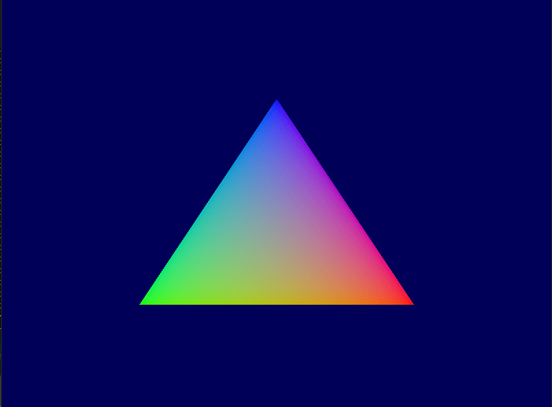
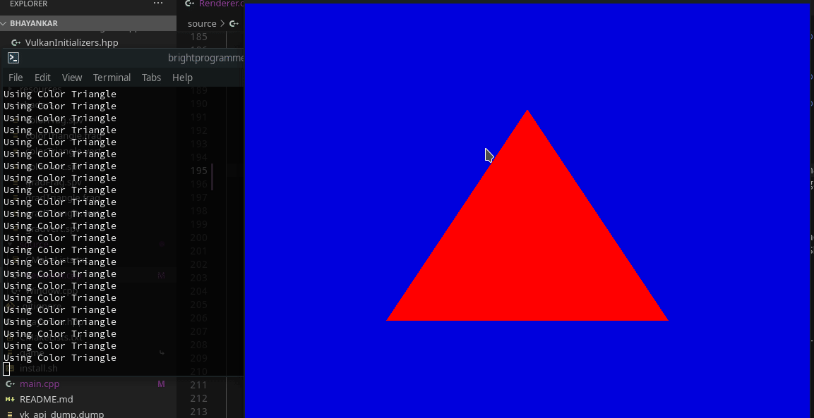
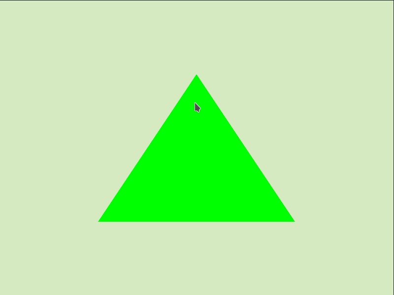

# Bhayankar

## First Steps

| First Triangle          | Different Pipelines     | With Vertex Buffer     |
| ----------------------- | ----------------------- | ---------------------- |
|  |  |  |

## Going 3D

| 3D Triangle           | 3D Monkey Head       | Many Monkey Heads |
| --------------------- | -------------------- | ----------------- |
|  |  |  |

Here is the [GitHub Repository Link](https://github.com/brightprogrammer/Bhayankar)

## Description

This is one of my beginning Vulkan projects. It was amazing learning this stuff because my progress was clearly visible.

## Comments

Again this was stopped because of my entrance exam preparations. At this point I was learning how to setup project using CMake and GitHub.