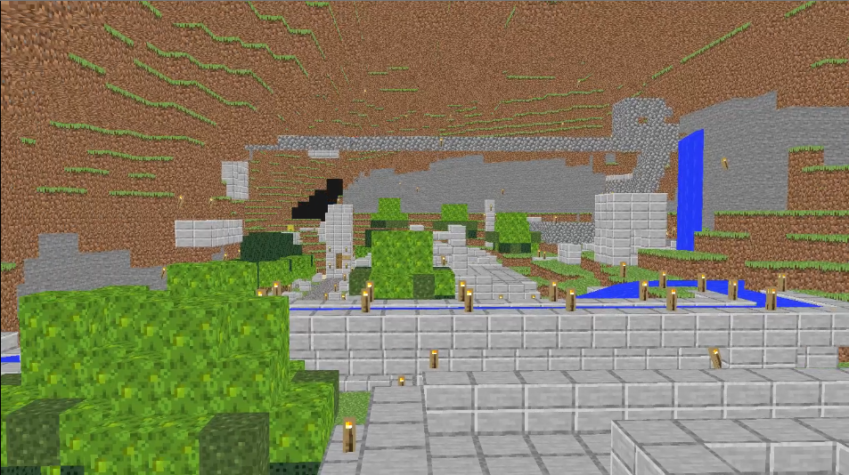

# GameZero

Here is the [GitHub Repository Link](https://github.com/brightprogrammer/GameZero)

## Description

I made this project while learning Vulkan. My goal was to make a MineCraft clone like what [Hopson did using OpenGL](https://www.youtube.com/watch?v=Xq3isov6mZ8).Vulkan is a modern graphics api written from sratch. It's also faster than many other graphics APIs like OpenGL. I closely followed [VkGuide](https://vkguide.dev) by V. Blanco and [Vulkan-Tutorial](https://vulkan-tutorial.com) by Alexander Overvoorde while working on this project. I stopped working on this project again due to my college entrance exams.

## Comments :

I don't plan to continue this further but instead write a similar one from scratch. I am trying to make a game engine and in that pursuit I learn a lot. That is what my main focus is when I'm taking such big projects (like this one!). Most of my learning was like this : I took a challenge that I'll make this and then I try and fail/succeed. In both cases there is a win-win situation.